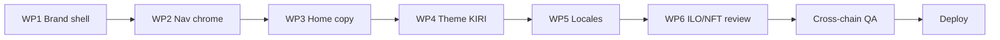

# Phase 1 Safe Restyle Plan — Melega DEX

**Objective:** Rebrand the visible interface from **MelegaSwap** to **Melega DEX**, aligned with **MELEGA AI | KIRI CIVILIZATION** visual language, without altering contracts, liquidity, farms, pools, or routing logic.

**Prerequisite:** `AUDIT_REPORT.md` verdict `MELEGASWAPV2_AUDIT_READY_FOR_SAFE_RESTYLE`  
**Guardrail doc:** `CONTRACT_PRESERVATION_MAP.md`

---

## Design principles

1. **Cosmetic only** — strings, images, CSS variables, meta tags, menu labels.
2. **Preserve all addresses** — zero edits to router, factory, MasterChef, LP, pool, or token contract fields.
3. **Preserve routes** — `/swap`, `/liquidity`, `/farms`, `/pools`, `/ilo`, `/nft/*` stay functional.
4. **Incremental deploy** — small PRs, smoke-test swap + stake on BSC after each batch.
5. **KIRI alignment** — dark civilization aesthetic: deep blacks, restrained accent (existing `#31d0aa` / purple tones in `vars.css.ts`), clean typography; avoid Pancake-era bunny motifs in new assets.

---

## Phase 1 scope matrix

| In scope | Out of scope |
|----------|--------------|
| App name: Melega DEX | Renaming `@pancakeswap/*` packages |
| Logo, favicon, OG images | Router/factory/MasterChef addresses |
| SEO / meta / titles | Farm/pool config files |
| Home + marketing copy | Token contract addresses |
| Menu/footer/help text | Liquidity migration |
| Theme tokens (colors, fonts) | Subgraph URL changes |
| Wallet `appName` display strings | New chain deployments |
| Locale string updates (user-visible) | Smart-router package constants |
| Remove PancakeSwap references in UI copy | ILO contract removal |

---

## Work packages (ordered)

### WP1 — Brand identity shell (low risk)

**Classification:** SAFE_FRONTEND_ONLY

| Task | Files |
|------|-------|
| Set product name to **Melega DEX** | `next-seo.config.ts`, `meta.ts` (`defaultTitleSuffix`: `Melega DEX`) |
| Update `_app.tsx` twitter/OG image alt text if needed | `apps/web/src/pages/_app.tsx` |
| Replace `/images/logo.png` with KIRI-aligned Melega DEX logo | `apps/web/public/images/logo.png` |
| Update favicon set | `apps/web/public/favicon.ico`, related |
| Fix Coinbase connector label | `apps/web/src/utils/wagmi.ts` → `appName: 'Melega DEX'` |

**Acceptance:** Header shows Melega DEX; browser tab title correct; wallet connect modal shows Melega DEX.

---

### WP2 — Navigation & global chrome

**Classification:** SAFE_FRONTEND_ONLY

| Task | Files |
|------|-------|
| Confirm menu labels (no MelegaSwap) | `components/Menu/config/config.ts` |
| Update help / support copy | `components/Menu/NeedHelp.tsx` (`support@melegaswap.finance` → approved Melega DEX support email if provided) |
| Footer / social links audit | `packages/uikit/src/components/Footer/` if rendered |
| `LogoWithText` alt text | `packages/uikit/src/components/Svg/Icons/LogoWithText.tsx` |

**Do not:** Remove ILO or NFT menu items in WP2 (see WP6).

---

### WP3 — Home & marketing copy

**Classification:** SAFE_FRONTEND_ONLY

| Task | Files |
|------|-------|
| Replace **MelegaSwap** with **Melega DEX** | `views/Home/components/SalesSection/data.ts` |
| Update metrics / win section copy | `views/Home/components/WinSection/index.tsx`, `MetricsSection/index.tsx` |
| Hero imagery (KIRI civilization tone) | `views/Home/components/*`, `public/images/` |
| Keep MARCO token messaging; clarify Melega DEX as product name | Same files |

**Acceptance:** Home page contains zero user-visible "MelegaSwap" strings (unless in external URLs).

---

### WP4 — Theme & visual system (KIRI)

**Classification:** SAFE_FRONTEND_ONLY

| Task | Files |
|------|-------|
| Refine color tokens (background, primary, accent) | `packages/ui/css/vars.css.ts`, `packages/ui/tokens/colors.ts` |
| Optional: swap Pancake purple focus ring for KIRI palette | `packages/ui/tokens/index.ts` shadows/focus |
| Audit uikit hardcoded pancake CDN images | e.g. `widgets/Swap/Footer.tsx` help image URL |
| Preserve layout breakpoints and component APIs | No uikit API changes |

**Suggested KIRI palette direction (example — tune with design):**
- Background: `#000000` / `#0a0a0f` (already dark)
- Primary accent: retain `#31d0aa` or shift to Melega brand cyan
- Secondary: `#523292` / `#aba0c4` (already in vars)
- Text: `#ffffff` / `#b8add2`

---

### WP5 — Localization sweep

**Classification:** SAFE_FRONTEND_ONLY (large diff)

| Task | Files |
|------|-------|
| Search `MelegaSwap`, `PancakeSwap`, `Pancake` in `apps/web/public/locales/en-US.json` (and priority locales) | `public/locales/*.json` |
| Update `packages/localization/src/config/translations.json` if used as source | |
| Keep **MARCO** as token symbol everywhere | Do not rename to a new ticker |

**Method:** Scripted grep + manual review; avoid touching translation keys used by contract error parsers.

---

### WP6 — ILO & legacy modules (careful)

**Classification:** Mixed

| Module | Action | Classification |
|--------|--------|----------------|
| **ILO `/ilo`** | **Keep visible** in Phase 1 unless product confirms no active sale on `ifov3` | CONTRACT_CRITICAL if removed |
| **ILO UI copy** | Rename "IFO" user strings to "ILO" where safe | SAFE_FRONTEND_ONLY |
| **Legacy `ifo.ts`** | **Do not delete** (unused by live UI but low risk to keep) | DO_NOT_TOUCH |
| **NFT (BSC)** | Keep; update decorative copy only | SAFE_FRONTEND_ONLY for copy |
| **Info `/info`** | Optional: re-enable menu with "Melega DEX Info" label | SAFE_FRONTEND_ONLY |
| **Bridge** | Leave disabled (no page route) | No action |

**ILO hide criteria (future WP, not Phase 1 default):**
1. On-chain `ifov3.status` indicates no active sale **and**
2. Product owner sign-off **and**
3. Menu item hidden only (route can remain for direct links)

---

### WP7 — README & docs (optional, low priority)

**Classification:** SAFE_FRONTEND_ONLY

| Task | Files |
|------|-------|
| Rename README title to Melega DEX | `README.md` |
| Leave package names as `@pancakeswap/*` in docs | Avoid scope creep |

---

## Files explicitly forbidden in Phase 1

```
packages/swap-sdk/src/constants.ts          # factory, init hash, WETH
apps/web/src/config/constants/exchange.ts   # routers
apps/web/src/views/Swap/SmartSwap/utils/exchange.ts
apps/web/src/config/constants/contracts.ts
packages/farms/constants/**
packages/farms/src/const.ts
apps/web/src/config/constants/pools.tsx     # contractAddress fields
packages/multicall/index.ts
apps/web/src/config/constants/supportChains.ts  # unless approved
apps/web/src/utils/wagmi.ts                 # CHAINS array only forbidden; appName OK
```

Token list rule: **may** change `name` field in JSON list; **must not** change `address`, `chainId`, `decimals`.

---

## Testing plan (minimum per WP)

| Test | Chain | Pass criteria |
|------|-------|---------------|
| Wallet connect | BSC | Connects, correct network |
| Swap small amount | BSC | Tx succeeds via router |
| Add/remove liquidity | BSC | LP mint/burn works |
| Farm stake/unstake | BSC | MasterChef interaction OK |
| Pool stake/harvest | BSC | sousChef OK |
| ILO page load | BSC | Reads `ifov3` without error |
| NFT pages load | BSC | No regression |
| Multi-chain switch | ETH, Base, Polygon | Farms/pools lists load |
| Visual regression | All | Logo, title, home copy correct |

---

## Rollout sequence



**Recommended PR split:**
1. PR-A: WP1 + WP2 (brand + nav)
2. PR-B: WP3 + WP4 (home + theme)
3. PR-C: WP5 (locales, can be partial en-US first)

---

## Success criteria

- [ ] User-visible product name is **Melega DEX** on home, header, SEO, wallet prompts
- [ ] No user-facing **MelegaSwap** on primary paths (/, /swap, /farms, /pools)
- [ ] KIRI-aligned dark theme applied consistently
- [ ] `CONTRACT_PRESERVATION_MAP.md` checklist passes (no address diffs)
- [ ] BSC swap + farm + pool smoke tests pass
- [ ] ILO and NFT remain functional if kept in menu

---

## Post–Phase 1 backlog (not blocking restyle)

| Item | Type |
|------|------|
| Verify Ethereum factory address vs on-chain deployment | CONFIG_SENSITIVE |
| Reconcile `smart-router` stale ROUTER_ADDRESS | CONFIG_SENSITIVE |
| Info subgraph health / Melega indexing | CONFIG_SENSITIVE |
| WalletConnect re-enable | CONFIG_SENSITIVE |
| Package rename `@pancakeswap` → `@melega` | Major refactor |
| Bridge page activation | Product decision |

---

## Final verdict

```
MELEGASWAPV2_AUDIT_READY_FOR_SAFE_RESTYLE
```

Phase 1 may begin at **WP1**. No code changes are required before starting; follow work packages in order and run the preservation checklist before each deploy.
