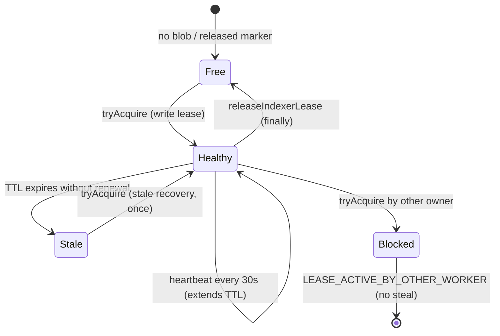

# Indexer Orchestrator Lease — Subsystem Audit (R791A.3 follow-up)

## Lifecycle

## Fields

| Field | Source | Meaning |
|-------|--------|---------|
| `ownerId` | `buildLeaseOwnerId(runType)` | `{runType}:{sha7}:{region}:{timestamp}` |
| `acquiredAt` | acquire | ISO timestamp of acquisition |
| `heartbeatAt` | acquire / heartbeat | Last renewal |
| `expiresAt` | acquire / heartbeat | `now + INDEXER_LEASE_TTL_MS` (270s) |
| `runType` | `manual` or `vercel-cron` | Invoker class |
| `deploymentSha` | `VERCEL_GIT_COMMIT_SHA` | Deploy identity |
| `released` | release | Marker when cleared |

## Constants

| Constant | Value | Purpose |
|----------|------:|---------|
| `INDEXER_LEASE_TTL_MS` | 270,000 | Covers 240s orchestrator budget + margin |
| `INDEXER_LEASE_HEARTBEAT_INTERVAL_MS` | 30,000 | Renew during long runs |
| `INDEXER_LEASE_STALE_GRACE_MS` | 5,000 | Post-expiry orphan grace |

## Release conditions

- Normal: `finally` block calls `releaseIndexerLease(ownerId)` after orchestrator completes or fails.
- Only the matching `ownerId` may release.
- Release writes `{ released: true }` marker (not delete).

## Stale / orphan detection

- **Stale:** `expiresAt <= now` (TTL exceeded, heartbeat not renewed in time).
- **Orphan:** stale lease with no live worker (recoverable on next acquire).
- **Healthy:** `expiresAt > now` — never stolen.

## Root cause (R791A.3 triple skip)

**B — Lease renewal bug** (systemic): prior 90s TTL vs 240s run budget with a single heartbeat allowed mid-run expiry and duplicate-worker risk.

**A — Healthy lease** (R791A.3 session): concurrent holder legitimately active; client retried 3× with 20s waits instead of exiting.

## Repair applied

1. TTL aligned to orchestrator budget (270s).
2. Periodic heartbeat during run (30s interval).
3. Stale auto-recovery on acquire (once).
4. Healthy lease → `LEASE_ACTIVE_BY_OTHER_WORKER`, no steal.
5. Client scripts exit immediately on healthy held lease (no 95s / triple retry).
