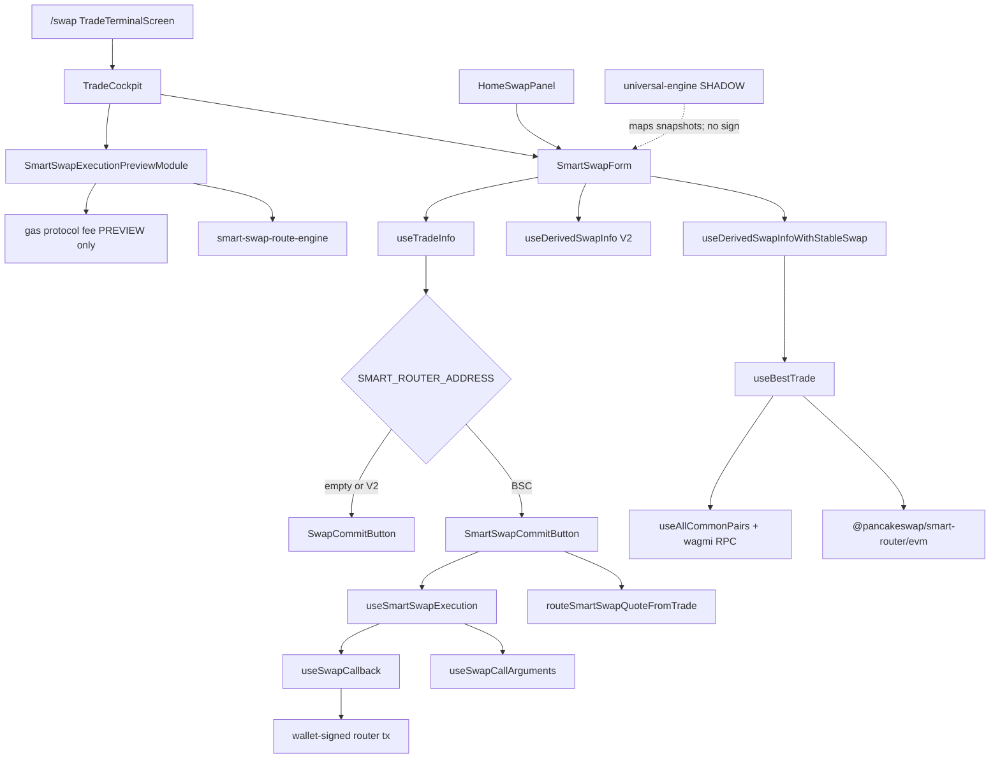

# CURRENT_ENGINE_MAP

Mission: `SMARTSWAP_UNIVERSAL_ENGINE_M1_FOUNDATION`  
Baseline: `3b8259ba` (`mission-marco-pay-processing-ux`, ancestor of current production tip; `origin/main` is an ancestor).  
Repository/runtime truth only.

## User-visible composition (frozen)

`/swap` → `TradeTerminalScreen` → `TradeCockpit` → **`SmartSwapForm`** (`views/Swap/SmartSwap/index.tsx`) plus Studio presentation modules.

Home Instant/Smart → `HomeSwapPanel` → same **`SmartSwapForm`**.

`SwapExperienceMode` (`instant` | `smart`) is presentation over one engine.

## Dependency graph

M1 V2 is **not wired** into `SmartSwapForm` or `useSwapCallback`.

## A. Quote pipeline

| Step | File | Symbol |
|------|------|--------|
| Form | `apps/web/src/views/Swap/SmartSwap/index.tsx` | `SmartSwapForm` |
| Stable/smart quote | `.../hooks/useDerivedSwapInfoWithStableSwap.ts` | `useDerivedSwapInfoWithStableSwap` |
| Best trade | `.../hooks/useBestTrade.ts` | `getBestTradeExactIn/Out` |
| Engine | `packages/smart-router/evm/getBestTrade.ts` | `getBestTradeExactIn` / `ExactOut` |
| V2 parallel | `state/swap/hooks` | `useDerivedSwapInfo` |
| Select | `.../hooks/useTradeInfo.ts` | `useTradeInfo` |
| Exec package | `apps/web/src/lib/routing-layer/facade.ts` | `routeSmartSwapQuoteFromTrade` |

API quote (`useBestTradeFromApi`) exists but is commented out. KERL may override on enforced testnet.

## B. Route discovery

V2 pairs (`getBestTradeFromV2`), stable (`getBestTradeWithStableSwap`), mixed hops. `RouteType`: `V2` | `STABLE_SWAP` | `MIXED`. Studio ranking in `smart-swap-route-engine/rankRoutes.ts` is presentation, not the live commit selector.

## C. Token normalization

`packages/smart-router/evm/utils/currency.ts` wrapped/unwrapped. Native sentinel `0xEeee…` in swap call arguments. Studio `normalizeSmartSwapRoute`. **No canonical multi-domain asset id** before M1.

## D. Chain handling

Page: ETH, BSC, BSC_TESTNET, BASE, POLYGON, ARBITRUM, AVAX (`SUPPORT_MULTI_CHAINS`).  
**Smart Router address is BSC-only.** Other EVM chains fall back to V2. Solana is not in the quote/exec path.

## E. Gas estimation

Preview: `SMART_SWAP_PREVIEW_GAS_UNITS = 220_000` + hop scaling. Authoritative: `contract.estimateGas` in `useSwapCallback` + `calculateGasMargin`.

## F. Price impact

`computeTradePriceBreakdown` / `Trade.priceImpact` minus LP fee fraction. V2 LP `BASE_FEE = 25 bps`.

## G. Minimum received

Engine: `Trade.minimumAmountOut`. Studio: `out * (10000 - slippageBips) / 10000`.

## H–I. Protocol fee (see PROTOCOL_FEE_AUDIT.md)

Two formulas exist (D87 20/30 bps; Founder 25% of estimated gas). Live swap path collects **neither**. UI: “Not collected”. `settleGasProtocolFeeOnChain` is unused by `useSwapCallback`.

## J–K. Wallet execution / lifecycle

Approve → confirm modal → estimateGas → `prepareMelegaSmartRouterSwap` → `contract[methodName]` → `addTransaction`. Single router tx.

## L. Route visualization

`SmartSwapVisualRoute` + `buildHopVisualization`. Existing surface for future routes. **Do not add venue selectors.**

## M. Widget boundaries

Engine UI = `SmartSwapForm`. Studio modules = presentation. Hosts: `/swap`, Home, Project island. See `SMARTSWAP_WIDGET_PORTABILITY.md`.

## N. Melega Router dependencies

| Contract | Address |
|----------|---------|
| BSC Smart Router | `0xC6665d98Efd81f47B03801187eB46cbC63F328B0` |
| BSC V2 Router | `0xc25033218D181b27D4a2944Fbb04FC055da4EAB3` |
| Treasury | `0xb6436EF4c7f76bE0f26c0C5C9dB72F2689abF65b` |

ABI: `config/abi/pancakeSwapSmartRouter.json`.

## O. Chain-specific assumptions

Multi-EVM UI; Smart Router execution BSC-only; stable flag BSC; gas preview assets mapped per chain.

## P. Duplicated pipelines

Live form quote, Studio preview re-quote, route-engine snapshot model, terminal indexer candles, disabled API quote, D87 fee plan (not a second on-chain quote).

## Q. RPC / indexer

wagmi `provider` for reserves; public RPCs; SWR quote cache; `useTradeTerminalData` for charts/recent.

## R. Failure / fallback

No smart router → V2 commit button. Gas estimate fail → `callStatic` then error. Studio `NO_ROUTE` / `QUOTE_UNAVAILABLE`. One venue failure today = Melega-only, so the whole quote fails. M1 adds isolation **for future adapters only**.

## S. Feature flags

`MELEGA_SMART_ROUTER_ARCHITECTURE = ADAPTER` (target WRAPPER). No SmartSwap shadow/canary flag before M1.

## Duplicate / coupled architecture

- Quote intelligence lives in `SmartSwapForm` hooks, Studio preview, and `smart-swap-route-engine` in parallel.
- Fee policy (D87) is separate from gas-fee preview and from actual collection (none).
- Widget is coupled to DEX page/shell but the form is already reused on Home and Project island.
- `@pancakeswap/smart-router` is the inherited venue implementation, not a portable adapter.

## Solana wallet UX

**Not implemented. Documented requirement only.** Founder approval required before any Solana wallet control appears in frozen SmartSwap UX.
