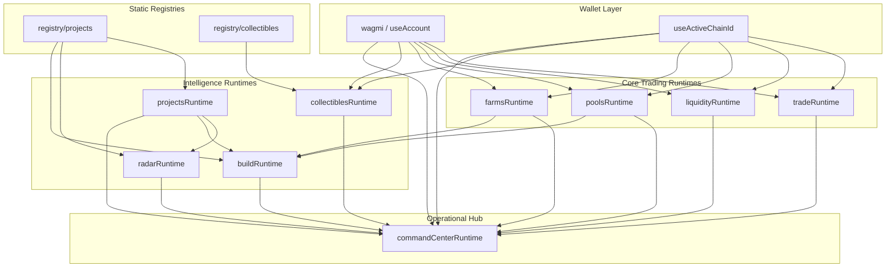

# DEX Runtime Architecture — Melega V2

**Effective:** 2026-07-03  
**Branch:** `design-system-foundation`  
**Staging:** https://v2.melega.finance  
**Authority:** [`DEX_CONSTITUTION.md`](./DEX_CONSTITUTION.md) · [`DEX_IMPLEMENTATION_MATRIX.md`](./DEX_IMPLEMENTATION_MATRIX.md)

---

## Principle

The UI is constitutionally frozen. All product surfaces consume **canonical runtime modules** — no duplicated ownership, metadata, or registry logic across studios.

```
Registry (static truth)
        ↓
Runtime hooks (live data + wallet)
        ↓
Formatters (studio card shapes — unchanged)
        ↓
Studio UI components (frozen layout)
```

---

## Layer map

| Layer | Module | Route(s) | On-chain / data source |
|-------|--------|----------|------------------------|
| **Trade** | `views/Trade/tradeRuntime/` | `/`, `/trade`, `/swap` | Smart router, `useBestTrade`, approvals, wagmi |
| **Liquidity** | `views/LiquidityStudio/liquidityRuntime/` | `/liquidity-studio`, `/add`, `/remove`, `/liquidity` | LP mint/burn, subgraph positions |
| **Pools** | `views/PoolsStudio/poolsRuntime/` | `/pools` | SousChef / vault, stake, claim |
| **Farms** | `views/FarmsStudio/farmsRuntime/` | `/farms` | MasterChef, deposit, harvest |
| **Projects** | `views/ProjectsStudio/projectsRuntime/` | `/projects` | `registry/projects` + enrich |
| **Radar** | `views/RadarStudio/radarRuntime/` | `/radar` | Projects runtime (no duplicate registry) |
| **Collectibles** | `views/CollectiblesStudio/collectiblesRuntime/` | `/collectibles` | Registry + DNFT `walletOfOwner` |
| **Build** | `views/BuildStudio/buildRuntime/` | `/build-studio`, `/import-existing-token` | Projects + Radar + Pools + Farms preview |
| **Command Center** | `views/CommandCenter/commandCenterRuntime/` | `/command-center` | Aggregates all studio runtimes |

---

## Orchestration graph



---

## Runtime module anatomy

Each studio runtime follows the same pattern established in R015–R023:

| File pattern | Responsibility |
|--------------|----------------|
| `use*Runtime.ts` | Orchestrator — hooks, memoized state, errors |
| `*RuntimeContext.tsx` | React provider + `use*Runtime()` |
| `format*Runtime.ts` | Map live/registry data → frozen UI card types |
| `build*.ts` | Pure helpers (health, AI heuristics, machine JSON) |
| `*RuntimeErrors.ts` | Machine + human error codes |
| `__tests__/*.test.ts` | Pure-function regression tests |

---

## Command Center aggregation

`useCommandCenterOrchestrationRuntime` is the **read-only aggregator** — it does not duplicate on-chain calls:

| Section | Source runtime |
|---------|----------------|
| Assets | `useTradeSwapRuntime` |
| Liquidity rows | `useLiquidityPositions` |
| Pool positions | `usePoolsStakingRuntime` |
| Farm positions | `useFarmsStakingRuntime` |
| Collectibles / identity | `useWalletCollectibleOwnership` (shared) |
| Infrastructure score | `useBuildOrchestrationRuntime` |
| Recommendations | Projects + Radar + Build |
| Machine JSON | `buildMachineSummary` v2 |

---

## Legacy compatibility

V2 preserves classic PancakeSwap-derived routes without redesign:

| Legacy route | Status | V2 handling |
|--------------|--------|-------------|
| `/swap` | 🟩 | `TradeTerminalScreen` / swap compat |
| `/add`, `/remove` | 🟩 | Legacy liquidity pages + studio |
| `/liquidity` | 🟩 | Redirect from `/pool` |
| `/nft`, `/nftmarket`, `/viewNFTs` | 🟩 | Unchanged mint/market surfaces |
| `/ilo` | 🟩 | Legacy ILO page |
| `/info/*` | 🟩 | Analytics subgraph pages |
| `/farms/history` | 🟩 | Redirect from `/farms/archived` |
| `/nfts` | 🟩 | Permanent redirect → `/collectibles` |

Middleware applies geo-sanctions only (`/451`); no route stripping.

---

## AI layer (heuristic only)

No ML inference in production path. AI surfaces are **rule-based suggestions**:

| Surface | Module | Auto-execute |
|---------|--------|--------------|
| Projects advisor | `buildAiRecommendations` | ❌ |
| Radar intelligence | `buildOpportunityScore` | ❌ |
| Build advisor | `buildAdvisor` | ❌ |
| Collectibles advisor | `buildAiAdvisorRows` | ❌ |
| Command Center briefing | `buildAiBriefing` | ❌ |

---

## Machine-readable exports

| Schema | Location | Collapsed default |
|--------|----------|-------------------|
| `melega.command-center.v2` | Command Center panel | ✅ |
| `melega.collectibles-identity.v1` | Collectibles advisor | ✅ |
| `melega.build-manifest.v1` | Build Studio | ✅ |
| Projects machine JSON | Projects advisor | ✅ |

---

## Shared infrastructure

| Capability | Path | Notes |
|------------|------|-------|
| Design system | `design-system/melega` | Shell, tokens, components |
| Wagmi config | `utils/wagmi.ts` | Multi-chain; BSC prod node via env |
| Execution boundary | `lib/execution-layer`, `lib/routing-layer` | KERL prep — swap unchanged |
| Homepage live | `lib/homepage-live` | Subgraph + farm metrics |
| Project registry | `registry/projects` | Canonical project list |
| Collectibles registry | `registry/collectibles` | 3 indexed slugs |

---

## Deployment topology

| Environment | Branch | Domain | Production layer |
|-------------|--------|--------|----------------|
| Staging V2 | `design-system-foundation` | `v2.melega.finance` | Vercel preview (enabled in `vercel.json`) |
| Production legacy | `main` @ `5d4818f` | `www.melega.finance` | Unchanged until explicit cutover |

**Rollback:** `git checkout main && git reset --hard 5d4818f` restores last known production state.

---

## Extension rules

1. New data → extend runtime module, not studio component layout.
2. New registry entry → update `registry/*` + matrix row.
3. Command Center reads from runtimes only — never add duplicate wallet hooks.
4. AI additions must remain heuristic until ML pipeline is constitutionally approved.
