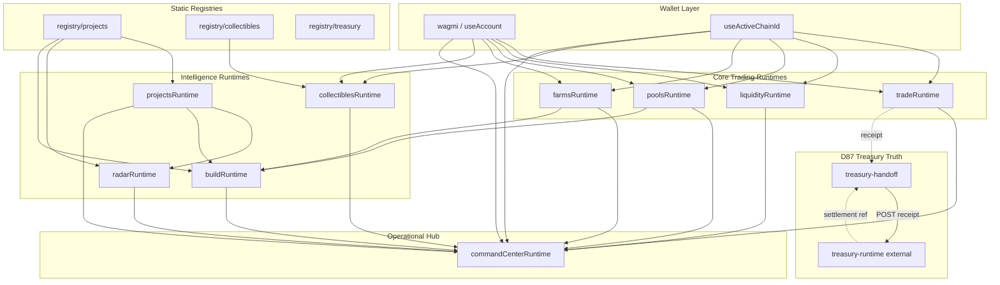

# DEX Runtime Architecture — Melega V2

**Effective:** 2026-07-03  
**Branch:** `design-system-foundation`  
**Staging:** https://v2.melega.finance  
**Authority:** [`DEX_CONSTITUTION.md`](./DEX_CONSTITUTION.md) · [`DEX_IMPLEMENTATION_MATRIX.md`](./DEX_IMPLEMENTATION_MATRIX.md)

---

## Principle

The UI is constitutionally frozen. All product surfaces consume **canonical runtime modules** — no duplicated ownership, metadata, or registry logic across studios.

```
Registry (static truth)
        ↓
Runtime hooks (live data + wallet)
        ↓
Formatters (studio card shapes — unchanged)
        ↓
Studio UI components (frozen layout)
```

### D87 Treasury Truth layer (D87-01)

Economic truth follows a **separate ingestion path** — not the studio runtime stack above.

```
On-chain receipt / signed invoice (evidence)
        ↓
Settlement Producer (Treasury Runtime — external)
        ↓
melega.settlement-event.v1
        ↓
Treasury Runtime (lib/treasury-runtime/) — single truth owner
        ↓
/registry/treasury/* manifests
        ↓
Command Center · EIE · Projects attribution (read only)
```

### D87-03 DEX receipt handoff (implemented)

DEX does **not** own settlement. After SmartSwap receipt confirmation:

```
Confirmed swap receipt
        ↓
lib/treasury-handoff/ (execution receipt only)
        ↓
POST /api/treasury/settlement-events
        ↓
Treasury Runtime /api/public/treasury/settlement-events
        ↓
Settlement reference stored in DEX (settlement_id, status)
```

See [`DEX_TREASURY_HANDOFF_REPORT.md`](./DEX_TREASURY_HANDOFF_REPORT.md).

**Rules:**

- Treasury Runtime ingests **Settlement Events only** — never UI, router, or wallet state.
- DEX submits **verified execution receipts** — never LP/Treasury/Buyback/Referral amounts or settlement IDs.
- Execution Ingress / Tracker **must not** emit settlements (existing ownership preserved).
- Command Center **reads** treasury state — never computes fees.
- See [`TREASURY_SETTLEMENT_ARCHITECTURE.md`](./TREASURY_SETTLEMENT_ARCHITECTURE.md) · [`TREASURY_EVENT_SCHEMA.md`](./TREASURY_EVENT_SCHEMA.md).

---

## Layer map

| Layer | Module | Route(s) | On-chain / data source |
|-------|--------|----------|------------------------|
| **Trade** | `views/Trade/tradeRuntime/` | `/`, `/trade`, `/swap` | Smart router, `useBestTrade`, approvals, wagmi |
| **Liquidity** | `views/LiquidityStudio/liquidityRuntime/` | `/liquidity-studio`, `/add`, `/remove`, `/liquidity` | LP mint/burn, subgraph positions |
| **Pools** | `views/PoolsStudio/poolsRuntime/` | `/pools` | SousChef / vault, stake, claim |
| **Farms** | `views/FarmsStudio/farmsRuntime/` | `/farms` | MasterChef, deposit, harvest |
| **Projects** | `views/ProjectsStudio/projectsRuntime/` | `/projects` | `registry/projects` + enrich |
| **Radar** | `views/RadarStudio/radarRuntime/` | `/radar` | Projects runtime (no duplicate registry) |
| **Collectibles** | `views/CollectiblesStudio/collectiblesRuntime/` | `/collectibles` | Registry + DNFT `walletOfOwner` |
| **Build** | `views/BuildStudio/buildRuntime/` | `/build-studio`, `/import-existing-token` | Projects + Radar + Pools + Farms preview |
| **Command Center** | `views/CommandCenter/commandCenterRuntime/` | `/command-center` | Aggregates all studio runtimes |
| **Treasury Truth** | `lib/treasury-handoff/` + proxy API | `/api/treasury/settlement-events` | Receipt handoff only — truth owned by Treasury Runtime |
| **Settlement Producer** | Treasury Runtime (external) | — | Normalizes receipts → `melega.settlement-event.v1` |

---

## Orchestration graph



---

## Runtime module anatomy

Each studio runtime follows the same pattern established in R015–R023:

| File pattern | Responsibility |
|--------------|----------------|
| `use*Runtime.ts` | Orchestrator — hooks, memoized state, errors |
| `*RuntimeContext.tsx` | React provider + `use*Runtime()` |
| `format*Runtime.ts` | Map live/registry data → frozen UI card types |
| `build*.ts` | Pure helpers (health, AI heuristics, machine JSON) |
| `*RuntimeErrors.ts` | Machine + human error codes |
| `__tests__/*.test.ts` | Pure-function regression tests |

---

## Command Center aggregation

`useCommandCenterOrchestrationRuntime` is the **read-only aggregator** — it does not duplicate on-chain calls:

| Section | Source runtime |
|---------|----------------|
| Assets | `useTradeSwapRuntime` |
| Liquidity rows | `useLiquidityPositions` |
| Pool positions | `usePoolsStakingRuntime` |
| Farm positions | `useFarmsStakingRuntime` |
| Collectibles / identity | `useWalletCollectibleOwnership` (shared) |
| Infrastructure score | `useBuildOrchestrationRuntime` |
| Recommendations | Projects + Radar + Build |
| Machine JSON | `buildMachineSummary` v2 |
| Treasury (planned) | `useTreasuryRuntime` — read only; never computes fees |

---

## Legacy compatibility

V2 preserves classic PancakeSwap-derived routes without redesign:

| Legacy route | Status | V2 handling |
|--------------|--------|-------------|
| `/swap` | 🟩 | `TradeTerminalScreen` / swap compat |
| `/add`, `/remove` | 🟩 | Legacy liquidity pages + studio |
| `/liquidity` | 🟩 | Redirect from `/pool` |
| `/nft`, `/nftmarket`, `/viewNFTs` | 🟩 | Unchanged mint/market surfaces |
| `/ilo` | 🟩 | Legacy ILO page |
| `/info/*` | 🟩 | Analytics subgraph pages |
| `/farms/history` | 🟩 | Redirect from `/farms/archived` |
| `/nfts` | 🟩 | Permanent redirect → `/collectibles` |

Middleware applies geo-sanctions only (`/451`); no route stripping.

---

## AI layer (heuristic only)

No ML inference in production path. AI surfaces are **rule-based suggestions**:

| Surface | Module | Auto-execute |
|---------|--------|--------------|
| Projects advisor | `buildAiRecommendations` | ❌ |
| Radar intelligence | `buildOpportunityScore` | ❌ |
| Build advisor | `buildAdvisor` | ❌ |
| Collectibles advisor | `buildAiAdvisorRows` | ❌ |
| Command Center briefing | `buildAiBriefing` | ❌ |

---

## Machine-readable exports

| Schema | Location | Collapsed default |
|--------|----------|-------------------|
| `melega.command-center.v2` | Command Center panel | ✅ |
| `melega.command-center.v3` | Command Center + treasury passthrough (planned) | — |
| `melega.settlement-event.v1` | Treasury settlements | — |
| `melega.treasury-runtime.v1` | `/registry/treasury/*` | — |
| `melega.collectibles-identity.v1` | Collectibles advisor | ✅ |
| `melega.build-manifest.v1` | Build Studio | ✅ |
| Projects machine JSON | Projects advisor | ✅ |

---

## Shared infrastructure

| Capability | Path | Notes |
|------------|------|-------|
| Design system | `design-system/melega` | Shell, tokens, components |
| Wagmi config | `utils/wagmi.ts` | Multi-chain; BSC prod node via env |
| Execution boundary | `lib/execution-layer`, `lib/routing-layer` | KERL prep — swap unchanged |
| Homepage live | `lib/homepage-live` | Subgraph + farm metrics |
| Project registry | `registry/projects` | Canonical project list |
| Collectibles registry | `registry/collectibles` | 3 indexed slugs |
| Treasury Truth | `lib/treasury-handoff/` | D87-03 receipt handoff — settlement owned by Treasury Runtime |
| Settlement Producer | Treasury Runtime (external) | Normalizes receipts → canonical settlement events |
| Fee policy | `config/constants/info.ts` | Display + handoff gross fee metadata only |
| Economic activation | `lib/economic-runtime` | Activation progress — separate from treasury aggregates |

---

## Deployment topology

| Environment | Branch | Domain | Production layer |
|-------------|--------|--------|----------------|
| Staging V2 | `design-system-foundation` | `v2.melega.finance` | Vercel preview (enabled in `vercel.json`) |
| Production legacy | `main` @ `5d4818f` | `www.melega.finance` | Unchanged until explicit cutover |

**Rollback:** `git checkout main && git reset --hard 5d4818f` restores last known production state.

---

## KAP-006C — DEX as Civilization Economic Exchange Engine

**Effective:** 2026-07-06 · **Marker:** `KAP-006C_DEX_GRAVITY_IMPLEMENTED`

The DEX converges routing, execution, liquidity, and machine surfaces under constitutional boundaries. Civilization Liquidity (creation, LP, routing-to-liquidity, exchange efficiency) is owned by the DEX. Gravity, Settlement Truth, and Opportunity Truth are explicitly **not** owned.

### Canonical routing pipeline

```
smart-router (computation engine)
        ↓
lib/routing-layer/facade (quote + instruction owner)
        ↓
melega.execution.v1 machine surface
        ↓
execution-layer (wallet hooks — no direct smart-router import)
```

- Every swap quote packages through `routeSmartSwapQuote` / `routeV2SwapQuote`.
- LP mint/burn instructions package through `routeLiquidityInstruction` (quote only — no submit).

### Canonical execution pipeline

```
routing-layer instruction
        ↓
execution-modes gates (DEX canonical gates when mode OFF)
        ↓
lib/execution-ingress/dispatch (submit owner)
        ↓
execution-tracker (evidence only)
        ↓
lib/treasury-handoff (receipt-only — unchanged)
```

- `useSmartSwapExecution` / `useV2SwapExecution` route submit via `submitSwapViaIngress`.
- Commit buttons remain thin UI — they do not import ingress directly.

### Canonical liquidity pipeline

```
/liquidity-studio (canonical UX)
        ↓
liquidityRuntime (canonical owner)
        ↓
state/mint + state/burn (shared primitives)
        ↓
/add · /remove (alias routes — same mint/burn flow)
```

- Farms/Pools rewards remain separate — not liquidity ownership.

### Machine surface plan

| Schema | Purpose |
|--------|---------|
| `melega.dex.v1` | Exchange engine manifest |
| `melega.liquidity.v1` | Pool discovery, LP positions, analytics — no auto-execution |
| `melega.execution.v1` | Quote/instruction lifecycle |
| `melega.exchange-receipt.v1` | Confirmed tx receipt to Treasury (`melega.dex-execution-receipt.v1` alias) |

Static manifest: `public/registry/exchange/melega-dex.json`

### Authority boundaries

**DEX owns:** Civilization Liquidity, routing-to-liquidity, exchange efficiency, swap/LP execution quality, machine surfaces, execution evidence, exchange receipts to Treasury.

**DEX never owns:** Civilization Gravity, Treasury execution, Settlement Truth, Opportunity Truth, Signal Gateway, Radar authority, Labs productive planning, reward/cashback computation.

**Delegated:** Core/G001, Treasury, Signal, Radar, Labs (consumption only for Radar opportunityRef).

### Out of scope (KAP-006C)

Market making, arbitrage, trading bots, UI redesign, Treasury Runtime changes, Gravity computation, Opportunity Truth detection/ranking.

---

## Extension rules

1. New data → extend runtime module, not studio component layout.
2. New registry entry → update `registry/*` + matrix row.
3. Command Center reads from runtimes only — never add duplicate wallet hooks.
4. AI additions must remain heuristic until ML pipeline is constitutionally approved.
5. Treasury amounts must come from Treasury Runtime only — never computed in studio runtimes or Command Center.
6. New fee-bearing modules must register a Settlement Producer before claiming revenue in any manifest.
