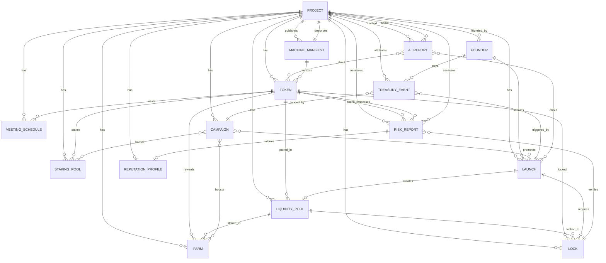

# Melega DEX Entity Model — V1

**Status:** Ratified logical architecture  
**Version:** 1.0  
**Date:** 2026-06-26  
**Parent documents:** `MELEGA_DEX_CONSTITUTION_V1.md`, `MELEGA_DEX_SYSTEM_MAP_V1.md`, `MELEGA_DEX_AI_PROTOCOL_V1.md`  
**Nature:** Canonical entity model — logical architecture, **not** a database schema

---

## 1. Purpose

This document defines the **canonical entity model** for Melega DEX as the AI-native economic layer of **Melega AI** and **Kiri Civilization**.

Melega DEX coordinates economic primitives — projects, tokens, liquidity, farms, pools, locks, launches, campaigns, treasury events, and intelligence artifacts — as **first-class logical entities** with:

- Stable identifiers for humans, machines, and agents
- Explicit relationships anchored on **Universal Project Identity (UPI)**
- Machine-readable manifests and human-readable surfaces
- Treasury attribution and observability by default
- Bounded AI responsibilities per entity type

**This is not a database schema.** Storage (indexers, registries, caches) may denormalize or shard these entities. The logical model is the contract of meaning across UI, Agent API, Treasury Runtime, Radar, and Space.

---

## 2. Design principles

| Principle | Definition |
|-----------|------------|
| **Project-first** | A **Project** is the primary economic identity; tokens, pools, farms, locks, campaigns, and reports are linked resources — not isolated silos. |
| **On-chain truth wins** | Canonical state for settlement lives on-chain; registries and manifests index and annotate that truth. |
| **Machine-readable by default** | Every entity type has a schema-backed representation for agents (Constitution I4). |
| **Treasury-accounted** | Fee-bearing actions emit **Treasury Events** traceable to $MARCO attribution (Constitution I5). |
| **No fabricated metrics** | Observability fields require `data_source` and `as_of`; missing data is explicit, not invented. |
| **AI assists, does not custody** | AI responsibilities are bounded per entity; execution requires human or policy-envelope permission. |

---

## 3. Universal Project Identity (UPI)

### 3.1 Definition

**Universal Project Identity (UPI)** is the stable, civilization-scoped identifier for an economic actor — a team, protocol, product, or launch initiative — that participates in Melega DEX.

UPI is **not** a token contract address. A single project may have zero, one, or many tokens across chains. Tokens, liquidity pools, farms, staking pools, locks, vesting schedules, launches, campaigns, treasury events, and intelligence reports **attach to UPI** as typed resources.

### 3.2 Why project-first

| Anti-pattern | UPI-correct pattern |
|--------------|---------------------|
| Token address = project identity | Token is a **resource** of a Project |
| Farm row = standalone product | Farm is a **reward surface** linked to Project + Pool + Token |
| ILO page = anonymous sale | Launch is a **governed event** under a Project with Founder attribution |
| Risk score per token only | Risk and Reputation aggregate at Project level with token-level drill-down |

### 3.3 UPI resolution graph

```
Project (UPI)
 ├── Founder(s)
 ├── Token(s)           [chain-scoped contract refs]
 ├── Liquidity Pool(s)  [pair / stable / concentrated]
 ├── Farm(s)            [LP stake → reward]
 ├── Pool(s)            [single-asset stake / vault]
 ├── Lock(s)            [LP or token lock contracts]
 ├── Vesting Schedule(s)
 ├── Launch(es)         [ILO, fair launch, generator deploy]
 ├── Campaign(s)        [incentives, SmartDrop hooks]
 ├── Treasury Event(s)  [fees paid, allocations]
 ├── AI Report(s)       [reasoning artifacts]
 ├── Risk Report(s)     [verification artifacts]
 ├── Reputation Profile [long-horizon trust synthesis]
 └── Machine Manifest(s) [discovery + capability declarations]
```

### 3.4 UPI identifier format

```
upi://melega/{namespace}/{slug}@{version}
```

| Component | Rule |
|-----------|------|
| `namespace` | `project` (default), `institution`, `ecosystem` (governance-gated) |
| `slug` | Lowercase kebab-case; unique within namespace |
| `version` | Monotonic integer; breaking metadata changes increment version |

**Example:** `upi://melega/project/acme-protocol@3`

Legacy tokens without UPI resolve through **provisional UPI** (`upi://melega/project/unregistered-{chainId}-{addressPrefix}@0`) until a Founder claims or governance assigns canonical UPI.

### 3.5 UPI invariants

1. One canonical UPI per real-world project; aliases map via `upi_aliases[]`.
2. No economic primitive is **listed** in registries without `project_upi` (nullable only during Phase 1 legacy import).
3. AI must not merge distinct projects without explicit `merge_proposal` governance artifact.
4. Treasury Events always reference `project_upi` when fee SKU is project-scoped.

---

## 4. Entity catalog

Each entity below defines: **Purpose**, **Canonical Identifier**, **Core attributes**, **Relationships**, **Machine-readable representation**, **Human-readable representation**, **AI responsibilities**, **Treasury interactions**, **Observability requirements**, and **Lifecycle states**.

---

### 4.1 Project (Universal Project Identity)

#### Purpose

Primary economic identity for a team, protocol, or product in the Melega/Kiri loop. Aggregates all linked resources, reputation, and treasury history.

#### Canonical Identifier

`upi://melega/project/{slug}@{version}`

#### Core attributes

| Attribute | Type | Description |
|-----------|------|-------------|
| `slug` | string | URL-safe unique key |
| `display_name` | string | Human-facing name |
| `description` | string | Neutral summary; no hype claims |
| `founder_upi_refs` | string[] | Linked Founder identities |
| `space_profile_url` | uri? | Kiri Space presence |
| `registry_status` | enum | `draft`, `submitted`, `listed`, `suspended`, `archived` |
| `phase` | enum | `legacy_import`, `registered`, `verified`, `governed` |
| `primary_token_refs` | TokenRef[] | Optional flagship tokens |
| `supported_chains` | number[] | Chain IDs with activity |
| `manifest_ref` | uri | Latest Machine Manifest |
| `created_at` / `updated_at` | datetime | Registry timestamps |

#### Relationships

| Relation | Target | Cardinality |
|----------|--------|-------------|
| `has_founder` | Founder | 1..n |
| `has_token` | Token | 0..n |
| `has_liquidity_pool` | Liquidity Pool | 0..n |
| `has_farm` | Farm | 0..n |
| `has_staking_pool` | Pool (staking) | 0..n |
| `has_lock` | Lock | 0..n |
| `has_vesting` | Vesting Schedule | 0..n |
| `has_launch` | Launch | 0..n |
| `has_campaign` | Campaign | 0..n |
| `has_treasury_event` | Treasury Event | 0..n |
| `has_ai_report` | AI Report | 0..n |
| `has_risk_report` | Risk Report | 0..n |
| `has_reputation` | Reputation Profile | 0..1 |
| `publishes` | Machine Manifest | 1..n |

#### Machine-readable representation

```json
{
  "$schema": "https://melega.finance/schemas/project/v1",
  "upi": "upi://melega/project/acme-protocol@3",
  "display_name": "Acme Protocol",
  "registry_status": "listed",
  "resources": {
    "tokens": ["token://56/0xabc..."],
    "liquidity_pools": ["lp://56/0xpair..."],
    "launches": ["launch://56/ilo-2026-q2-acme"]
  },
  "data_source": "project-registry",
  "as_of": "2026-06-26T12:00:00Z"
}
```

#### Human-readable representation

Project profile page: name, description, linked tokens/pools, lock summary, latest risk tier, reputation summary, Space link. **Listed ≠ audited** disclaimer always visible.

#### AI responsibilities

| Role | Responsibility |
|------|----------------|
| Project Verifier | Metadata consistency, registry completeness |
| Reputation Analyst | Synthesize trust signals at project level |
| Launch Assistant | Pre-launch checklist against project record |
| Kiri Surface Reporter | Civilization briefs referencing UPI |

**May not:** Certify team identity without attestation; conflate listing with endorsement.

#### Treasury interactions

Project-scoped fee SKUs (listing, launch, campaign) emit Treasury Events with `project_upi`. Aggregated fee totals exposed in project economic summary.

#### Observability requirements

| Signal | Requirement |
|--------|-------------|
| Registry mutations | Audit log with actor + reason |
| Resource attachment | Event per link/unlink |
| Status transitions | Radar alert on `suspended` |
| Manifest drift | Compare manifest `version` vs registry |

#### Lifecycle states

`draft` → `submitted` → `listed` → (`verified` | `suspended`) → `archived`

---

### 4.2 Token

#### Purpose

Chain-scoped fungible (or wrapped) asset participating in swap, liquidity, farm, pool, lock, or launch flows.

#### Canonical Identifier

```
token://{chainId}/{contractAddress}
```

#### Core attributes

| Attribute | Type | Description |
|-----------|------|-------------|
| `chain_id` | number | EVM chain ID |
| `address` | address | Checksummed contract |
| `symbol` | string | Ticker |
| `name` | string | Full name |
| `decimals` | number | ERC-20 decimals |
| `project_upi` | string | Parent project |
| `list_status` | enum | `unlisted`, `default_list`, `extended_list`, `blocked` |
| `risk_tier` | enum | `unknown`, `low`, `medium`, `high`, `critical` |
| `verification` | object | Explorer verification, proxy flags |
| `legacy_import` | boolean | Phase 1 token list origin |

#### Relationships

| Relation | Target | Cardinality |
|----------|--------|-------------|
| `belongs_to` | Project | n..1 |
| `paired_in` | Liquidity Pool | 0..n |
| `reward_in` | Farm / Pool | 0..n |
| `locked_in` | Lock | 0..n |
| `vested_under` | Vesting Schedule | 0..n |
| `launched_via` | Launch | 0..n |
| `assessed_by` | Risk Report | 0..n |

#### Machine-readable representation

Token Registry entry + `TokenRiskReport` fragments. Schema: `https://melega.finance/schemas/token/v1`.

#### Human-readable representation

Token row in swap selector, explorer links, risk badge, project link. Contract address copy with chain badge.

#### AI responsibilities

| Role | Responsibility |
|------|----------------|
| Token Risk Analyst | Honeypot, holder concentration, liquidity depth |
| Route Analyst | Include risk tier in route tradeoff explanation |

**May not:** Block trades (warn only unless governance policy); fabricate holder stats.

#### Treasury interactions

Swap/route fees may reference `input_token` / `output_token`. Listing fees tied to `project_upi` via token.

#### Observability requirements

On-chain `Transfer` volume (sourced), liquidity depth snapshots, list status changes, risk tier updates with `as_of`.

#### Lifecycle states

`discovered` → `listed` → (`active` | `blocked`) → `deprecated`

---

### 4.3 Founder

#### Purpose

Human or institutional actor accountable for project submission, launch decisions, and fee payment — not a wallet address alone.

#### Canonical Identifier

```
founder://melega/{founderId}@{version}
```

`founderId`: stable slug or verified external DID hash.

#### Core attributes

| Attribute | Type | Description |
|-----------|------|-------------|
| `display_name` | string | Public name or org |
| `contact_channels` | object | Email, Space handle (verified flags) |
| `wallet_addresses` | address[] | Associated signing wallets |
| `attestation_level` | enum | `unverified`, `email_verified`, `kyc_attested`, `institutional` |
| `projects` | string[] | UPI refs |

#### Relationships

| Relation | Target | Cardinality |
|----------|--------|-------------|
| `founds` | Project | 0..n |
| `initiates` | Launch / Campaign | 0..n |
| `pays` | Treasury Event | 0..n |

#### Machine-readable representation

`https://melega.finance/schemas/founder/v1` — no PII in public manifest; attestation level only.

#### Human-readable representation

Founder card on project/launch pages; verification badges; contact via Space.

#### AI responsibilities

| Role | Responsibility |
|------|----------------|
| Launch Assistant | Guide founder through launch checklist |
| Project Verifier | Cross-check founder claims vs on-chain facts |

**May not:** Store or expose raw KYC documents; impersonate founder.

#### Treasury interactions

Founder wallet signs fee transactions; Treasury Events record `payer_address` mapped to `founder_id` when known.

#### Observability requirements

Launch submissions, fee payments, attestation upgrades logged.

#### Lifecycle states

`provisional` → `active` → `suspended` → `revoked`

---

### 4.4 Liquidity Pool

#### Purpose

On-chain liquidity venue (V2 pair, stable swap pool, or future concentrated pool) enabling swap and LP positions.

#### Canonical Identifier

```
lp://{chainId}/{poolAddress}
```

For V2: pool address = LP token contract address.

#### Core attributes

| Attribute | Type | Description |
|-----------|------|-------------|
| `chain_id` | number | Chain ID |
| `address` | address | Pool / LP token address |
| `token0_ref` / `token1_ref` | TokenRef | Pair constituents |
| `pool_type` | enum | `v2`, `stable`, `concentrated` |
| `factory_ref` | string | Factory contract (read-only ref) |
| `project_upi` | string? | Owning project if project-scoped |
| `reserve_snapshot` | object | Sourced reserves + `as_of` |
| `fee_tier_bps` | number? | Swap fee basis points |

#### Relationships

| Relation | Target | Cardinality |
|----------|--------|-------------|
| `contains` | Token | 2..n |
| `staked_in` | Farm | 0..n |
| `locked_via` | Lock | 0..n |
| `created_by` | Launch | 0..1 |
| `belongs_to` | Project | 0..1 |

#### Machine-readable representation

Indexer pool record + routing graph node. Schema: `https://melega.finance/schemas/liquidity-pool/v1`.

#### Human-readable representation

Pair name, reserves, LP share on add/remove liquidity, explorer link.

#### AI responsibilities

| Role | Responsibility |
|------|----------------|
| Liquidity Strategist | Initial depth and lock recommendations |
| Farm / Pool Advisor | LP depth context for farm sustainability |

#### Treasury interactions

Swap fees flow per protocol economics; platform MARCO fees on add/remove/swap emit Treasury Events when applicable.

#### Observability requirements

Reserve updates, TVL (sourced), impermanent loss education copy only — no fabricated APY.

#### Lifecycle states

`inactive` → `active` → `low_liquidity` → `deprecated`

---

### 4.5 Farm

#### Purpose

MasterChef (or equivalent) staking surface where users stake LP tokens to earn reward tokens (typically MARCO or partner tokens).

#### Canonical Identifier

```
farm://{chainId}/{masterChefAddress}/{pid}
```

#### Core attributes

| Attribute | Type | Description |
|-----------|------|-------------|
| `chain_id` | number | Chain ID |
| `pid` | number | Pool ID in MasterChef |
| `lp_ref` | Liquidity Pool ref | Staked LP |
| `reward_token_ref` | TokenRef | Emission token |
| `project_upi` | string? | Linked project |
| `apr_snapshot` | object | Live APR + `calculation_method` + `as_of` |
| `is_finished` | boolean | Emission ended |
| `multiplier` | string | Allocation weight |

#### Relationships

| Relation | Target | Cardinality |
|----------|--------|-------------|
| `stakes` | Liquidity Pool | 1..1 |
| `rewards` | Token | 1..1 |
| `belongs_to` | Project | 0..1 |
| `promoted_by` | Campaign | 0..n |

#### Machine-readable representation

`FarmPoolHealthReport` + farm registry row. Schema: `https://melega.finance/schemas/farm/v1`.

#### Human-readable representation

Farm table/card: pair, APR (or `—`), multiplier, staked-only toggle, finished state greyed.

#### AI responsibilities

| Role | Responsibility |
|------|----------------|
| Farm / Pool Advisor | Emission sustainability, stale farm warnings |

**May not:** Display APR without `calculation_method` (AI Protocol R3).

#### Treasury interactions

Platform fees on harvest/stake when configured; campaign subsidies via Treasury Event.

#### Observability requirements

`pid` status, emission rate changes, `is_finished` transitions, APR source lineage.

#### Lifecycle states

`upcoming` → `live` → `finished` → `archived`

---

### 4.6 Pool (staking)

#### Purpose

Single-asset staking pool (sousChef / vault) — e.g. MARCO pools, auto-compounding vault — distinct from liquidity pools.

#### Canonical Identifier

```
staking-pool://{chainId}/{contractAddress}/{sousId}
```

#### Core attributes

| Attribute | Type | Description |
|-----------|------|-------------|
| `chain_id` | number | Chain ID |
| `sous_id` | number | Pool identifier |
| `staking_token_ref` | TokenRef | Token staked |
| `earning_token_ref` | TokenRef | Reward token |
| `vault_key` | string? | e.g. `cakeVault`, `cakeFlexibleSideVault` |
| `project_upi` | string? | Linked project |
| `apr_snapshot` | object | Sourced APR + metadata |
| `is_finished` | boolean | Rewards ended |

#### Relationships

| Relation | Target | Cardinality |
|----------|--------|-------------|
| `stakes` | Token | 1..1 |
| `belongs_to` | Project | 0..1 |
| `promoted_by` | Campaign | 0..n |

#### Machine-readable representation

`FarmPoolHealthReport` (shared schema family). Schema: `https://melega.finance/schemas/staking-pool/v1`.

#### Human-readable representation

Pool cards: stake token, APR tooltip (“APR varies with reward price”), vault labels.

#### AI responsibilities

| Role | Responsibility |
|------|----------------|
| Farm / Pool Advisor | Vault vs flexible tradeoffs, reward token risk |

#### Treasury interactions

Bounty / harvest fee SKUs; vault performance fees if configured.

#### Observability requirements

Emission schedule, `userData` load state, finished pool warnings.

#### Lifecycle states

`upcoming` → `live` → `finished` → `archived`

---

### 4.7 Lock

#### Purpose

Time-bound or schedule-bound lock of LP tokens or project tokens — trust signal for launches and reputation.

#### Canonical Identifier

```
lock://{chainId}/{lockerContract}/{lockId}
```

#### Core attributes

| Attribute | Type | Description |
|-----------|------|-------------|
| `chain_id` | number | Chain ID |
| `locker_address` | address | Locker contract |
| `lock_id` | string | On-chain lock identifier |
| `locked_asset_ref` | TokenRef \| LP ref | Locked asset |
| `amount` | string | Locked amount (wei) |
| `beneficiary` | address | Unlock recipient |
| `unlock_at` | datetime | Unlock timestamp |
| `project_upi` | string | Associated project |
| `verification_status` | enum | `unverified`, `verified`, `disputed` |

#### Relationships

| Relation | Target | Cardinality |
|----------|--------|-------------|
| `locks` | Token \| Liquidity Pool | 1..1 |
| `belongs_to` | Project | 1..1 |
| `supports` | Launch | 0..n |
| `verified_by` | Risk Report | 0..n |

#### Machine-readable representation

`LockVerificationReport`. Schema: `https://melega.finance/schemas/lock/v1`.

#### Human-readable representation

Lock explorer: amount, duration, beneficiary, verification badge.

#### AI responsibilities

| Role | Responsibility |
|------|----------------|
| Lock Verifier | On-chain proof of amount, beneficiary, schedule |

**May not:** Mark `verified: true` without chain proof.

#### Treasury interactions

Lock creation fee SKUs; SmartDrop eligibility may require verified lock.

#### Observability requirements

Unlock approaching alerts (Radar), verification hash, dispute flags.

#### Lifecycle states

`pending` → `active` → `unlockable` → `released` → `expired`

---

### 4.8 Vesting Schedule

#### Purpose

Logical schedule of token unlocks over time — may map to one or more on-chain vesting contracts or lock series.

#### Canonical Identifier

```
vesting://{chainId}/{vestingContract}/{scheduleId}
```

#### Core attributes

| Attribute | Type | Description |
|-----------|------|-------------|
| `chain_id` | number | Chain ID |
| `token_ref` | TokenRef | Vested token |
| `beneficiary` | address | Recipient |
| `total_amount` | string | Total vested |
| `released_amount` | string | Already released |
| `cliff_at` | datetime? | Cliff timestamp |
| `schedule_type` | enum | `linear`, `step`, `custom` |
| `milestones` | array | `{ at, amount }` |
| `project_upi` | string | Parent project |

#### Relationships

| Relation | Target | Cardinality |
|----------|--------|-------------|
| `vests` | Token | 1..1 |
| `belongs_to` | Project | 1..1 |
| `composed_of` | Lock | 0..n |
| `part_of` | Launch | 0..1 |

#### Machine-readable representation

Schema: `https://melega.finance/schemas/vesting/v1` with on-chain calldata refs.

#### Human-readable representation

Timeline chart, next unlock date, % released.

#### AI responsibilities

| Role | Responsibility |
|------|----------------|
| Lock Verifier | Cross-check schedule vs chain |
| Project Verifier | Founder allocation transparency |

#### Treasury interactions

Vesting deploy fees; team allocation disclosures (no treasury custody of vested tokens).

#### Observability requirements

Release events indexed; cliff alerts; schedule amendments logged.

#### Lifecycle states

`draft` → `active` → `completed` → `cancelled`

---

### 4.9 Launch

#### Purpose

Governed economic event introducing a token or liquidity — ILO, fair launch, token generator deploy, or future launch types.

#### Canonical Identifier

```
launch://{chainId}/{launchType}/{launchSlug}
```

**Example:** `launch://56/ilo/acme-q2-2026`

#### Core attributes

| Attribute | Type | Description |
|-----------|------|-------------|
| `launch_type` | enum | `ilo`, `fair`, `generator`, `governance` |
| `chain_id` | number | Chain ID |
| `project_upi` | string | Parent project |
| `founder_ref` | Founder ref | Initiator |
| `sale_token_ref` | TokenRef | Token offered |
| `raise_token_ref` | TokenRef | Payment token (e.g. BNB) |
| `starts_at` / `ends_at` | datetime | Sale window |
| `contract_refs` | object | IFOv3 / sale contract addresses (read-only) |
| `status` | enum | See lifecycle |
| `liquidity_pool_ref` | LP ref? | Post-launch LP |

#### Relationships

| Relation | Target | Cardinality |
|----------|--------|-------------|
| `belongs_to` | Project | 1..1 |
| `initiated_by` | Founder | 1..1 |
| `offers` | Token | 1..1 |
| `creates` | Liquidity Pool | 0..1 |
| `requires` | Lock | 0..n |
| `funded_by` | Treasury Event | 0..n |
| `assessed_by` | AI Report / Risk Report | 0..n |

#### Machine-readable representation

`LaunchReadinessReport` + launch manifest. Schema: `https://melega.finance/schemas/launch/v1`.

#### Human-readable representation

ILO page, countdown, contribution UI, empty state when inactive, DYOR disclaimer.

#### AI responsibilities

| Role | Responsibility |
|------|----------------|
| Launch Assistant | Checklist: liquidity, locks, fees, disclosures |
| Project Verifier | Sale params vs registry |

**May not:** Deploy contracts or accept contributions without wallet signature.

#### Treasury interactions

Launch fee SKUs, listing fees, MARCO fee routing to Treasury Runtime.

#### Observability requirements

Status transitions, raise cap progress (on-chain), post-launch LP creation events.

#### Lifecycle states

`planned` → `pending` → `live` → `completed` | `cancelled` | `inactive` (no active sale)

---

### 4.10 Campaign

#### Purpose

Time-bounded incentive or visibility program — farm boosts, SmartDrop hooks, Space promotions — linked to projects and economic primitives.

#### Canonical Identifier

```
campaign://melega/{campaignSlug}@{version}
```

#### Core attributes

| Attribute | Type | Description |
|-----------|------|-------------|
| `display_name` | string | Campaign title |
| `project_upi` | string | Beneficiary project |
| `campaign_type` | enum | `farm_boost`, `smartdrop`, `referral`, `space_feature` |
| `starts_at` / `ends_at` | datetime | Active window |
| `target_refs` | string[] | Farm, Pool, Launch refs |
| `budget_marco` | string? | Allocated MARCO (treasury-sourced) |
| `eligibility_rules` | object | Machine-evaluable predicates |

#### Relationships

| Relation | Target | Cardinality |
|----------|--------|-------------|
| `promotes` | Project | 1..1 |
| `targets` | Farm \| Pool \| Launch | 1..n |
| `funded_by` | Treasury Event | 0..n |
| `reported_in` | AI Report | 0..n |

#### Machine-readable representation

Schema: `https://melega.finance/schemas/campaign/v1`.

#### Human-readable representation

Campaign banner, eligibility copy, date range, no guaranteed returns language.

#### AI responsibilities

| Role | Responsibility |
|------|----------------|
| Kiri Surface Reporter | Campaign summary for Signal |
| Farm / Pool Advisor | Boost sustainability notes |

#### Treasury interactions

Campaign budget allocation and spend events in Treasury Runtime.

#### Observability requirements

Budget burn rate, participant counts (sourced), early termination alerts.

#### Lifecycle states

`draft` → `scheduled` → `active` → `completed` | `cancelled`

---

### 4.11 Treasury Event

#### Purpose

Immutable economic journal entry recording fee ingestion, allocation, subsidy, or governance-directed movement attributed in $MARCO within Treasury Runtime.

#### Canonical Identifier

```
treasury-event://melega/{journalId}/{sequence}
```

#### Core attributes

| Attribute | Type | Description |
|-----------|------|-------------|
| `event_type` | enum | `fee_ingestion`, `allocation`, `subsidy`, `buyback`, `governance` |
| `sku` | string | Fee SKU code |
| `amount_marco` | string | MARCO amount (wei) |
| `payer_address` | address? | On-chain payer |
| `project_upi` | string? | Scoped project |
| `trigger_entity_ref` | string | Launch, swap, listing, etc. |
| `tx_hash` | string? | On-chain proof |
| `attribution_rule_id` | string | Treasury Runtime rule |
| `recorded_at` | datetime | Journal timestamp |

#### Relationships

| Relation | Target | Cardinality |
|----------|--------|-------------|
| `attributes_to` | Project | 0..1 |
| `triggered_by` | Launch \| Campaign \| Token listing \| Swap action | 0..1 |
| `paid_by` | Founder | 0..1 |

#### Machine-readable representation

Treasury Runtime journal export. Schema: `https://melega.finance/schemas/treasury-event/v1`.

#### Human-readable representation

Fee explanation panel (“This action incurs X MARCO platform fee”), treasury transparency page.

#### AI responsibilities

| Role | Responsibility |
|------|----------------|
| Treasury Fee Interpreter | Explain SKU, amount, attribution |

**May not:** Waive fees or alter journal entries.

#### Treasury interactions

**Primary entity** for treasury — all other entities emit or reference Treasury Events.

#### Observability requirements

Append-only journal, reconciliation with on-chain transfers, anomaly detection (Radar).

#### Lifecycle states

`pending` → `confirmed` → `reconciled` | `disputed`

---

### 4.12 AI Report

#### Purpose

Structured reasoning artifact produced by MELEGA AI under AI Protocol rules — recommendations, checklists, comparisons — never a substitute for on-chain truth.

#### Canonical Identifier

```
ai-report://melega/{reportType}/{uuid}
```

#### Core attributes

| Attribute | Type | Description |
|-----------|------|-------------|
| `report_type` | enum | `route`, `launch_readiness`, `farm_health`, `liquidity_advice`, `kiri_brief`, ... |
| `subject_refs` | string[] | Entity refs assessed |
| `project_upi` | string? | Context project |
| `verified_facts` | array | Sourced claims |
| `inferences` | array | Labeled analysis |
| `reasoning` | array | `why[]` per AI Protocol R5 |
| `execution_mode` | enum | `read_only`, `assist`, `bounded_execute` |
| `model_manifest` | object | Model ID, version, policy envelope |
| `generated_at` | datetime | Timestamp |

#### Relationships

| Relation | Target | Cardinality |
|----------|--------|-------------|
| `about` | Any economic entity | 1..n |
| `belongs_to` | Project | 0..1 |
| `supersedes` | AI Report | 0..1 |

#### Machine-readable representation

Primary delivery format. Schemas per AI Protocol §9 (`RouteRecommendation`, `LaunchReadinessReport`, etc.).

#### Human-readable representation

Summary card with “AI-generated” label, expand for reasoning, link to full JSON.

#### AI responsibilities

**Producer entity** — all agent roles emit AI Reports under R1–R7.

#### Treasury interactions

Indirect — reports may explain fees that trigger Treasury Events; no direct ledger write.

#### Observability requirements

Report lineage, model version, policy envelope ID, retention policy, user/agent request ID.

#### Lifecycle states

`generating` → `published` → `superseded` → `archived`

---

### 4.13 Risk Report

#### Purpose

Verification-focused assessment of token, project, lock, or launch risk — distinct from open-ended AI reasoning; emphasizes sourced checks and tiers.

#### Canonical Identifier

```
risk-report://melega/{scope}/{subjectRef}/{uuid}
```

#### Core attributes

| Attribute | Type | Description |
|-----------|------|-------------|
| `scope` | enum | `token`, `project`, `lock`, `launch`, `pool` |
| `subject_ref` | string | Canonical entity ref |
| `risk_tier` | enum | `unknown`, `low`, `medium`, `high`, `critical` |
| `dimensions` | array | `{ id, score, evidence[], as_of }` |
| `endorsement_status` | enum | Always `none` unless audit badge verified |
| `verified_checks` | array | Pass/fail with proof links |
| `issued_at` | datetime | Timestamp |

#### Relationships

| Relation | Target | Cardinality |
|----------|--------|-------------|
| `assesses` | Token \| Project \| Lock \| Launch | 1..1 |
| `informs` | Reputation Profile | 0..1 |
| `may_trigger` | Radar alert | 0..n |

#### Machine-readable representation

`TokenRiskReport`, `ProjectVerificationReport`, `LockVerificationReport` per AI Protocol §9.

#### Human-readable representation

Risk badge, dimension drill-down, “Listed ≠ audited”, no color-only warnings.

#### AI responsibilities

| Role | Responsibility |
|------|----------------|
| Token Risk Analyst | Token scope |
| Project Verifier | Project scope |
| Lock Verifier | Lock scope |

#### Treasury interactions

None directly; risk tier may gate paid launch SKUs (policy).

#### Observability requirements

Tier changes logged, evidence URLs valid, stale report TTL and refresh policy.

#### Lifecycle states

`draft` → `active` → `stale` → `superseded`

---

### 4.14 Reputation Profile

#### Purpose

Long-horizon synthesis of trust signals for a Project — complements but does not override Risk Report tiers.

#### Canonical Identifier

```
reputation://melega/project/{slug}@{version}
```

(Aligned with UPI slug; version increments on methodology change.)

#### Core attributes

| Attribute | Type | Description |
|-----------|------|-------------|
| `project_upi` | string | Subject project |
| `trust_score` | number? | 0–100 or null if insufficient data |
| `factors` | array | `{ id, weight, value, as_of }` |
| `positive_signals` | array | Locks, fee payment history, campaign completion |
| `negative_signals` | array | Radar incidents, disputes, stale locks |
| `methodology_version` | string | Scoring recipe ID |
| `last_computed_at` | datetime | Timestamp |

#### Relationships

| Relation | Target | Cardinality |
|----------|--------|-------------|
| `profiles` | Project | 1..1 |
| `aggregates` | Risk Report, Treasury Event, Lock, Campaign | 0..n |
| `surfaced_on` | Space, Kiri Signal | 0..n |

#### Machine-readable representation

`trust_score` object per AI Protocol §3.9. Schema: `https://melega.finance/schemas/reputation/v1`.

#### Human-readable representation

Reputation summary on project page — non-blocking, clearly labeled as synthesized.

#### AI responsibilities

| Role | Responsibility |
|------|----------------|
| Reputation Analyst | Factor breakdown, no override of risk tier |

**May not:** Hide negative Radar incidents.

#### Treasury interactions

Fee payment history as positive factor input; no automatic treasury actions.

#### Observability requirements

Factor lineage, methodology version bumps, recompute cadence.

#### Lifecycle states

`insufficient_data` → `active` → `stale` → `frozen` (governance dispute)

---

### 4.15 Machine Manifest

#### Purpose

Discovery and capability declaration document for Melega DEX platform, project, or API surface — enables agents to locate schemas, endpoints, and policy versions without HTML scraping.

#### Canonical Identifier

```
manifest://melega/{scope}/{name}@{version}
```

| Scope | Examples |
|-------|----------|
| `platform` | `manifest://melega/platform/dex@1` |
| `project` | Per-project resource index |
| `well-known` | `/.well-known/melega-dex-manifest.json` |

#### Core attributes

| Attribute | Type | Description |
|-----------|------|-------------|
| `scope` | enum | `platform`, `project`, `organ` |
| `name` | string | Manifest name |
| `version` | semver | Manifest version |
| `constitution_version` | string | `MELEGA_DEX_CONSTITUTION_V1` ref |
| `phase` | enum | `phase_1`, `phase_2`, `phase_3` |
| `endpoints` | array | API URLs + OpenAPI refs |
| `schemas` | array | JSON Schema URLs |
| `chains` | array | Supported chain IDs |
| `published_at` | datetime | Timestamp |

#### Relationships

| Relation | Target | Cardinality |
|----------|--------|-------------|
| `describes` | Platform \| Project | 1..1 |
| `indexes` | Token, Pool, Farm, API routes | 0..n |
| `referenced_by` | Agent clients | n..n |

#### Machine-readable representation

**Self-describing** — JSON document is the canonical form.

```json
{
  "manifest": "manifest://melega/platform/dex@1.0.0",
  "phase": "phase_2",
  "constitution": "MELEGA_DEX_CONSTITUTION_V1",
  "schemas": ["https://melega.finance/schemas/project/v1"],
  "status": "phase_2_pending"
}
```

#### Human-readable representation

Developers footer links, docs portal, “Machine API: Phase 2” badge.

#### AI responsibilities

| Role | Responsibility |
|------|----------------|
| Kiri Surface Reporter | Manifest version in civilization briefs |
| All agents | Fetch manifest before capability assumptions |

#### Treasury interactions

None.

#### Observability requirements

Manifest version drift alerts, endpoint health checks, schema compatibility tests.

#### Lifecycle states

`draft` → `published` → `deprecated` (with `successor_ref`)

---

## 5. Entity relationship diagram



**Reading guide:** `PROJECT` (UPI) is the hub. Execution primitives (`TOKEN`, `LIQUIDITY_POOL`, `FARM`, `STAKING_POOL`) hang off UPI. Intelligence artifacts (`AI_REPORT`, `RISK_REPORT`, `REPUTATION_PROFILE`) read execution state but do not mutate it. `TREASURY_EVENT` is the economic journal spine. `MACHINE_MANIFEST` is the discovery layer for agents.

---

## 6. Cross-entity conventions

### 6.1 Canonical reference string

All cross-entity pointers use **typed URI refs** (`token://`, `lp://`, `upi://`, etc.) — never bare addresses without chain context.

### 6.2 Observability triple

Every live numeric field in machine representations SHOULD include:

```json
{
  "value": "...",
  "data_source": "subgraph|rpc|registry|treasury-runtime",
  "as_of": "ISO-8601"
}
```

### 6.3 Human vs machine parity

| Layer | Authority |
|-------|-----------|
| On-chain state | Ultimate truth |
| Machine registry + manifests | Agent-primary |
| Human UI | Summarized view; must not contradict machine layer |

### 6.4 AI output separation

| Bucket | Content |
|--------|---------|
| `verified_facts[]` | Sourced, reproducible |
| `inferences[]` | Model analysis, labeled |
| `reasoning[]` | Explanation chain |

---

## 7. Entity evolution policy

New entity types and attributes will be introduced as Melega DEX progresses through Phase 2–3. The following rules ensure **backward compatibility** for agents, indexers, and legacy UI.

### 7.1 Adding a new entity type

1. **Proposal** — Document purpose, UPI relationship, and treasury/observability impact in an architecture PR (no production code required for logical approval).
2. **Schema registration** — Publish JSON Schema at `https://melega.finance/schemas/{entity}/v{N}` with `$id` stable URL.
3. **Manifest update** — Increment `manifest://melega/platform/dex@{semver}` minor version; add entity to `schemas[]` and Agent API route table.
4. **Optional linkage** — New entities MUST declare `project_upi` requirement or explicit exemption (e.g. platform-wide `Treasury Event`).
5. **Phase gate** — Constitution phase must permit entity (e.g. agent-executable entities require Phase 3 policy envelope).

### 7.2 Adding attributes to existing entities

| Change type | Compatibility rule |
|-------------|-------------------|
| **Additive optional field** | Allowed in minor schema version; agents MUST ignore unknown fields |
| **Required field addition** | Minor version bump + default for legacy records + migration note |
| **Semantic rename** | New field alongside old for one major version; `deprecated` flag on old |
| **Identifier change** | Forbidden; use alias map (`canonical_ref`, `legacy_refs[]`) |

### 7.3 UPI stability

- UPI slug changes require `upi_aliases[]` and governance note; never silently retarget treasury history.
- Project merges produce new UPI with `merged_from[]` lineage; old UPI resolves as alias indefinitely.

### 7.4 Schema versioning

```
{entity}/v1  → initial
{entity}/v1.1 → additive optional (same URL path with patch metadata)
{entity}/v2  → breaking; v1 supported for ≥1 major phase
```

Agents declare `Accept-Schema-Version` or embed `schema_version` in requests per AI Protocol.

### 7.5 Deprecation

1. Mark entity or endpoint `deprecated` in Machine Manifest with `successor_ref` and `sunset_at`.
2. Radar emits stale-API alerts through deprecation window.
3. Remove human UI last — Agent API and registry maintain read-only tombstones for historical refs.

### 7.6 Forbidden breaking changes

| Action | Status |
|--------|--------|
| Reuse identifier for different semantic entity | **Forbidden** |
| Remove Treasury Event history | **Forbidden** |
| Drop `project_upi` from project-scoped entities | **Forbidden** |
| Merge AI Report and Risk Report types | **Forbidden** (distinct epistemic roles) |
| Breaking router/factory address in logical model without migration entity | **Forbidden** |

### 7.7 Legacy import path

Phase 1 entities imported from MelegaSwapV2 configs carry `legacy_import: true` and provisional UPI. Evolution to canonical UPI is **additive** — no deletion of legacy refs until governance migration and indexer replay complete.

---

## 8. Document lineage

| Version | Date | Change |
|---------|------|--------|
| 1.0 | 2026-06-26 | Initial canonical entity model — 15 entities, UPI doctrine, ERD, evolution policy |

**Related documents:** `MELEGA_DEX_CONSTITUTION_V1.md`, `MELEGA_DEX_SYSTEM_MAP_V1.md`, `MELEGA_DEX_AI_PROTOCOL_V1.md`, `MELEGA_DEX_WP2_UX_SHELL_SPEC.md`

---

*Melega DEX Entity Model V1 — logical architecture for the AI-native economic layer of Melega AI and Kiri Civilization.*
