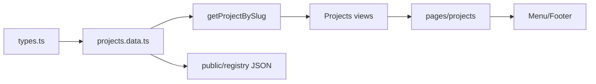

# Melega DEX Project Registry Core — Implementation Plan V1

**Status:** MVP implementation plan (pre-code)  
**Version:** 1.0  
**Date:** 2026-06-26  
**Source spec:** `MELEGA_DEX_PROJECT_REGISTRY_CORE_SPEC_V1.md`  
**Classification:** `SAFE_FRONTEND_ONLY` — static registry slice  
**Nature:** Incremental delivery plan — **not** implementation code

---

## Executive summary

This plan translates Project Registry Core into a **frontend-only, static-data MVP** that ships project identity pages without touching swap execution, contracts, wallets, or databases.

**MVP delivers:**

- `/projects` — browse static project index  
- `/projects/[slug]` — project detail page  
- Static `ProjectRecord` config + types  
- Project capability matrix (honest, mostly `observed` / `none`)  
- Project trust badges (no fake verification)  
- Per-project + index machine manifest JSON under `public/`  
- Deep links to legacy `/swap`, `/liquidity`, `/farms`, `/pools`  
- **MARCO / Melega DEX** as first canonical `melega-dex` project entry  

**Deferred:** API, database, founder submission, treasury write path, AI pipeline, Radar/Space live hooks.

---

## 1. MVP boundaries

### 1.1 In scope

| Area | MVP behavior |
|------|----------------|
| **Data** | TypeScript static config (`projects.ts` + JSON manifests) committed in repo |
| **Routes** | `/projects`, `/projects/[slug]` only |
| **Read model** | `ProjectRecord` subset aligned with spec §5 |
| **Capabilities** | Static matrix from seed + optional read-only chain ID lists (no live TVL/APR) |
| **Trust badges** | `listed`, `observed`, `legacy_import` only — **no `verified` badge in MVP** |
| **Machine surface** | Static JSON at `public/.well-known/` and `public/registry/projects/` |
| **Navigation** | Optional menu/footer link (“Projects”) — presentational |
| **i18n** | `en-US` strings in `translations.json` for new UI copy |
| **Styling** | KIRI dark shell; reuse WP2 `DexDisclaimer` patterns |

### 1.2 Explicitly out of scope

| Area | Reason |
|------|--------|
| Database / API routes | MVP constraint |
| Wallet connect / write / fees | MVP constraint |
| Founder create/edit flows | Phase 2 |
| AI verification workers | No fake verification |
| Live TVL, APR, volume, user counts | No fabricated metrics |
| Token Registry API integration | Static cross-refs only |
| Contract / router / farm config changes | Forbidden |
| Replacing token lists | Additive doctrine |
| `registry_status: verified` with checkmark | Requires pipeline — use `observed` + `legacy_import` for MARCO |
| Radar / Space / SmartDrop live webhooks | Stub links only |

### 1.3 Success criteria

- [ ] `/projects` renders from static config without runtime API  
- [ ] `/projects/melega-dex` shows MARCO multi-chain token refs from preservation map  
- [ ] Capability matrix shows only honest statuses (`live` only where statically known)  
- [ ] No `verified` checkmark unless `verification_status` is honestly `unverified`/`observed`  
- [ ] Machine JSON matches human page data (same UPI, slugs, refs)  
- [ ] Swap/farms/pools pages behave identically before/after  
- [ ] `git diff` shows zero forbidden files touched  

### 1.4 Phase label

All MVP records carry:

```json
{
  "phase": "legacy_import",
  "registry_status": "listed",
  "verification_status": "unverified",
  "endorsement_status": "none",
  "mvp_static": true
}
```

---

## 2. Files likely to be created

### 2.1 Config & types (isolated registry module)

```
apps/web/src/registry/projects/types.ts
apps/web/src/registry/projects/projects.data.ts
apps/web/src/registry/projects/index.ts
apps/web/src/registry/projects/getProjectBySlug.ts
apps/web/src/registry/projects/getAllProjects.ts
apps/web/src/registry/projects/capabilities.ts
apps/web/src/registry/projects/constants.ts
```

### 2.2 Views & components

```
apps/web/src/views/Projects/index.tsx
apps/web/src/views/Projects/ProjectDetail.tsx
apps/web/src/views/Projects/components/ProjectCard.tsx
apps/web/src/views/Projects/components/ProjectHero.tsx
apps/web/src/views/Projects/components/ProjectCapabilityMatrix.tsx
apps/web/src/views/Projects/components/ProjectTrustBadge.tsx
apps/web/src/views/Projects/components/ProjectTokenList.tsx
apps/web/src/views/Projects/components/ProjectResourceLinks.tsx
apps/web/src/views/Projects/components/ProjectDisclaimer.tsx
```

### 2.3 Pages (Next.js routes)

```
apps/web/src/pages/projects/index.tsx
apps/web/src/pages/projects/[slug].tsx
```

### 2.4 Static machine manifests

```
apps/web/public/registry/projects/index.json
apps/web/public/registry/projects/melega-dex.json
apps/web/public/.well-known/melega-dex-projects.json
```

### 2.5 Optional schema stub (documentation-facing)

```
apps/web/public/schemas/project/v1.schema.json
```

### 2.6 Tests (lightweight)

```
apps/web/src/registry/projects/__tests__/projects.data.test.ts
apps/web/src/registry/projects/__tests__/getProjectBySlug.test.ts
```

**Total new files:** ~22–24

---

## 3. Files likely to be modified

| File | Change | Risk |
|------|--------|------|
| `apps/web/src/components/Menu/config/config.ts` | Add optional **Projects** nav item → `/projects` | Low — href only |
| `packages/uikit/src/components/Footer/config.tsx` | Link “Project Registry” → `/projects` | Low |
| `apps/web/public/.well-known/melega-dex-manifest.json` | Add `projects_index` URL pointer | Low |
| `apps/web/src/config/localization/translations.json` | New UI strings (badges, disclaimers, page titles) | Low |
| `apps/web/next-seo.config.ts` or page-level `Meta` | SEO for `/projects/*` | Low |

**Do not modify** swap, farms, pools, wagmi, exchange, token lists, or hooks.

**Optional (nice-to-have, same sprint):**

- `apps/web/src/views/Home/components/QuickActionsRow.tsx` — add “Projects” chip  
- `apps/web/src/views/Home/components/CakeDataRow.tsx` — link to `/projects/melega-dex`  

---

## 4. Forbidden files

### 4.1 DO NOT MODIFY (MVP)

```
apps/web/src/config/constants/exchange.ts
apps/web/src/config/constants/contracts.ts
apps/web/src/views/Swap/SmartSwap/utils/exchange.ts
packages/smart-router/evm/constants/exchange.ts
packages/multicall/index.ts
packages/farms/src/const.ts
packages/farms/constants/**
apps/web/src/config/constants/pools.tsx
apps/web/src/config/constants/supportChains.ts
apps/web/src/config/constants/lists.ts
apps/web/src/config/constants/tokenLists/**
packages/tokens/src/**
packages/swap-sdk/src/constants.ts
apps/web/src/utils/wagmi.ts
```

### 4.2 DO NOT MODIFY (business logic)

```
apps/web/src/state/**
apps/web/src/views/Swap/**/hooks/**
apps/web/src/views/Farms/hooks/**
apps/web/src/views/Pools/hooks/**
apps/web/src/hooks/useSwap*
apps/web/src/config/abi/**
```

### 4.3 DO NOT MODIFY (swap/farm/pool views — except optional single link)

```
apps/web/src/views/Swap/index.tsx
apps/web/src/views/Swap/SmartSwap/**
apps/web/src/views/Farms/Farms.tsx
apps/web/src/views/Pools/index.tsx
apps/web/src/views/Pool/index.tsx
```

Registry deep links are **outbound from project pages only** — no inbound coupling into swap logic.

### 4.4 DO NOT CREATE in MVP

```
apps/web/src/pages/api/registry/**
prisma / migrations / docker DB services
on-chain ProjectRegistry.sol
```

---

## 5. Data model proposal

### 5.1 TypeScript types (`registry/projects/types.ts`)

Static MVP subset of spec `ProjectRecord`:

```typescript
export type ProjectRegistryStatus =
  | 'listed'
  | 'archived' // tombstone only in future

export type ProjectVerificationStatus =
  | 'unverified'
  | 'observed' // legacy_import / indexed, no pipeline

export type ProjectRiskTier =
  | 'unknown'
  | 'low'
  | 'medium'
  | 'high'
  | 'critical'

export type CapabilityStatus =
  | 'none'
  | 'partial'
  | 'live'
  | 'finished'
  | 'unverified'
  | 'scheduled'
  | 'clear'
  | 'watch'

export interface TokenRef {
  chainId: number
  address: string
  symbol: string
  /** token://56/0x... */
  ref: string
}

export interface ProjectCapabilities {
  tradable: { status: CapabilityStatus; notes?: string }
  liquidity: { status: CapabilityStatus; notes?: string }
  farm: { status: CapabilityStatus; notes?: string }
  pool: { status: CapabilityStatus; notes?: string }
  lock: { status: CapabilityStatus; notes?: string }
  vesting: { status: CapabilityStatus; notes?: string }
  launch: { status: CapabilityStatus; notes?: string }
  smartdrop: { status: CapabilityStatus; notes?: string }
  radar: { status: CapabilityStatus; notes?: string }
  space: { status: CapabilityStatus; notes?: string }
  labs: { status: CapabilityStatus; notes?: string }
  aiReport: { status: CapabilityStatus; notes?: string }
  machineManifest: { status: CapabilityStatus; notes?: string }
  treasuryCompatible: { status: CapabilityStatus; notes?: string }
}

export interface StaticProjectRecord {
  upi: string
  slug: string
  displayName: string
  tagline?: string
  description: string
  registryStatus: ProjectRegistryStatus
  phase: 'legacy_import' | 'registered'
  verificationStatus: ProjectVerificationStatus
  endorsementStatus: 'none'
  riskTier: ProjectRiskTier
  legacyImport: boolean
  mvpStatic: true
  sectorTags: string[]
  supportedChains: number[]
  websiteUrl?: string
  docsUrl?: string
  spaceProfileUrl?: string
  socialLinks?: { type: string; url: string }[]
  resources: {
    tokens: TokenRef[]
    liquidityPools: string[] // lp:// refs, optional empty
    farms: string[] // farm:// refs, optional empty
    stakingPools: string[]
  }
  capabilities: ProjectCapabilities
  primaryTokenRefs: string[]
  deepLinks: {
    swap?: string
    liquidity?: string
    farms?: string
    pools?: string
    buyMarco?: string
  }
  disclaimer: string
  asOf: string // ISO date — static snapshot date, not live
}
```

### 5.2 Validation (build-time)

- `slug` unique across `projects.data.ts`
- `upi` matches `upi://melega/project/{slug}@1`
- Token addresses lowercase checksummed in seed file (copy from preservation map verbatim)
- `capabilities.*.status` — disallow `live` for liquidity/farm/pool unless `notes` explains static source
- No numeric TVL/APR fields in MVP schema (intentional omission)

### 5.3 Sync rule

`projects.data.ts` is **source of truth** for UI.  
Build script or manual step copies to `public/registry/projects/*.json` (document in README snippet inside plan — optional `scripts/sync-project-manifests.ts` in later sprint).

---

## 6. Static seed data proposal

### 6.1 Canonical entry: `melega-dex`

| Field | Value |
|-------|-------|
| `slug` | `melega-dex` |
| `upi` | `upi://melega/project/melega-dex@1` |
| `displayName` | `Melega DEX` |
| `tagline` | `AI-native liquidity surface of Melega AI \| KIRI Civilization` |
| `registryStatus` | `listed` |
| `phase` | `legacy_import` |
| `verificationStatus` | `observed` |
| `riskTier` | `low` |
| `legacyImport` | `true` |
| `sectorTags` | `['Infrastructure', 'DeFi']` |

**Token refs (from `CONTRACT_PRESERVATION_MAP.md` — display only, no config import):**

| Chain | chainId | MARCO address |
|-------|---------|---------------|
| BSC | 56 | `0x963556de0eb8138E97A85F0A86eE0acD159D210b` |
| Ethereum | 1 | `0x5911Dc98a9E1A4FfFD802C3A57cdA6bbd26Cdb76` |
| Polygon | 137 | `0xD3e28c74177B812d1543A406aD1A97ee3C398AC2` |
| Base | 8453 | `0x56e46bE7714550A4Cb7bD0863BaB2680c099d8d7` |

**Capabilities (honest static):**

| Capability | Status | Notes |
|------------|--------|-------|
| tradable | `live` | MARCO on legacy default lists |
| liquidity | `live` | `/liquidity` available platform-wide |
| farm | `live` | `/farms` — legacy configs |
| pool | `live` | `/pools` — MARCO vaults |
| lock | `none` | Not indexed in MVP |
| treasuryCompatible | `partial` | Fees not live in static MVP |
| machineManifest | `live` | JSON published |
| radar / space / smartdrop / labs / aiReport | `none` | Links stubbed or omitted |

**Deep links:**

```typescript
deepLinks: {
  swap: '/swap',
  liquidity: '/liquidity',
  farms: '/farms',
  pools: '/pools',
  buyMarco: '/swap?outputCurrency=0x963556de0eb8138E97A85F0A86eE0acD159D210b',
}
```

### 6.2 Optional second seed (minimal)

| slug | Purpose |
|------|---------|
| `marco-token` | MARCO as asset-focused project view (optional; may merge into `melega-dex` to avoid duplication) |

**Recommendation:** Ship **one** seed project (`melega-dex`) in Sprint 1 to reduce impersonation surface. Add more only after Project Verifier pipeline exists.

### 6.3 Provisional pattern (documented, not seeded)

Template for future imports — **do not seed scam placeholders:**

```
upi://melega/project/unregistered-{chainId}-{prefix}@0
```

---

## 7. Project page routing proposal

### 7.1 Routes

| Route | Page file | View | Rendering |
|-------|-----------|------|-----------|
| `/projects` | `pages/projects/index.tsx` | `views/Projects/index.tsx` | SSG — `getStaticProps` reads project list |
| `/projects/[slug]` | `pages/projects/[slug].tsx` | `views/Projects/ProjectDetail.tsx` | SSG — `getStaticPaths` from slugs + `getStaticProps` |

### 7.2 Path generation

```typescript
// getStaticPaths
{ paths: [{ params: { slug: 'melega-dex' } }], fallback: false }
```

`fallback: false` for MVP — unknown slug → 404 (use existing `NotFound`).

### 7.3 Layout

- Wrap with existing `Page` / `Layout` from `apps/web/src/views/Page.tsx` or `components/Layout/Page`
- `removePadding` false; KIRI dark background consistent with WP2

### 7.4 SEO

| Route | Title |
|-------|-------|
| `/projects` | `Projects \| Melega DEX` |
| `/projects/melega-dex` | `Melega DEX \| Project Registry` |

`robots`: index allowed — public discovery surface.

### 7.5 Middleware

No changes to `middleware.ts` matcher required. Routes inherit default geo/auth behavior.

### 7.6 Future alias (document only)

`dex.melega.ai/projects/{slug}` → same component host at cutover.

---

## 8. Machine manifest proposal

### 8.1 Index manifest

**Path:** `public/registry/projects/index.json`

```json
{
  "manifest": "manifest://melega/platform/project-registry@0.1.0",
  "api_version": "0.1.0",
  "phase": "mvp_static",
  "constitution": "MELEGA_DEX_CONSTITUTION_V1",
  "schema": "https://melega.finance/schemas/project/v1",
  "projects": [
    {
      "upi": "upi://melega/project/melega-dex@1",
      "slug": "melega-dex",
      "manifest_url": "/registry/projects/melega-dex.json"
    }
  ],
  "disclaimer": "Listed ≠ audited. MVP static registry — not live verification.",
  "data_source": "project-registry-static",
  "as_of": "2026-06-26"
}
```

### 8.2 Per-project manifest

**Path:** `public/registry/projects/melega-dex.json`

- Mirror `StaticProjectRecord` JSON field names (camelCase or snake_case — pick snake_case for machine JSON to match spec examples)
- Include `capabilities` object
- Include `resources.tokens[]` with `token://` refs
- **Exclude** fabricated metrics

### 8.3 Well-known discovery

**Path:** `public/.well-known/melega-dex-projects.json`

```json
{
  "name": "Melega DEX Project Registry",
  "version": "0.1.0",
  "status": "mvp_static",
  "index": "/registry/projects/index.json",
  "documentation": "https://github.com/meleganza/MelegaSwapV2/blob/main/docs/MELEGA_DEX_PROJECT_REGISTRY_CORE_SPEC_V1.md"
}
```

**Update** `melega-dex-manifest.json` to add:

```json
"project_registry": "/.well-known/melega-dex-projects.json"
```

### 8.4 Consistency check (CI-friendly)

Unit test: `projects.data.ts` serializes identically to `public/registry/projects/melega-dex.json` (modulo formatting).

---

## 9. UI components proposal

### 9.1 Component tree

```
ProjectsPage
├── ProjectDisclaimer (global)
├── ProjectSearchBar (client filter — slug/name only, no AI)
└── ProjectCard[]

ProjectDetailPage
├── ProjectDisclaimer
├── ProjectHero
│   ├── logo / displayName / tagline
│   ├── ProjectTrustBadge
│   └── UPI copy field
├── ProjectTokenList (multi-chain)
├── ProjectCapabilityMatrix
├── ProjectResourceLinks (deep links)
└── Machine manifest download link
```

### 9.2 `ProjectTrustBadge`

MVP allowed badges only:

| Badge key | Shown when | Label |
|-----------|------------|-------|
| `listed` | `registryStatus === 'listed'` | Listed |
| `observed` | `verificationStatus === 'observed'` | Observed |
| `legacy` | `legacyImport === true` | Legacy import |

**Never render** `verified` checkmark in MVP.

Tooltip: **“Listed ≠ audited. Observed = indexed legacy data, not automated verification.”**

### 9.3 `ProjectCapabilityMatrix`

- Grid 3–4 columns desktop; 2 columns mobile
- Each cell: label, status icon (`none` / `partial` / `live`), optional `notes` subtext
- No percentages, no APR, no TVL

### 9.4 `ProjectTokenList`

- Table: Chain | Symbol | Address (copy) | Explorer link (external)
- Link to `/swap?outputCurrency={address}` for BSC MARCO only in MVP (chain-aware expansion later)

### 9.5 `ProjectDisclaimer`

Reuse or extend `components/Dex/DexDisclaimer.tsx`:

> Listed ≠ audited. This profile is a static registry entry. Verification pipeline not active in this release.

### 9.6 Styling

- Reuse WP2 tokens: `#0a0a0f` bg, `rgba(255,255,255,0.12)` borders, `#31d0aa` accents
- Min 44px touch on links
- Icon + text on badges (D87)

---

## 10. Safety constraints

| ID | Constraint |
|----|------------|
| C1 | **No fake verification** — only `observed` / `unverified` badges |
| C2 | **No fake TVL/APR/volume/users** — omit metrics entirely in MVP |
| C3 | **No endorsement copy** — no “Trusted”, “Official”, “Safe”, “Audited” |
| C4 | **No wallet writes** — no submit, no fee pay, no connect requirement |
| C5 | **No contract changes** |
| C6 | **Registry isolated** under `apps/web/src/registry/` — no imports from registry into swap hooks |
| C7 | **Additive routes** — existing routes unchanged |
| C8 | **MARCO addresses** copied from preservation map only — no edits to `packages/tokens` |
| C9 | **Single canonical project** in MVP seed to avoid false authority on third-party tokens |
| C10 | **Machine JSON = human UI** — same claims, same disclaimer |
| C11 | **Static `as_of` date** visible on every page |
| C12 | **404 for unknown slugs** — no dynamic guess / address routing |

---

## 11. Test checklist

### 11.1 Manual QA

- [ ] `/projects` loads without wallet connected  
- [ ] `/projects/melega-dex` shows MARCO addresses for 4 chains  
- [ ] Unknown `/projects/foo` → 404  
- [ ] “Buy MARCO” / swap deep link opens `/swap` with correct BSC output currency  
- [ ] Farms/pools/liquidity links navigate correctly  
- [ ] No checkmark “verified” badge anywhere  
- [ ] Disclaimer visible on list + detail  
- [ ] Mobile layout: cards stack; matrix readable  
- [ ] Download `/registry/projects/melega-dex.json` returns valid JSON  
- [ ] `/.well-known/melega-dex-projects.json` resolves  
- [ ] `/swap`, `/farms`, `/pools` regression smoke test unchanged  

### 11.2 Automated (unit)

- [ ] `getProjectBySlug('melega-dex')` returns record  
- [ ] `getProjectBySlug('invalid')` returns undefined  
- [ ] All slugs unique  
- [ ] All `token://` refs match `chainId` + `address`  
- [ ] `capabilities` has no empty `live` without notes  
- [ ] JSON manifest matches data module (snapshot test)  

### 11.3 Forbidden diff check

```bash
git diff --name-only | rg -i 'exchange\.ts|contracts\.ts|farms/constants|pools\.tsx|tokenLists|wagmi\.ts|packages/tokens'
# expect: no matches
```

### 11.4 Build

```bash
yarn workspace web build
```

---

## 12. Sprint breakdown

### Sprint 0 — Prep (0.5 day)

| Task | Output |
|------|--------|
| Review spec + this plan | Sign-off |
| Freeze seed addresses from `CONTRACT_PRESERVATION_MAP.md` | Address table in PR description |
| Agree slug: `melega-dex` only | Scope lock |

### Sprint 1 — Data layer (1–2 days)

| Task | Files |
|------|-------|
| Types + constants | `registry/projects/types.ts`, `constants.ts` |
| Seed `melega-dex` | `projects.data.ts` |
| Getters + capability helper | `getProjectBySlug.ts`, `getAllProjects.ts`, `capabilities.ts` |
| Unit tests | `__tests__/*` |

**Exit:** Data module complete; tests green.

### Sprint 2 — Machine manifests (0.5 day)

| Task | Files |
|------|-------|
| Generate `index.json`, `melega-dex.json` | `public/registry/projects/` |
| Well-known pointer | `melega-dex-projects.json`, update `melega-dex-manifest.json` |
| Snapshot test JSON ↔ TS | test file |

**Exit:** Agents can fetch static manifests.

### Sprint 3 — UI components (2 days)

| Task | Files |
|------|-------|
| Trust badge, disclaimer, capability matrix | `views/Projects/components/*` |
| Project card, hero, token list, links | components |
| List + detail views | `views/Projects/index.tsx`, `ProjectDetail.tsx` |

**Exit:** Storybook-less review in dev via temp route or completed pages.

### Sprint 4 — Routing & integration (1 day)

| Task | Files |
|------|-------|
| Next.js pages SSG | `pages/projects/*` |
| Nav/footer links | `config.ts`, footer |
| i18n strings | `translations.json` |
| SEO meta | page headers |

**Exit:** `/projects` live in dev; nav reachable.

### Sprint 5 — QA & hardening (1 day)

| Task | Output |
|------|--------|
| Manual checklist §11 | Signed QA |
| Build + lint | Clean |
| Forbidden file audit | Documented |
| PR description + screenshots | Review ready |

**Exit:** MVP ready for merge to feature branch (not production API).

### Total estimate

**5–6 engineering days** for one developer, assuming WP2 shell already merged.

### Post-MVP backlog (not this plan)

| Item | Spec ref |
|------|----------|
| Founder submit flow | §7 |
| Token Registry UPI bind API | PR-WP5 |
| Treasury fee SKU | §14 |
| AI Project Verifier | §9 |
| Radar webhooks | §15.3 |
| `dex.melega.ai` host | §15.2 |

---

## Appendix A — Dependency graph (MVP)



---

## Appendix B — Risk register

| Risk | Mitigation |
|------|------------|
| Impersonation projects seeded | Only `melega-dex` in MVP |
| Users confuse `observed` with `verified` | Tooltip + no checkmark |
| Drift TS vs JSON | Snapshot test |
| Scope creep into Token Registry API | This plan forbids API routes |
| Accidental swap hook import | ESLint path rule optional: `registry/**` cannot import `state/**` |

---

## Document lineage

| Version | Date | Change |
|---------|------|--------|
| 1.0 | 2026-06-26 | Initial MVP implementation plan |

**Source:** `MELEGA_DEX_PROJECT_REGISTRY_CORE_SPEC_V1.md`

---

### Closing reminder

**The Project Registry is the canonical identity layer of Melega DEX. Tokens are assets of projects, not the identity of the project itself.**

This MVP proves the **routing, UI, and machine surface** without risking legacy swap execution.

---

*Melega DEX Project Registry Core Implementation Plan V1 — safe static MVP delivery.*
