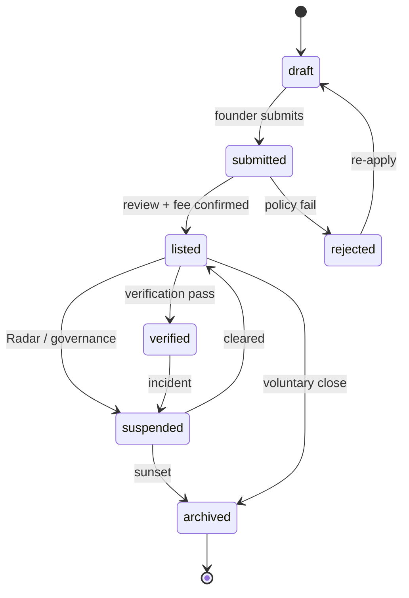

# Melega DEX Project Registry Core — Specification V1

**Status:** Ratified organ specification (core)  
**Version:** 1.0  
**Date:** 2026-06-26  
**Organ:** 06 — Project Registry (Core)  
**Strategic priority:** Identity root of Melega DEX — project-first, not token-first  
**Parent documents:** `MELEGA_DEX_CONSTITUTION_V1.md`, `MELEGA_DEX_SYSTEM_MAP_V1.md`, `MELEGA_DEX_ENTITY_MODEL_V1.md`, `MELEGA_DEX_AI_PROTOCOL_V1.md`, `MELEGA_DEX_TOKEN_REGISTRY_SPEC_V1.md`  
**Nature:** Core organ specification — **not** implementation code

> **System Map alignment:** Project Registry is **Organ 06** in `MELEGA_DEX_SYSTEM_MAP_V1.md`. It is the **canonical identity root** of the platform: every other registry organ attaches resources to a Project (UPI).

---

## 1. Purpose

The **Project Registry Core** is the foundational identity organ of Melega DEX — the place where economic actors (teams, protocols, products, institutions) become **legible, linkable, and machine-readable** inside Melega AI and Kiri Civilization.

It exists to:

- Assign and govern **Universal Project Identity (UPI)** — stable IDs that outlive any single contract
- Aggregate **linked resources** (tokens, pools, farms, locks, campaigns, reports, treasury events) under one project graph
- Power **human project pages** and **agent discovery** from a single `ProjectRecord`
- Coordinate **Radar**, **Space**, **SmartDrop**, **Labs**, and **Treasury Runtime** around project context — not address sprawl
- Bridge **MelegaSwapV2 legacy** into a project-first future without breaking live liquidity or swap paths
- Prepare **dex.melega.ai** and civilization surfaces for agent-first economics

The Project Registry is a **registry and coordination layer**, not an endorsement engine. **Listed ≠ audited. Verified ≠ safe.**

---

## 2. Why project-first instead of token-first

### 2.1 The failure mode of token-first DEXes

| Token-first pattern | Consequence |
|---------------------|-------------|
| Identity = contract address | Multi-chain teams fragment into unrelated rows |
| Search by ticker | Impersonation and scam clones thrive |
| Reputation on token | Lost on redeploy or bridge mint |
| Campaigns bind to address | SmartDrop and Space cannot follow the team |
| Agents index by `0x…` | No graph for reasoning; hallucination risk |
| Treasury fees per tx | No project-level economic memory |

### 2.2 Project-first correction

| Project-first pattern | Benefit |
|-----------------------|---------|
| Identity = UPI | One slug, many chains, one history |
| Tokens are **assets of** the project | Clear “real vs clone” narrative |
| Reputation on UPI | Survives contract upgrades |
| All organs link to `project_upi` | Farms, locks, campaigns share context |
| Agents resolve UPI → resource graph | Structured reasoning per AI Protocol |
| Treasury events attribute to UPI | Civilization-visible fee and participation history |

### 2.3 Strategic rule (non-negotiable)

**Melega DEX is project-first, not token-first.**

- Token Registry (Organ 05) **requires** UPI for new listings.
- Swap UI may still show symbols for UX — but **profile, trust, and discovery** anchor on Project.
- If Project Registry and Token Registry disagree, **Project Registry UPI linkage** wins for identity; **on-chain** wins for settlement.

---

## 3. Universal Project Identity

### 3.1 Definition

**Universal Project Identity (UPI)** is the civilization-scoped, stable identifier for a Project in Melega DEX.

```
upi://melega/{namespace}/{slug}@{version}
```

| Component | Rule |
|-----------|------|
| `namespace` | `project` (default), `institution`, `ecosystem` (governance-gated) |
| `slug` | Lowercase kebab-case; globally unique per namespace |
| `version` | Monotonic integer; breaking metadata or governance merge increments |

**Examples:**

- `upi://melega/project/acme-protocol@3`
- `upi://melega/project/melega-dex@1`
- `upi://melega/institution/example-fund@1`

### 3.2 Aliases and provisional UPI

| Type | Format | Use |
|------|--------|-----|
| **Canonical UPI** | Assigned at registration or governance | All new resources |
| **Alias** | `upi_aliases[]` on record | Renames, mergers |
| **Provisional** | `upi://melega/project/unregistered-{chainId}-{prefix}@0` | Legacy import only; `legacy_import: true` |

### 3.3 UPI invariants

1. One canonical UPI per real-world project; merges produce new UPI with `merged_from[]` lineage.
2. No Token Registry listing (post-MVP policy) without resolvable `project_upi`.
3. Treasury project-scoped fees **must** include `project_upi`.
4. AI agents **must** use UPI in reports — not ticker alone.
5. Kiri Governance may `suspend` UPI; it cannot silently reassign treasury history.

### 3.4 Public resolution

| Input | Output |
|-------|--------|
| UPI slug | `ProjectRecord` |
| Token `token://` | Parent `project_upi` (if linked) |
| Space profile ID | Bound UPI |
| Founder wallet | `founder://` → linked projects |

---

## 4. Project lifecycle states

### 4.1 `registry_status` (visibility)



| Status | Public browse | Agent API | Resource linking |
|--------|---------------|-----------|------------------|
| `draft` | No | Owner only | Draft resources allowed |
| `submitted` | No | Owner only | Pending |
| `listed` | Yes | Yes | Active |
| `verified` | Yes | Yes | Active + verified badge |
| `rejected` | No | Tombstone | Blocked |
| `suspended` | Hidden / tombstone | Yes with warnings | Read-only link |
| `archived` | Tombstone | Tombstone | Frozen |

### 4.2 `phase` (maturity)

| Phase | Meaning |
|-------|---------|
| `legacy_import` | Bootstrapped from MelegaSwapV2; provisional metadata |
| `registered` | Founder-registered; self-service complete |
| `verified` | Automated + policy verification complete |
| `governed` | Kiri Governance attestation or institutional tier |

### 4.3 Orthogonal axes

- `risk_tier` — project rollup (max of linked token tiers unless policy override)
- `reputation_profile_ref` — long-horizon trust synthesis
- `space_binding_status` — `unbound`, `pending`, `bound`
- `manifest_version` — machine manifest semver

---

## 5. Project canonical fields

### 5.1 Identity

| Field | Required | Description |
|-------|----------|-------------|
| `upi` | Yes | Canonical UPI string |
| `slug` | Yes | URL segment |
| `display_name` | Yes | Human name |
| `tagline` | Optional | ≤ 120 chars |
| `description` | Yes | 50–2000 chars; neutral tone |
| `logo_uri` | Recommended | Project-level logo (distinct from token logos) |
| `banner_uri` | Optional | Premium / future |

### 5.2 Classification

| Field | Description |
|-------|-------------|
| `sector_tags` | Controlled vocabulary (DeFi, Gaming, Infrastructure, …) |
| `supported_chains` | Derived from linked resources |
| `primary_language` | ISO 639-1 for default copy |
| `jurisdiction_disclosure` | Optional; not legal advice |

### 5.3 People and links

| Field | Description |
|-------|-------------|
| `founder_refs` | `founder://melega/...` |
| `website_url` | HTTPS |
| `docs_url` | HTTPS |
| `space_profile_url` | Kiri Space |
| `social_links` | Typed URIs (twitter, telegram, …) |

### 5.4 Registry governance

| Field | Description |
|-------|-------------|
| `registry_status` | §4.1 |
| `phase` | §4.2 |
| `verification_status` | `unverified`, `pending`, `verified`, `failed`, `disputed` |
| `endorsement_status` | Always `none` unless external audit attestation |
| `risk_tier` | `unknown` … `critical` |
| `legacy_import` | Boolean |
| `created_at` / `updated_at` | ISO-8601 |
| `listed_at` / `verified_at` | ISO-8601 |

### 5.5 Economic pointers

| Field | Description |
|-------|-------------|
| `primary_token_refs` | Flagship tokens per chain |
| `treasury_summary_ref` | Aggregated fee totals (read-only) |
| `manifest_ref` | Latest project Machine Manifest URI |
| `reputation_profile_ref` | `reputation://melega/project/...` |

### 5.6 Observability envelope (all API responses)

```json
{
  "data_source": "project-registry",
  "as_of": "2026-06-26T12:00:00Z",
  "disclaimer": "Listed ≠ audited."
}
```

---

## 6. Linked resources

Projects do not **contain** liquidity on-chain — they **index and contextualize** linked resources. Attachment is explicit, auditable, reversible (except tombstoned history).

### 6.1 Tokens

| Aspect | Rule |
|--------|------|
| **Ref** | `token://{chainId}/{address}` |
| **Source organ** | Token Registry (05) |
| **Cardinality** | 0..n per project |
| **Attachment** | Token submission or founder link request |
| **Project field** | `resources.tokens[]` |

### 6.2 Liquidity pools

| Aspect | Rule |
|--------|------|
| **Ref** | `lp://{chainId}/{poolAddress}` |
| **Source** | Indexer + Liquidity Engine |
| **Cardinality** | 0..n |
| **Display** | Pairs list on project page; sourced depth only |

### 6.3 Farms

| Aspect | Rule |
|--------|------|
| **Ref** | `farm://{chainId}/{masterChef}/{pid}` |
| **Source** | Farm Factory (07) + legacy configs |
| **Cardinality** | 0..n |
| **Display** | Live / finished; APR only if sourced |

### 6.4 Pools (staking)

| Aspect | Rule |
|--------|------|
| **Ref** | `staking-pool://{chainId}/{contract}/{sousId}` |
| **Source** | Pool Factory (08) + legacy `pools.tsx` |
| **Cardinality** | 0..n |

### 6.5 Locks

| Aspect | Rule |
|--------|------|
| **Ref** | `lock://{chainId}/{locker}/{lockId}` |
| **Source** | Lock Center (09) |
| **Cardinality** | 0..n |
| **Trust** | `verified` only with on-chain proof |

### 6.6 Vesting schedules

| Aspect | Rule |
|--------|------|
| **Ref** | `vesting://{chainId}/{contract}/{scheduleId}` |
| **Source** | Lock / Vesting Center |
| **Cardinality** | 0..n |

### 6.7 SmartDrop campaigns

| Aspect | Rule |
|--------|------|
| **Ref** | `campaign://melega/{slug}@{version}` |
| **Source** | SmartDrop |
| **Cardinality** | 0..n active |
| **Display** | Active / scheduled / completed |

### 6.8 Radar signals

| Aspect | Rule |
|--------|------|
| **Ref** | `radar-signal://melega/{id}` |
| **Source** | Radar |
| **Cardinality** | 0..n |
| **Display** | Incident timeline; never hidden by project owner |

### 6.9 Space coverage

| Aspect | Rule |
|--------|------|
| **Ref** | Space profile ID + URL |
| **Binding** | Bidirectional when `space_binding_status: bound` |
| **Display** | Embed / link community surface |

### 6.10 Labs origin

| Aspect | Rule |
|--------|------|
| **Ref** | `labs-experiment://melega/{id}` |
| **Flag** | `labs_origin: true` on experimental projects |
| **Display** | “Labs experimental” banner; excluded from default discovery |

### 6.11 AI reports

| Aspect | Rule |
|--------|------|
| **Ref** | `ai-report://melega/{type}/{uuid}` |
| **Types** | Project verification, launch readiness, kiri brief |
| **Cardinality** | 0..n; latest surfaced |

### 6.12 Treasury events

| Aspect | Rule |
|--------|------|
| **Ref** | `treasury-event://melega/{journalId}/{seq}` |
| **Scope** | All project-scoped MARCO fees |
| **Display** | Founder dashboard + public aggregate |

### 6.13 Resource graph integrity

- **Link:** founder or organ webhook with `project_upi` + resource ref + actor + timestamp
- **Unlink:** soft unlink preserves history; tombstone on fraud
- **Conflicting claim:** two projects claim same token → dispute workflow; Radar + governance

---

## 7. Founder workflow

### 7.1 Create project

1. Connect wallet → **Create Project** (`/registry/projects/new`)
2. Choose slug (availability check) + display name + description
3. Upload project logo (optional)
4. Add links (website, docs, socials)
5. Pay **PROJECT_REGISTER_STANDARD** MARCO fee (if applicable)
6. Status → `submitted` → `listed`

### 7.2 Link resources

From project dashboard:

| Action | Flow |
|--------|------|
| Add token | Deep link to Token Registry submit with `project_upi` pre-filled |
| Claim legacy token | Prove wallet control → attach to UPI |
| Request farm/pool display | Read-only index from chain; no fake creation in MVP |
| Register lock | Link Lock Center verified lock |
| Bind Space | OAuth / signature handshake with Space |
| Start campaign | SmartDrop wizard (future) |

### 7.3 Maintain project

- Edit metadata → triggers re-verification if material change
- View Radar incidents → respond (no delete)
- Download Machine Manifest
- Fee history (treasury)
- Completeness score (profile quality, not trust)

### 7.4 Success criteria (founder)

**“My project is fully integrated”** when:

- UPI listed and verified (per policy)
- ≥1 token linked and registry-listed
- Space bound (recommended)
- Primary liquidity visible (sourced) or explicit “no liquidity yet”
- Capability matrix shows honest next steps

---

## 8. Trader workflow

### 8.1 Discovery

- Browse `/registry/projects`
- Search by name, slug, token symbol (resolves to parent project)
- Filter: chain, sector, verification, risk tier

### 8.2 Project page consumption

1. Land on **Project hero** — name, tagline, UPI, badges
2. Scan **linked tokens** — chain tabs; contract copy
3. Review **risk + trust** — project tier + per-token drill-down
4. Inspect **capabilities** — liquidity, farms, locks (§12)
5. Read **AI Summary** — labeled AI-generated
6. Act — swap / add liquidity / farm (deep links; legacy paths preserved)

### 8.3 Warnings

- Project `suspended` → tombstone page; tokens show critical warnings
- Token `suspicious` under project → project banner, not hidden
- **Listed ≠ audited** persistent footer

---

## 9. AI agent workflow

### 9.1 Discovery

```
manifest → GET /api/public/dex/projects
        → schema: project/v1
```

### 9.2 Resolution

```
Input: ticker | address | slug | upi
  → resolve to upi
  → fetch ProjectRecord + resource index
  → fetch risk + reputation + latest ai-report
  → emit structured response with verified_facts[] / inferences[]
```

### 9.3 Roles (AI Protocol)

| Role | Project Registry use |
|------|----------------------|
| Project Verifier | Metadata consistency, link integrity |
| Reputation Analyst | `reputation_profile_ref` |
| Launch Assistant | Pre-launch checklist vs project graph |
| Token Risk Analyst | Roll up token tiers to project |
| Kiri Surface Reporter | Civilization briefs by UPI |
| Treasury Fee Interpreter | Project fee history explanation |

### 9.4 Agent constraints

- Never equate `listed` with endorsement
- Never output trust score without `methodology_version`
- On ambiguous ticker → return disambiguation list with UPIs

---

## 10. Machine-readable project profile

### 10.1 `ProjectRecord` (canonical)

```json
{
  "$schema": "https://melega.finance/schemas/project/v1",
  "upi": "upi://melega/project/acme-protocol@3",
  "slug": "acme-protocol",
  "display_name": "Acme Protocol",
  "description": "Neutral project summary.",
  "registry_status": "listed",
  "phase": "registered",
  "verification_status": "verified",
  "endorsement_status": "none",
  "risk_tier": "medium",
  "legacy_import": false,
  "founder_refs": ["founder://melega/jane-doe@1"],
  "space_profile_url": "https://space.melega.ai/acme",
  "space_binding_status": "bound",
  "resources": {
    "tokens": ["token://56/0xabc..."],
    "liquidity_pools": ["lp://56/0xpair..."],
    "farms": ["farm://56/0x41D5.../42"],
    "staking_pools": [],
    "locks": ["lock://56/0xlock/1"],
    "vesting_schedules": [],
    "campaigns": [],
    "radar_signals": []
  },
  "capabilities": {
    "tradable": { "status": "partial", "notes": "Token on legacy list" },
    "liquidity": { "status": "live", "pool_count": 2 },
    "farm": { "status": "live", "farm_count": 1 },
    "treasury_compatible": { "status": "live" }
  },
  "primary_token_refs": ["token://56/0xabc..."],
  "reputation_profile_ref": "reputation://melega/project/acme-protocol@1",
  "manifest_ref": "manifest://melega/project/acme-protocol@1.0.0",
  "treasury_summary": {
    "total_fees_marco": "1000000000000000000000",
    "data_source": "treasury-runtime",
    "as_of": "2026-06-26T12:00:00Z"
  },
  "disclaimer": "Listed ≠ audited.",
  "data_source": "project-registry",
  "as_of": "2026-06-26T12:00:00Z"
}
```

### 10.2 Project Machine Manifest

Per-project fragment at `manifest://melega/project/{slug}@{semver}`:

- UPI, schema version, resource ref list, capability snapshot, constitution version, phase

### 10.3 Events (webhooks)

| Event | Payload |
|-------|---------|
| `registry.project.listed` | `upi`, `founder_ref` |
| `registry.project.verified` | `upi`, `verification_status` |
| `registry.project.resource_linked` | `upi`, `resource_ref`, `type` |
| `registry.project.suspended` | `upi`, `reason_code` |
| `registry.project.tier_changed` | `upi`, `risk_tier` |

---

## 11. Human-readable project page

### 11.1 Route

`/registry/projects/{slug}` (and future `dex.melega.ai/projects/{slug}`)

### 11.2 Layout

| Zone | Content |
|------|---------|
| **Hero** | Logo, name, tagline, UPI copy, trust badges |
| **Summary** | Description, sector tags, chains |
| **Tokens** | Multi-chain table; link to token profiles |
| **Liquidity & DeFi** | Pools, farms, staking pools (sourced) |
| **Trust & locks** | Lock cards, vesting timeline |
| **Campaigns** | SmartDrop active / past |
| **Radar** | Incident timeline (if any) |
| **AI** | Summary + expand report |
| **Space** | Community embed / link |
| **Treasury** | Public fee aggregate (not PII) |
| **Footer** | Listed ≠ audited; manifest download |

### 11.3 States

| State | UX |
|-------|-----|
| Draft | Owner-only preview URL |
| Suspended | Tombstone + reason code |
| Archived | Historical read-only |
| Labs origin | Experimental banner |

---

## 12. Capability Matrix at project level

Aggregated from linked resources — **honest status only**.

| Capability | Project-level meaning | Status values |
|------------|----------------------|---------------|
| **Tradable** | Any linked token swap-eligible | `none`, `partial`, `live` |
| **Liquidity** | ≥1 LP with sourced depth | `none`, `low`, `live` |
| **Farm** | ≥1 active farm | `none`, `finished`, `live` |
| **Pool** | ≥1 staking pool / vault | `none`, `live` |
| **Lock** | ≥1 verified lock | `none`, `unverified`, `verified` |
| **Vesting** | Disclosed schedules | `none`, `partial`, `complete` |
| **Launch** | ILO / launch events | `none`, `planned`, `live`, `completed` |
| **SmartDrop** | Campaigns | `none`, `scheduled`, `active` |
| **Radar** | Monitoring | `clear`, `watch`, `incident` |
| **Space** | Community | `unbound`, `bound` |
| **Labs** | Experimental origin | `no`, `yes` |
| **AI Report** | Latest analysis | `none`, `available`, `stale` |
| **Machine Manifest** | Published | `none`, `published` |
| **Treasury compatible** | Fee SKUs active | `none`, `live` |

**UI:** Grid with ✓ / ○ / — / clock; tooltip cites source organ and `as_of`.

---

## 13. Risk and trust badges

### 13.1 Project-level badges

| Badge | Meaning | Does NOT mean |
|-------|---------|---------------|
| **Registry listed** | Project record public | Audited, safe |
| **Registry verified** | Automated project checks passed | Team KYC, endorsement |
| **Governed** | Kiri Governance attestation tier | Investment approval |
| **Observed** | Legacy import / partial | Recommended |
| **Suspicious** | Radar or dispute | Guilty — means “review” |
| **Suspended** | Policy or governance hold | — |
| **Labs experimental** | Originated in Labs | Production-ready |

### 13.2 Risk tier (project)

- Default: **max** linked token `risk_tier`
- Override: governance documented in `risk_override_ref`
- Display: chip + dimension breakdown link

### 13.3 Reputation (orthogonal)

- `trust_score` from Reputation Profile — **synthesis**, not verification
- Copy: “Reputation is informational; not an endorsement.”

### 13.4 D87 rules

- Icon + text on every badge
- No “Trusted” or “Official” without audit attestation SKU
- `endorsement_status: none` in all automated flows

---

## 14. Treasury accounting hooks

### 14.1 Project-scoped fee SKUs

| SKU | Trigger |
|-----|---------|
| `PROJECT_REGISTER_STANDARD` | Project registration |
| `PROJECT_VERIFY_REFRESH` | Re-verification |
| `PROJECT_PREMIUM_PROFILE` | Premium tier (future) |
| `TOKEN_LIST_STANDARD` | Token list (attributes to same UPI) |
| `LAUNCH_STANDARD` | Launch under project |
| `CAMPAIGN_BOOST` | SmartDrop promotion |

### 14.2 Treasury Event shape (project)

Every fee event includes:

```json
{
  "project_upi": "upi://melega/project/acme-protocol@3",
  "sku": "PROJECT_REGISTER_STANDARD",
  "amount_marco": "...",
  "payer_address": "0x...",
  "tx_hash": "0x...",
  "trigger_entity_ref": "upi://melega/project/acme-protocol@3"
}
```

### 14.3 Public aggregates

- `treasury_summary` on `ProjectRecord` — totals only, no payer PII
- Founder dashboard — full receipt list
- Reconciliation: Treasury Runtime is source of truth; registry caches read model

---

## 15. Integration boundaries

### 15.1 MelegaSwapV2 legacy

| Boundary | Rule |
|----------|------|
| **Swap / router** | Unchanged; no project registry in swap critical path |
| **Farms / pools configs** | Read-only index → link to UPI via import job |
| **Token lists** | Legacy lists remain; Token Registry links to UPI |
| **Import** | `legacy_import: true`, provisional UPI, no retroactive fees |
| **NFT / ILO** | Existing routes; launch linked to UPI when founder claims |

**Principle:** Additive overlay — legacy works if Project Registry offline.

### 15.2 dex.melega.ai future surface

| Integration | Direction |
|-------------|-----------|
| Project pages | Canonical host for `/projects/{slug}` |
| Agent landing | Manifest discovery root |
| Institutional view | Read-only project packs |
| SSO / wallet | Same UPI resolution as MelegaSwapV2 web |

### 15.3 Radar

| Direction | Data |
|-----------|------|
| Registry → Radar | `listed`, `suspended`, `tier_changed` events |
| Radar → Registry | `radar_signals[]` on project; can force `suspended` |
| UX | Incidents visible on project page; founders cannot delete |

### 15.4 Space

| Direction | Data |
|-----------|------|
| Bind | `space_profile_url` + `space_binding_status` |
| Space → Registry | Profile slug sync |
| UX | Community tab; founder bind wizard |

### 15.5 SmartDrop

| Direction | Data |
|-----------|------|
| Campaigns | `campaign://` refs under UPI |
| Eligibility | Predicates use `project_upi` + token refs |
| Treasury | Campaign fees → project attribution |

### 15.6 Labs

| Direction | Data |
|-----------|------|
| Experiments | `labs_origin: true`; separate discovery index |
| Promotion | Labs → production requires governance gate |
| AI | Experimental scores never auto-promote to production tier |

### 15.7 Treasury Runtime

| Direction | Data |
|-----------|------|
| Fees | All project SKUs → journal |
| Read | `treasury_summary` cache |
| Rule | No off-ledger project fees |

### 15.8 Kiri Governance

| Direction | Data |
|-----------|------|
| Suspend / archive | Governance vote → `registry_status` |
| Merge UPI | `merged_from[]`, alias map |
| Phase promotion | `registered` → `governed` |
| Rule | Governance cannot erase treasury history |

---

## 16. MVP scope

| ID | Deliverable |
|----|-------------|
| PR-1 | UPI assignment + slug uniqueness |
| PR-2 | `ProjectRecord` schema + public read API |
| PR-3 | Founder create/edit project flow |
| PR-4 | Link Token Registry tokens to UPI (required on token submit) |
| PR-5 | Human project page (read) |
| PR-6 | Legacy import job — ecosystem tokens → `melega-dex` UPI + provisionals |
| PR-7 | Project-level capability matrix (read-only from indexers) |
| PR-8 | Radar event hooks (`listed`, `suspended`) |
| PR-9 | `PROJECT_REGISTER_STANDARD` treasury integration |
| PR-10 | Machine manifest stub per project |

### MVP exit criteria

- [ ] Founder can create project and link ≥1 token
- [ ] Public API returns `ProjectRecord` with `resources.tokens[]`
- [ ] Project page live with Listed ≠ audited
- [ ] Legacy swap/farms unchanged
- [ ] Agents can resolve `token://` → `project_upi`
- [ ] No endorsement automation

---

## 17. Out of scope for MVP

| Item | Reason |
|------|--------|
| Project merge / split governance UI | Kiri Governance Phase 2+ |
| Full Space embed | Bind URL only |
| SmartDrop campaign creation | SmartDrop organ |
| Farm / pool **creation** via registry | Farm/Pool Factory organs |
| On-chain registry contract | Off-chain index MVP |
| KYC / institutional attestation | External providers |
| Premium profile billing | Product Phase 2 |
| dex.melega.ai production cutover | Infrastructure |
| Reputation score computation | Reputation Engine Phase 2 |
| Blocking swap by project status | Policy / router scope |

---

## 18. Safety rules

| # | Rule |
|---|------|
| S1 | **No automatic endorsement** — listing ≠ audit ≠ safe |
| S2 | **No fake verification** — badges require pipeline audit trail |
| S3 | **No trusted styling without verified** — checkmark = automated checks only |
| S4 | **No fabricated metrics** — TVL, APR, volume, users omitted if unsourced |
| S5 | **Radar incidents cannot be hidden** by project owners |
| S6 | **Two projects cannot silently share one token** — dispute workflow |
| S7 | **Provisional UPI cannot claim verified** without full registration |
| S8 | **Labs scores never production-default** |
| S9 | **Governance suspension is immediate on critical Radar signal** (policy-tunable) |
| S10 | **PII not in public ProjectRecord** |

---

## 19. Implementation work packages

| WP | Name | Owner | Depends | Week |
|----|------|-------|---------|------|
| **PR-WP1** | Schema + OpenAPI | Architecture | Entity Model | 1–2 |
| **PR-WP2** | Registry store + UPI service | Backend | PR-WP1 | 2–4 |
| **PR-WP3** | Public read API | Backend | PR-WP2 | 4 |
| **PR-WP4** | Founder write API + auth | Backend | PR-WP2, Treasury | 4–6 |
| **PR-WP5** | Token Registry UPI integration | Backend | PR-WP2, Token Registry | 5–6 |
| **PR-WP6** | Legacy import | Backend | PR-WP2 | 6 |
| **PR-WP7** | Project page UI | Frontend | PR-WP3 | 6–8 |
| **PR-WP8** | Founder dashboard UI | Frontend | PR-WP4 | 7–8 |
| **PR-WP9** | Capability indexer | Indexer | PR-WP3 | 7–9 |
| **PR-WP10** | Radar webhooks | Platform | PR-WP3 | 8 |
| **PR-WP11** | Treasury SKU + receipts | Treasury | PR-WP4 | 5–7 |
| **PR-WP12** | Project manifest generator | Platform | PR-WP3 | 9 |
| **PR-WP13** | AI Project Verifier worker | AI | PR-WP4 | 8–10 |
| **PR-WP14** | Observability + audit log | DevOps | PR-WP2+ | ongoing |

**Critical path:** PR-WP1 → PR-WP2 → PR-WP5 (Token link) → PR-WP7 (page)

---

## 20. Final doctrine

### Product laws

1. **Project is identity; token is asset.**
2. **UPI is stable across chains and contracts.**
3. **Resources link explicitly; nothing is implied.**
4. **Trust is labeled, never marketed.**
5. **Treasury remembers projects, not just addresses.**
6. **Humans and agents read the same ProjectRecord.**
7. **Legacy keeps working; civilization adds memory on top.**

### Relationship to Token Registry

Token Registry (Organ 05) is the **first implementation organ** for asset-level metadata.  
Project Registry Core (Organ 06) is the **identity root** those assets attach to.  
Neither replaces the other — **Project without token is valid; token without project is temporary (legacy only).**

---

### Closing statement

**The Project Registry is the canonical identity layer of Melega DEX. Tokens are assets of projects, not the identity of the project itself.**

---

## Document lineage

| Version | Date | Change |
|---------|------|--------|
| 1.0 | 2026-06-26 | Initial Project Registry Core specification |

**Related:** `MELEGA_DEX_ENTITY_MODEL_V1.md` (§4.1 Project), `MELEGA_DEX_TOKEN_REGISTRY_SPEC_V1.md`, `MELEGA_DEX_TOKEN_REGISTRY_PRODUCT_V1.md`, `MELEGA_DEX_SYSTEM_MAP_V1.md` (Organ 06)

---

*Melega DEX Project Registry Core V1 — the project-first identity organ of the AI-native economic layer.*
