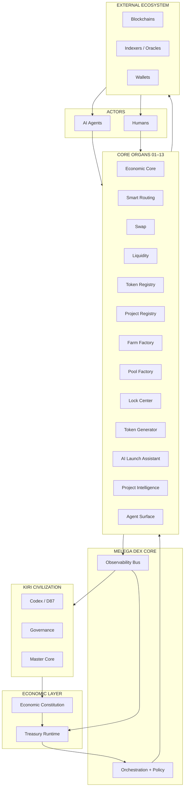
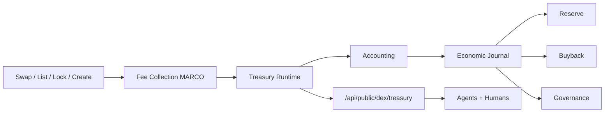
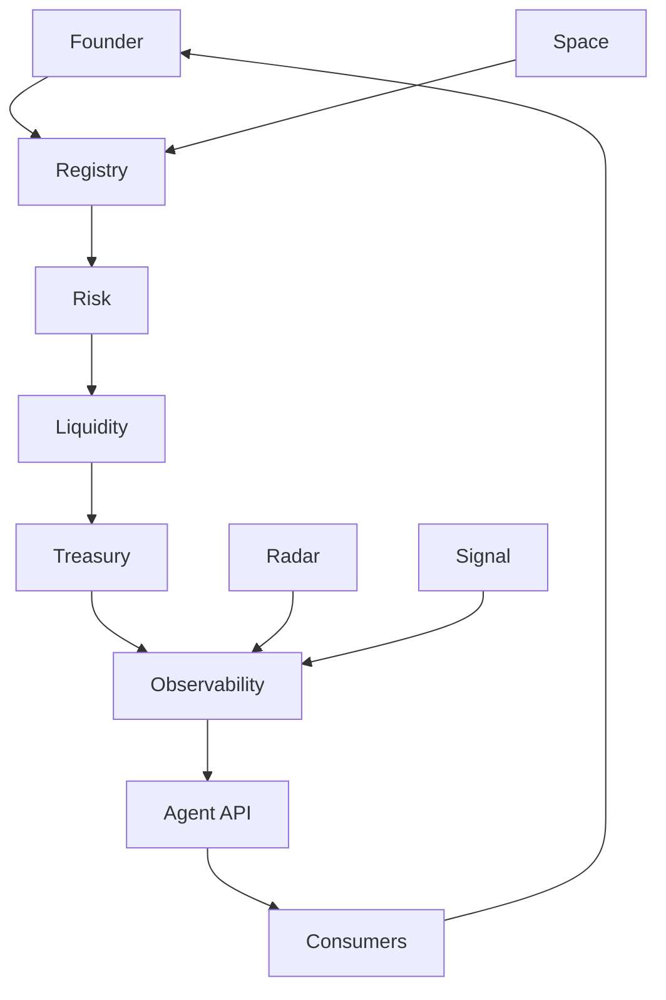
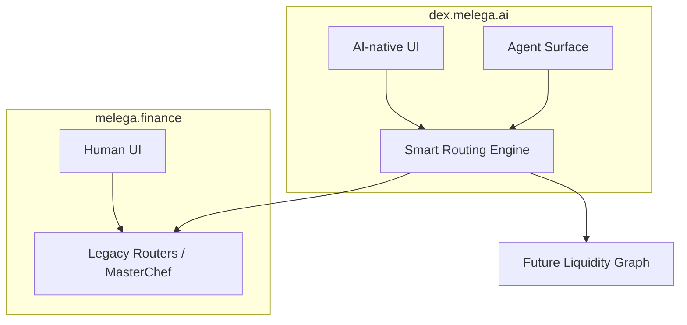
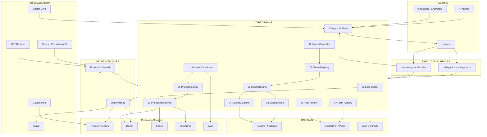

# Melega DEX System Map — V1

**Status:** Ratified architecture topology  
**Version:** 1.0  
**Date:** 2026-06-26  
**Parent doctrine:** `docs/MELEGA_DEX_CONSTITUTION_V1.md`  
**Nature:** Architectural map — not an implementation specification

Melega DEX is **one organ** of KIRI CIVILIZATION. This document defines its complete topology: what it connects to, what it contains, how value and information flow, and where trust boundaries lie.

---

## SECTION 1 — SYSTEM PURPOSE

**Melega DEX is the decentralized economic execution layer of Melega AI and Kiri Civilization.**

It is the surface where economic intent becomes on-chain action — and where every action is recorded, explained, and accounted for in the civilization's treasury loop.

Swap is **one capability**, not the definition of the system. Melega DEX also coordinates:

| Capability class | Examples |
|------------------|----------|
| **Execution** | Swap, add/remove liquidity, farm stake, pool stake, lock, vest |
| **Discovery** | Token registry, project registry, route graphs, manifests |
| **Launch** | Token generation, ILO/launch campaigns, AI launch assistant |
| **Intelligence** | Risk tiers, trust scores, Radar alerts, project summaries |
| **Coordination** | Fee collection in $MARCO, treasury attribution, SmartDrop hooks |
| **Machine access** | Agent API, well-known discovery, quote/route endpoints |

Humans interact through web clients. Agents interact through machine surfaces. Both consume the **same economic truth** — on-chain state, indexed reality, and treasury journals — never divergent marketing layers.

---

## SECTION 2 — GLOBAL TOPOLOGY

### 2.1 Textual topology

Civilization sits above economics. Economics sits above execution. Execution sits above organs. Organs serve ecosystem participants through machine and human interfaces.

```
KIRI CIVILIZATION
        │
        │  culture, governance context, Codex, Master Core policy
        ▼
ECONOMIC CONSTITUTION  (MELEGA_DEX_CONSTITUTION_V1 + D87)
        │
        │  invariants, phase model, migration law, fee doctrine
        ▼
TREASURY RUNTIME
        │
        │  fee ingestion, accounting, journal, reserve, buyback, governance allocation
        ▼
MELEGA DEX CORE
        │
        │  orchestration, manifests, policy enforcement, observability bus
        ▼
CORE ORGANS  (01–13)
        │
        │  swap, liquidity, routing, registries, factories, locks, launch, intelligence, agent surface
        ▼
EXTERNAL ECOSYSTEM
        │
        │  chains, wallets, indexers, oracles, partner protocols, institutions
        ▼
AI AGENTS  (MELEGA AI, KIRI operators, integrators, institutional bots)
        │
        │  quote, verify, execute (bounded), report
        ▼
HUMANS  (founders, traders, LPs, institutions, enterprises)
        │
        │  browse, sign, govern, audit
        ▼
ECONOMIC OUTCOMES  (settlement, fees, reputation, treasury entries)
```

**Downward flow:** policy → execution constraints → organ behavior → on-chain effects.  
**Upward flow:** chain events → indexers → observability → Radar/Signal → treasury journal → governance.

### 2.2 Mermaid — global topology



---

## SECTION 3 — CORE ORGANS

Each organ: **Responsibilities · Inputs · Outputs · Dependencies**

---

### Organ 01 — Economic Core

| Field | Definition |
|-------|------------|
| **Responsibilities** | Central coordination of fee SKUs, MARCO denomination, phase gates, manifest versioning, and cross-organ policy enforcement. Maintains the economic truth graph linking registries to live on-chain state. |
| **Inputs** | Constitution rules, Treasury Runtime receipts, organ events, governance parameters, chain configs (read-only legacy map) |
| **Outputs** | Fee schedules, economic events, organ health status, phase compliance signals |
| **Dependencies** | Treasury Runtime, Constitution, Observability bus, all other organs (orchestration only — no duplicate execution) |

---

### Organ 02 — Smart Routing Engine

| Field | Definition |
|-------|------------|
| **Responsibilities** | Compute best routes across legacy Melega pairs, stable pools, and future liquidity graphs. Expose quotes with path, impact, and contract calldata hints. Never invent routes. |
| **Inputs** | Pair reserves, factory maps, token registry, pool topology, fee schedule, slippage policy |
| **Outputs** | `RoutePlan`, `Quote`, `priceImpact`, `contracts[]`, `data_source`, `as_of` |
| **Dependencies** | Swap Engine (execution target), Token Registry, Liquidity Engine, Economic Core, Agent Surface |

---

### Organ 03 — Swap Engine

| Field | Definition |
|-------|------------|
| **Responsibilities** | Execute token swaps via verified routers (legacy V2, smart router, future routers). Apply platform fee hooks. Surface simulation results before signature. |
| **Inputs** | `RoutePlan`, wallet address, slippage tolerance, chainId |
| **Outputs** | Transaction payload, receipt, swap fee event → Treasury |
| **Dependencies** | Immutable router contracts, Smart Routing Engine, Risk Engine (pre-trade warnings), Treasury Runtime |

---

### Organ 04 — Liquidity Engine

| Field | Definition |
|-------|------------|
| **Responsibilities** | Add/remove liquidity, import pools, zap flows. Track LP positions and pair creation against factory init-code rules. |
| **Inputs** | Token pair, amounts, factory/router addresses, wallet |
| **Outputs** | LP tokens minted/burned, liquidity events, depth updates for routing graph |
| **Dependencies** | Swap Engine (shared router layer), Token Registry, Lock Center (post-LP lock flows), Smart Routing Engine |

---

### Organ 05 — Token Registry

| Field | Definition |
|-------|------------|
| **Responsibilities** | Canonical token records: address, chain, decimals, metadata, listing status, risk tier, logo verification state, fee payment proof. |
| **Inputs** | Listing applications, on-chain token contracts, logo uploads, listing fees (MARCO) |
| **Outputs** | `TokenRecord`, manifest entries, search index for humans/agents |
| **Dependencies** | Economic Core (fees), Risk Engine, Treasury Runtime, Project Registry (optional link) |

---

### Organ 06 — Project Registry

| Field | Definition |
|-------|------------|
| **Responsibilities** | Stable `project_id` entities linking teams, tokens, campaigns, Space profiles, and reputation. Machine manifest per project. |
| **Inputs** | Founder applications, listing fees, Space bindings, Radar incidents |
| **Outputs** | `ProjectRecord`, Project AI Page source data, agent discovery entries |
| **Dependencies** | Token Registry, Project Intelligence, AI Launch Assistant, Treasury Runtime |

---

### Organ 07 — Farm Factory

| Field | Definition |
|-------|------------|
| **Responsibilities** | Register and lifecycle-manage farm programs (MasterChef pids, reward tokens, schedules). Detect stale/inactive farms. |
| **Inputs** | Farm creation requests, MARCO fees, LP token addresses, reward parameters |
| **Outputs** | `FarmRecord`, live farm status, stale flags |
| **Dependencies** | Liquidity Engine (LP tokens), Economic Core, Token Registry, Agent Surface, legacy `packages/farms` configs (Phase 1) |

---

### Organ 08 — Pool Factory

| Field | Definition |
|-------|------------|
| **Responsibilities** | Register sousChef pools, vaults, and staking programs. Align with live pool configs without silent removal. |
| **Inputs** | Pool creation requests, MARCO fees, staking/earning token pairs |
| **Outputs** | `PoolRecord`, APR metadata (sourced, labeled), vault state pointers |
| **Dependencies** | Token Registry, Economic Core, Treasury Runtime, legacy `pools.tsx` configs (Phase 1) |

---

### Organ 09 — Lock Center

| Field | Definition |
|-------|------------|
| **Responsibilities** | Index, verify, and expose all lock types. No "locked" badge without on-chain proof. |

**Sub-domains:**

| Sub-domain | Purpose |
|------------|---------|
| **Liquidity Lock** | LP token locks in locker contracts |
| **Token Lock** | Generic ERC-20 locks |
| **Vesting** | Time-released schedules with cliff support |
| **Team Allocation** | Founder/team vesting attestations linked to project |
| **Advisor Allocation** | Advisor vesting schedules |
| **Investor Allocation** | Investor round vesting / lock attestations |

| Field | Definition |
|-------|------------|
| **Inputs** | Locker contract events, lock registration fees, project linkage |
| **Outputs** | `LockRecord{verified, unlock_at, amount, locker, beneficiary}`, trust signals to Project Intelligence |
| **Dependencies** | Token Registry, Project Registry, Risk Engine, Treasury Runtime |

---

### Organ 10 — Token Generator

| Field | Definition |
|-------|------------|
| **Responsibilities** | Deploy standard token templates; auto-register in Token Registry; collect generator fees. Template-only in early phases. |
| **Inputs** | Template selection, parameters, MARCO fee, wallet signature |
| **Outputs** | New contract address, `TokenRecord` draft, treasury receipt |
| **Dependencies** | Token Registry, Economic Core, Treasury Runtime, Risk Engine (post-deploy scan) |

---

### Organ 11 — AI Launch Assistant

| Field | Definition |
|-------|------------|
| **Responsibilities** | MELEGA AI advisory workflow: launch checklist, risk disclosure, fee estimate, manifest draft, campaign structure. **Non-custodial, non-executing** without wallet/agent signature. |
| **Inputs** | Project intent, token metadata, target chain, fee schedule |
| **Outputs** | Launch plan, disclosure pack, manifest draft → Project Registry / Space |
| **Dependencies** | Project Registry, Token Generator, Lock Center, Economic Core, Labs (experimental prompts) |

---

### Organ 12 — Project Intelligence

| Field | Definition |
|-------|------------|
| **Responsibilities** | Aggregate outward-facing and inward-facing intelligence per project. |

| Integration | Role |
|-------------|------|
| **Radar** | Anomaly alerts, incident timeline, stale farm detection |
| **Space** | Community surface, campaign presence |
| **SmartDrop** | Incentive eligibility tied to verified actions |
| **News** | Curated feeds with source attribution |
| **AI summaries** | MELEGA AI-generated briefs (labeled as AI-generated) |
| **Risk** | Risk Engine tier display |
| **Trust score** | Reputation Engine composite (non-blocking) |

| Field | Definition |
|-------|------------|
| **Inputs** | Registry records, Radar events, on-chain metrics, news feeds |
| **Outputs** | Project AI Page, intelligence API fragments, agent-readable `project_intelligence` block |
| **Dependencies** | Project Registry, Risk Engine, Reputation Engine, Radar, Space, SmartDrop |

---

### Organ 13 — Agent Surface

| Field | Definition |
|-------|------------|
| **Responsibilities** | Machine APIs, well-known manifests, discovery documents, OpenAPI specs, rate limits, audit logs. Primary interface for MELEGA AI and third-party agents. |
| **Inputs** | All organ read models, Economic Core fee schedules, constitution version |
| **Outputs** | HTTP/JSON endpoints, `/.well-known/*` files, webhook hooks (future), signed manifest bundles |
| **Dependencies** | Every organ (read), Economic Core, Treasury Runtime (public aggregates), Observability bus |

---

## SECTION 4 — TREASURY INTEGRATION

Every fee-bearing action follows the same observable pipeline. No off-ledger platform revenue.

### 4.1 Fee flow (text)

```
User Action (swap, list, lock, farm create, …)
        │
        ▼
Fee Collection  ($MARCO or governed native fee switch)
        │
        ▼
Treasury Runtime  (ingestion endpoint / on-chain receiver)
        │
        ▼
Accounting  (SKU tag, chain, tx_hash, payer, amount)
        │
        ▼
Economic Journal  (append-only civilization ledger)
        │
        ├──► Reserve  (protocol reserve buckets)
        │
        ├──► Buyback  (governed MARCO buyback program)
        │
        └──► Governance  (allocatable surplus per vote)
```

### 4.2 Fee types → Treasury tags

| Action | Treasury tag | Observable fields |
|--------|--------------|-------------------|
| Swap platform fee | `treasury.swap` | `tx_hash`, `marco_amount`, `pair`, `route_id` |
| Token listing | `treasury.listing` | `token_address`, `chainId`, `payer` |
| Logo verification | `treasury.logo` | `logoURI`, `verification_id` |
| Farm creation | `treasury.farm` | `farm_id`, `pid`, `chainId` |
| Pool creation | `treasury.pool` | `pool_id`, `sousId` |
| LP lock | `treasury.lock.lp` | `lock_id`, `locker_contract` |
| Token lock / vesting | `treasury.lock.token` | `schedule_id`, `beneficiary` |
| Token generator | `treasury.generator` | `contract_address` |
| AI launch assistant | `treasury.launch.ai` | `campaign_id` |
| Premium project profile | `treasury.profile.premium` | `project_id`, `period` |

### 4.3 Mermaid — treasury flow



---

## SECTION 5 — AI WORKFLOWS

### 5.1 Founder workflow

```
Intent → AI Launch Assistant (advisory)
      → Token Generator OR import existing token
      → Token Registry listing (+ MARCO fee)
      → Project Registry (+ logo verification fee)
      → Liquidity Engine (create pair / add LP)
      → Lock Center (LP + team/advisor/investor schedules)
      → Farm Factory / Pool Factory (optional programs)
      → Space campaign + SmartDrop hook
      → Project Intelligence (live page)
      → Radar watch activated
```

### 5.2 Trader workflow

```
Intent → Agent Surface OR human UI
      → Risk Engine pre-check
      → Smart Routing Engine quote
      → Swap Engine execution
      → Treasury fee event
      → Optional: inspect locks, farms, pools, project intelligence
```

### 5.3 Autonomous Agent workflow

```
Trigger (signal, schedule, MELEGA AI plan)
      → Read /.well-known/melega-dex.json
      → Query /quote, /risk, /locks, /fees
      → Simulate route (no execution without policy envelope)
      → If within D87 bounds: submit tx OR recommend to human signer
      → Emit observability event → Radar → Economic Journal
```

### 5.4 Institution workflow

```
Onboard → institutional API key (scoped)
       → read-only: registry, risk, treasury aggregates, route depth
       → write (optional): execute via dedicated policy envelope
       → SLA observability stream
       → compliance export from Economic Journal
```

### 5.5 Enterprise workflow

```
Integrate → Agent Surface + Institutional APIs
         → white-label Project Intelligence embed
         → custom fee schedule (governance-approved)
         → Radar enterprise alert channel
         → treasury reporting API for internal ERP
         → no hidden endorsement; all badges sourced
```

---

## SECTION 6 — MACHINE SURFACES

| Endpoint | Purpose | Consumer | Auth | Output | Machine readability |
|----------|---------|----------|------|--------|---------------------|
| `/.well-known/melega-dex.json` | Primary discovery | Agents, wallets, indexers | None | Manifest v1 | JSON Schema linked |
| `/.well-known/kiri-dex-surface.json` | KIRI overlay (governance, Space, D87 version) | KIRI agents | None | Manifest v1 | JSON Schema linked |
| `GET /api/public/dex/manifest` | Full platform manifest | Integrators | None | `api_version`, organs, chains | OpenAPI + Schema |
| `GET /api/public/dex/routes` | Route enumeration | Agents, aggregators | None | `routes[]`, `as_of` | OpenAPI |
| `GET /api/public/dex/quote` | Best quote | Agents, traders, AI | None (public); higher rate with key | `Quote`, path, fees | OpenAPI |
| `GET /api/public/dex/tokens` | Token registry | Agents, UI, Radar | None | Paginated `TokenRecord` | OpenAPI |
| `GET /api/public/dex/projects` | Project registry | Agents, Space, institutions | None | `ProjectRecord` | OpenAPI |
| `GET /api/public/dex/farms` | Farm registry + status | Agents, farmers | None | `FarmRecord`, `stale` flags | OpenAPI |
| `GET /api/public/dex/pools` | Pool registry + status | Agents, stakers | None | `PoolRecord`, sourced APR | OpenAPI |
| `GET /api/public/dex/locks` | Lock index | Agents, auditors | None | `LockRecord`, `verified` | OpenAPI |
| `GET /api/public/dex/risk` | Risk tiers + signals | Agents, traders | None | `tier`, `signals[]` | OpenAPI |
| `GET /api/public/dex/treasury` | Public treasury aggregates | Governance, institutions | None | Totals by tag, `as_of` | OpenAPI |
| `GET /api/public/dex/fees` | Active fee schedule | Founders, agents | None | SKU → MARCO amount | OpenAPI |
| `POST /api/agent/v1/simulate` *(Phase 3)* | Tx simulation | MELEGA AI agents | API key + policy envelope | Calldata, gas, warnings | OpenAPI |
| `POST /api/agent/v1/execute` *(Phase 3)* | Bounded execution | Authorized agents | API key + envelope | tx_hash, journal_id | OpenAPI |
| `GET /api/institutional/v1/report` *(future)* | Compliance export | Enterprises | mTLS + key | Journal slice | CSV/JSON |

**Machine readability standard:** every response includes `api_version`, `as_of`, `data_source`, `disclaimer`.

---

## SECTION 7 — DATA FLOW

### 7.1 Primary information flow

```
Founder
   │  (application, fees, metadata)
   ▼
Registry  (Token + Project)
   │  (records, manifests)
   ▼
Risk  (tier, signals, warnings)
   │  (cleared or labeled)
   ▼
Liquidity  (pairs, depth, LP)
   │  (routing graph update)
   ▼
Treasury  (fee events, journal entries)
   │  (accounted outcomes)
   ▼
Observability  (logs, Radar, Signal)
   │  (civilization-visible state)
   ▼
Agent API  (public read models)
   │  (quotes, registry, risk, locks)
   ▼
Consumers  (humans, agents, institutions, governance)
```

### 7.2 Mermaid — data flow



---

## SECTION 8 — SECURITY BOUNDARIES

| Zone | Mutability | Trust level | Consumers may assume |
|------|------------|-------------|----------------------|
| **Immutable contracts** | On-chain, governance-gated upgrade only | **Highest** — source of settlement truth | Balances, locks, swaps executed |
| **Mutable frontend** | Deploy anytime | **Low** — presentation only | Nothing about safety or endorsement |
| **AI-generated content** | Regenerated | **Advisory** — labeled | Not audit, not financial advice |
| **Verified metadata** | Changes with fee + review | **Medium** — attestation not audit | Logo/listing paid, not scam-free |
| **Treasury data** | Append-only journal | **High** — civilization ledger | Fees paid, amounts, tags |
| **Machine manifests** | Versioned, signed (future) | **High** — API contract | Endpoint URLs, schemas, chain list |

**Trust boundaries:**

1. **UI never overrides chain.** If UI shows "safe" and Risk API shows `high_risk`, API wins.
2. **Listing ≠ endorsement.** Registry status is economic registration, not due diligence completion.
3. **AI summaries ≠ facts.** Project Intelligence must label AI-generated blocks.
4. **Manifests are contracts.** Breaking manifest schema requires `api_version` bump.
5. **Treasury journal is authoritative** for fee accounting; UI totals are views of journal + chain.

---

## SECTION 9 — LEGACY COMPATIBILITY

### 9.1 Dual-surface model

| Surface | URL | Role |
|---------|-----|------|
| **Legacy execution surface** | `melega.finance` | Phase 1 human UI over MelegaSwapV2 contracts (swap, LP, farms, pools, ILO, NFT) |
| **AI-native execution surface** | `dex.melega.ai` | Machine-first discovery, Agent API, registries, intelligence (Phase 2+) |

Both surfaces read the **same on-chain state**. Neither surface fabricates metrics the other cannot verify.

### 9.2 Smart Routing coexistence

```
Smart Routing Engine
        │
        ├──► Legacy Melega V2 pairs (BSC, ETH, Base, Polygon, …)
        ├──► Stable pools (where configured)
        └──► Future pools (governance-gated)
```

**No forced migration.** Users keep LP on legacy factories until they opt into a governed migration path.

### 9.3 Mermaid — legacy + native



---

## SECTION 10 — FUTURE EXTENSIONS

Architectural space reserved — **not in scope for Phase 1–2 implementation**. Each extension must pass D87 review and constitution amendment before production fees.

| Extension | Touches organs | Treasury note |
|-----------|----------------|---------------|
| **Lending** | Economic Core, new Lending Engine | Interest fees → journal |
| **Borrowing** | Lending Engine, Risk Engine | Collateral risk mandatory |
| **Perpetuals** | New Derivatives Engine, Risk | High-risk tier default |
| **Options** | Derivatives Engine | Governance-gated |
| **Prediction Markets** | New Markets Engine | No unverified odds |
| **RWA** | Registry + Compliance layer | Institutional API required |
| **Yield Marketplace** | Farm/Pool Factory aggregator | Sourced APR only |
| **Intent-based execution** | Smart Routing + Agent Surface | Solver competition, bounded |
| **Cross-chain settlement** | Routing + bridge adapters | No fake bridge TVL |
| **AI Portfolio Manager** | Agent Surface + MELEGA AI | Read-only default; execute bounded |
| **DAO tooling** | Governance hooks | Treasury allocation only |
| **Institutional APIs** | Agent Surface enterprise tier | mTLS, audit exports |

Reserved namespace: `Organ 14+` slots in manifests — unassigned until ratified.

---

## SECTION 11 — CIVILIZATION ALIGNMENT

Melega DEX **integrates with** civilization systems; it does **not duplicate** their mandates.

| Civilization system | Melega DEX interaction | Melega DEX does NOT |
|---------------------|------------------------|-------------------|
| **Treasury Runtime** | Receives all MARCO fees; reads allocation rules | Replace journal or reserves |
| **Radar** | Consumes alerts; publishes stale farm / incident hooks | Replace Radar scoring engine |
| **Space** | Project pages, campaigns, community links | Host full social graph |
| **SmartDrop** | Fee rebates, launch incentives on verified actions | Mint unbacked rewards |
| **Labs** | Experimental AI prompts, template trials | Set production fees without promotion |
| **Signal** | Ingests economic events for civilization feed | Replace Signal transport |
| **Master Core** | Receives policy envelopes for bounded agent execution | Override D87 globally |
| **Governance** | Proposes migrations, fee changes, new organs | Hold votes internally |
| **Codex** | References constitution + system map versions | Rewrite civilization law |

**Integration pattern:** Melega DEX emits **economic events** upward; civilization systems emit **policy and alerts** downward.

---

## SECTION 12 — FINAL DIAGRAM

Master architecture — all layers, organs, civilization systems, actors.



---

## SECTION 13 — DOCTRINE

**Every economic action performed through Melega DEX must be explainable, observable, machine-readable, treasury-accounted, and compatible with the constitutional principles of Kiri Civilization.**

---

## Document control

| Field | Value |
|-------|-------|
| Document ID | `MELEGA-DEX-SYSTEM-MAP-V1` |
| Parent | `MELEGA-DEX-CONSTITUTION-V1` |
| Supersedes | — |
| Next review | WP3 (Machine Manifest) kickoff |
