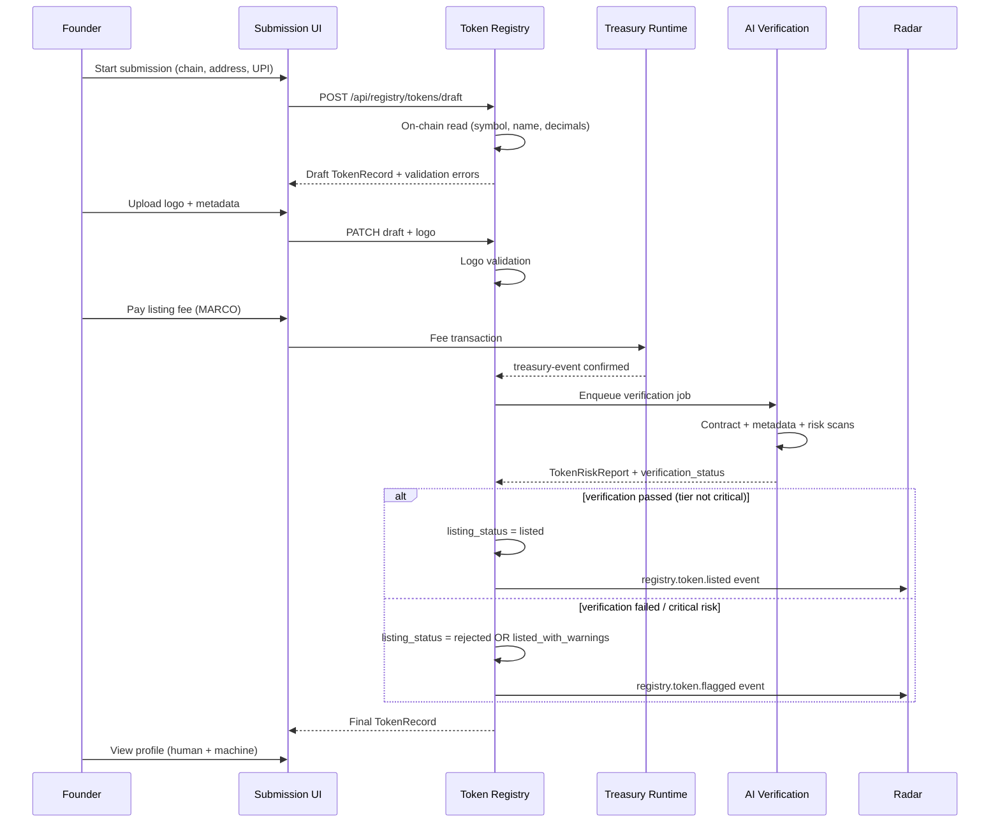
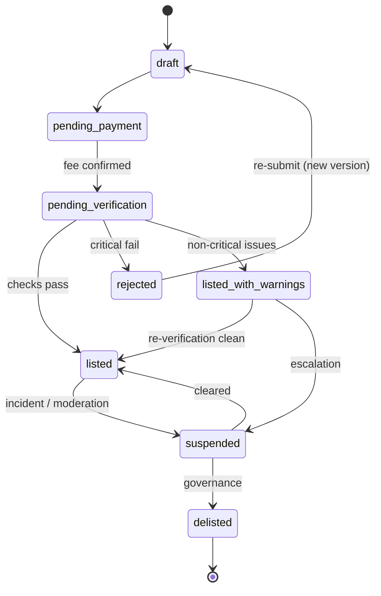

# Melega DEX Token Registry — Specification V1

**Status:** Ratified organ specification  
**Version:** 1.0  
**Date:** 2026-06-26  
**Organ:** 05 — Token Registry  
**Parent documents:** `MELEGA_DEX_CONSTITUTION_V1.md`, `MELEGA_DEX_SYSTEM_MAP_V1.md`, `MELEGA_DEX_ENTITY_MODEL_V1.md`, `MELEGA_DEX_AI_PROTOCOL_V1.md`  
**Nature:** Product and architecture specification — **not** implementation code

---

## 1. Purpose

The **Token Registry** is the first production **Melega DEX organ**: a canonical, AI-native index of fungible tokens across supported chains.

It exists to:

- Give founders **self-service** paths to submit tokens with metadata and logos
- Give humans and agents **machine-readable token profiles** with explicit risk and verification state
- Link every registry token to **Universal Project Identity (UPI)** where possible
- Feed **swap UI**, **Radar**, **Space**, **SmartDrop**, **Labs**, and **Treasury Runtime** from one economic truth layer
- Operate **additively** atop legacy MelegaSwapV2 token lists — never breaking existing swap behavior in MVP

The Token Registry is a **registry and intelligence surface**, not an endorsement engine. **Listed ≠ audited. Verified ≠ safe.**

---

## 2. Scope

### 2.1 In scope (V1)

| Capability | Description |
|------------|-------------|
| Self-service submission | Founder submits token + metadata + logo via web form or API |
| Metadata validation | Schema, length, URL, and on-chain field cross-checks |
| Logo upload & validation | Hosted logo with format/size/hash policy |
| AI verification | Automated checks + structured `TokenRiskReport` / verification flags |
| Risk classification | Tier assignment with sourced dimensions |
| UPI linking | Required for new submissions; optional for legacy import |
| Machine profiles | `TokenRecord` JSON for Agent API and manifests |
| Human UI | Registry browse, submission portal, token detail pages |
| MARCO fees | Listing fee SKU compatible with Treasury Runtime |
| Ecosystem hooks | Events and read models for Radar, Space, SmartDrop, Labs |
| Legacy coexistence | Overlay on existing default/extended token lists |

### 2.2 Out of scope (V1)

| Capability | Deferred to |
|------------|-------------|
| Contract deployment / token generation | Token Generator organ (Organ 10) |
| Replacing `@pancakeswap/tokens` or `tokenLists/**` as swap source of truth | Post-MVP migration phase |
| Automatic swap enablement for unlisted addresses | Governance + risk policy |
| KYC / team identity certification | External attestation providers |
| Subgraph rewrites | Separate indexer task |
| Smart contract changes | Forbidden in MVP |
| Blocking swaps at router level | Policy decision; MVP is warn/display only |

### 2.3 Supported chains (initial)

Per Constitution Phase 1–2 wallet surface: **BSC (56), Base (8453), Polygon (137), Ethereum (1)**.  
Chain expansion requires manifest update + fee SKU registration — not silent addition.

---

## 3. Relationship with Universal Project Identity

### 3.1 Doctrine

Per Entity Model V1, a **Token** is a **linked resource** of a **Project (UPI)**, not a standalone identity.

| Rule | MVP enforcement |
|------|-----------------|
| New submissions MUST include `project_upi` OR create a draft Project in the same flow | Submission blocked without UPI resolution path |
| Token canonical ID remains `token://{chainId}/{address}` | Unchanged |
| One Project may have many Tokens | Registry indexes `project_upi` on each `TokenRecord` |
| Legacy tokens without UPI get `provisional_upi` | `upi://melega/project/unregistered-{chainId}-{prefix}@0` + `legacy_import: true` |
| Reputation and campaigns aggregate at Project level | Token inherits project context in UI/API |

### 3.2 UPI resolution at submission

```
Founder starts submission
        │
        ├─► Existing Project? ──► link project_upi
        │
        └─► New Project? ──► create Project draft (slug, name, description)
                              └──► link token to new project_upi (version 0)
```

Project Registry (Organ 06) may be a separate service in MVP, but **Token Registry MUST store `project_upi`** and reject orphan new listings.

### 3.3 Display hierarchy

| Surface | Primary label | Secondary |
|---------|-----------------|-----------|
| Token profile | Symbol + name | Project display name (linked) |
| Swap selector | Symbol | Risk badge; project link on detail |
| Agent API | `token://` ref | `project_upi`, `risk_tier`, `verification_status` |

---

## 4. Token submission workflow

### 4.1 Actors

| Actor | Role |
|-------|------|
| **Founder** | Submits token, pays fee, attests accuracy |
| **Registry service** | Validates, persists, emits events |
| **AI verification pipeline** | Runs checks, produces reports |
| **Treasury Runtime** | Confirms MARCO fee payment |
| **Moderator** (optional MVP) | Handles disputes and `suspended` transitions |

### 4.2 End-to-end flow



### 4.3 Submission states (workflow)

| Step | `submission_status` | User-visible |
|------|----------------------|--------------|
| Draft created | `draft` | Continue editing |
| Awaiting payment | `pending_payment` | Pay MARCO fee |
| Payment confirmed | `pending_verification` | “Verification in progress” |
| AI + rules complete | `completed` | Listed / rejected / warnings |
| User cancelled | `cancelled` | — |

### 4.4 Idempotency

- One active submission per `token://{chainId}/{address}` at a time.
- Re-submission after `rejected` creates new submission version; history preserved.
- Fee payment tied to `submission_id`; non-refundable on rejection unless governance policy.

### 4.5 Wallet requirements

- Submitter MUST connect wallet on target chain (or sign message proving control).
- Optional: require `tx.from` or EIP-712 attestation matching Founder `wallet_addresses[]`.

---

## 5. Metadata fields

### 5.1 On-chain fields (read-only, sourced from RPC)

| Field | Source | Override allowed |
|-------|--------|------------------|
| `chain_id` | Submission input | No |
| `address` | Submission input | No |
| `symbol` | `ERC20.symbol()` | No — display on-chain value |
| `name` | `ERC20.name()` | No |
| `decimals` | `ERC20.decimals()` | No |
| `total_supply` | `ERC20.totalSupply()` | Display only; `as_of` required |

### 5.2 Submitter-provided fields

| Field | Required | Validation |
|-------|----------|------------|
| `project_upi` | Yes (new) | Must resolve to Project draft or existing |
| `short_description` | Yes | 20–280 chars; no guaranteed-return language |
| `website_url` | Recommended | HTTPS; reachable (HEAD check) |
| `docs_url` | Optional | HTTPS |
| `twitter_url` | Optional | Known domain allowlist |
| `telegram_url` | Optional | Known domain allowlist |
| `whitepaper_url` | Optional | HTTPS or IPFS gateway |
| `tags` | Optional | Max 5; from controlled vocabulary |
| `founder_contact_email` | Optional | Format only; not public in API |

### 5.3 Registry-managed fields

| Field | Set by | Description |
|-------|--------|-------------|
| `token_id` | Registry | `token://{chainId}/{address}` |
| `listing_status` | Registry + policy | See §15 |
| `risk_tier` | Risk engine + AI | See §8 |
| `verification_status` | AI pipeline | `unverified`, `pending`, `verified`, `failed`, `disputed` |
| `logo_uri` | Registry CDN | After logo validation |
| `logo_hash` | Registry | SHA-256 of normalized image |
| `fee_paid` | Treasury | Boolean + `treasury_event_ref` |
| `legacy_import` | Import job | Phase 1 list origin |
| `endorsement_status` | Always `none` | Unless external audit badge verified separately |
| `created_at` / `updated_at` | Registry | ISO-8601 |
| `data_source` | Always `token-registry` | Machine responses |

### 5.4 TokenRecord schema (machine profile)

```json
{
  "$schema": "https://melega.finance/schemas/token/v1",
  "token_id": "token://56/0x963556de0eb8138E97A85F0A86eE0acD159D210b",
  "chain_id": 56,
  "address": "0x963556de0eb8138E97A85F0A86eE0acD159D210b",
  "symbol": "MARCO",
  "name": "MARCO",
  "decimals": 18,
  "project_upi": "upi://melega/project/melega-dex@1",
  "listing_status": "listed",
  "risk_tier": "low",
  "verification_status": "verified",
  "endorsement_status": "none",
  "logo_uri": "https://cdn.melega.finance/tokens/56/0x9635.../logo.png",
  "logo_hash": "sha256:...",
  "metadata": {
    "short_description": "...",
    "website_url": "https://www.melega.finance"
  },
  "fee_paid": true,
  "treasury_event_ref": "treasury-event://melega/...",
  "legacy_import": false,
  "disclaimer": "Listed ≠ audited. Verification reflects automated checks only.",
  "data_source": "token-registry",
  "as_of": "2026-06-26T12:00:00Z"
}
```

---

## 6. Logo validation policy

### 6.1 Upload requirements

| Rule | Value |
|------|-------|
| Formats | PNG, WebP, SVG (SVG sanitized) |
| Max file size | 512 KB |
| Min dimensions | 64×64 px (raster) |
| Max dimensions | 512×512 px (server resizes) |
| Aspect ratio | 1:1 (square crop if needed) |
| Transparency | Allowed (PNG/WebP) |
| Animation | **Forbidden** (no GIF/APNG) |

### 6.2 Security checks

1. **Magic-byte validation** — reject mismatched MIME/extension.
2. **SVG sanitization** — strip scripts, external refs, `on*` handlers.
3. **Malware scan** — async pipeline hook (MVP: stub with manual quarantine path).
4. **Perceptual hash** — flag near-duplicates of known scam logos (Radar feed).
5. **Content policy** — reject explicit, hate, or impersonation imagery (manual review queue).

### 6.3 Storage

| Item | Policy |
|------|--------|
| CDN path | `tokens/{chainId}/{addressLower}/logo.{ext}` |
| Immutable version | Content-addressed by `logo_hash`; updates increment `logo_version` |
| Fallback | Generic chain placeholder if logo rejected or missing |

### 6.4 Logo vs verification

- **Logo approval** ≠ **token verification**.
- A token may be `listed` with `verification_status: unverified` and no logo.
- Swap UI uses legacy list logo if registry logo absent (additive merge rules, §12).

---

## 7. AI verification workflow

### 7.1 Principles (AI Protocol alignment)

| Rule | Application |
|------|-------------|
| R1 No fake data | Every check cites `evidence[]` with `data_source` + `as_of` |
| R2 No hidden endorsements | `endorsement_status: none` unless audit badge |
| R6 Verified vs inferred | `verified_checks[]` separate from `heuristics[]` |
| R7 Machine-readable output | Emit `risk-report://` artifact |

### 7.2 Verification pipeline stages

| Stage | Checks | Blocking? |
|-------|--------|-----------|
| **S1 — Contract existence** | Code at address; `ERC20` interface | Yes |
| **S2 — Explorer verification** | BscScan/Etherscan verified source (if available) | No — flags `unverified_source` |
| **S3 — Honeypot / tax heuristics** | Static analysis + simulation hooks | Yes if critical |
| **S4 — Holder concentration** | Top holders % (sourced indexer) | No — risk dimension |
| **S5 — Liquidity depth** | Pair existence + reserve threshold | No — warn if low |
| **S6 — Metadata consistency** | Name/symbol match site; phishing domain check | No — flags mismatch |
| **S7 — Logo similarity** | pHash vs scam database | No — manual queue |
| **S8 — Project linkage** | UPI exists; Space profile consistency (if bound) | No |

### 7.3 Outputs

| Artifact | Consumer |
|----------|----------|
| `TokenRiskReport` (`risk-report://melega/token/...`) | Registry, Swap UI, Agents |
| `AI Report` fragment (`ai-report://...`) | Founder dashboard (explanations) |
| Radar event | `token.verification.completed` |

### 7.4 `verification_status` mapping

| Status | Meaning | UI label |
|--------|---------|----------|
| `unverified` | Not yet processed or insufficient checks | “Not verified” |
| `pending` | Pipeline running | “Verification pending” |
| `verified` | S1 passed; no critical failures; tiers ≤ `high` with disclosure | “Registry verified” |
| `failed` | Critical check failed | “Verification failed” |
| `disputed` | Radar incident or manual challenge | “Under review” |

**Critical:** `verified` means **automated registry checks passed** — NOT “safe to invest”, NOT “audited”, NOT “official”.

### 7.5 Re-verification

- Scheduled refresh: 24h for new listings, 7d for established, immediate on Radar incident.
- Any tier change emits new `RiskReport` version; old report `superseded`.

### 7.6 Human review queue (MVP-lite)

- Tokens with `risk_tier: critical`, logo disputes, or metadata mismatch → moderator queue.
- Moderator may set `listing_status: suspended` — cannot set `endorsement_status`.

---

## 8. Risk classification

### 8.1 Risk tiers

| Tier | Definition | Default swap UI treatment |
|------|------------|---------------------------|
| `unknown` | Insufficient data | Warning banner; no “trusted” styling |
| `low` | Standard token; checks pass | Neutral display |
| `medium` | Elevated concentration, unverified source, or low liquidity | Yellow informational banner |
| `high` | Multiple risk signals | Strong warning; extra confirm step (UI only) |
| `critical` | Honeypot, malicious, or confirmed scam | `listing_status: suspended`; hidden from registry browse; swap via address still possible (legacy) |

### 8.2 Risk dimensions (scored)

| Dimension ID | Inputs | Weight (default) |
|--------------|--------|------------------|
| `contract_safety` | Honeypot, proxy, mintable | High |
| `liquidity_depth` | TVL in Melega pairs | Medium |
| `holder_concentration` | Top 10 holders % | Medium |
| `metadata_trust` | Domain age, mismatch flags | Low |
| `project_linkage` | UPI completeness, Space bind | Low |
| `incident_history` | Radar negative signals | High |

### 8.3 Tier computation

- **Rule engine** sets floor/ceiling (e.g. honeypot → `critical`).
- **AI Risk Analyst** proposes tier + `reasoning[]`; rule engine wins on conflict.
- APR, volume, and user counts **MUST NOT** influence tier.

### 8.4 Project-level rollup

- Project `risk_tier` = max(token tiers) for linked tokens unless governance override documented.
- Display both token tier and project context on detail pages.

---

## 9. Human UI requirements

### 9.1 Surfaces

| Surface | Route (proposed) | Purpose |
|---------|------------------|---------|
| Registry browse | `/registry/tokens` | Search/filter listed tokens |
| Token detail | `/registry/tokens/[chainId]/[address]` | Full profile + risk + UPI link |
| Submit token | `/registry/submit` | Self-service wizard |
| My submissions | `/registry/submissions` | Founder dashboard |
| Manage tokens modal | Swap UI overlay | “Registry sync: Phase 2” label (WP2 hint) |

### 9.2 Mandatory UI copy

- Global: **“Listed ≠ audited.”**
- Verification badge tooltip: **“Registry verified = automated checks only. Not investment advice.”**
- Risk banners: icon + text (D87 — not color alone).
- No “Trusted”, “Safe”, “Official”, or “Verified project” without explicit audit attestation SKU.

### 9.3 Submission wizard steps

1. Select chain + paste address → on-chain preview  
2. Link or create Project (UPI)  
3. Metadata form  
4. Logo upload  
5. Fee summary (MARCO) + wallet pay  
6. Verification status tracker  
7. Result: listed / rejected / warnings  

### 9.4 Accessibility & mobile

- Min 44px touch targets on submission actions.
- Token rows scroll horizontally on mobile; card layout alternative.
- Risk tier visible without hover-only tooltips.

---

## 10. Machine API requirements

### 10.1 Public read endpoints (MVP)

| Method | Path | Description |
|--------|------|-------------|
| `GET` | `/api/public/dex/tokens` | Paginated list; filters: `chain_id`, `listing_status`, `risk_tier`, `project_upi` |
| `GET` | `/api/public/dex/tokens/{chainId}/{address}` | Single `TokenRecord` |
| `GET` | `/api/public/dex/tokens/{chainId}/{address}/risk` | Latest `TokenRiskReport` |
| `GET` | `/api/public/dex/manifest` | Includes registry schema URLs |

### 10.2 Authenticated write endpoints (MVP)

| Method | Path | Auth | Description |
|--------|------|------|-------------|
| `POST` | `/api/registry/tokens/draft` | Wallet signature | Create draft |
| `PATCH` | `/api/registry/tokens/draft/{id}` | Owner | Update metadata/logo |
| `POST` | `/api/registry/tokens/draft/{id}/submit` | Owner + fee proof | Trigger verification |
| `GET` | `/api/registry/submissions` | Owner | List own submissions |

### 10.3 Response envelope (all endpoints)

```json
{
  "api_version": "1.0.0",
  "data": { },
  "as_of": "ISO-8601",
  "data_source": "token-registry",
  "disclaimer": "Listed ≠ audited."
}
```

### 10.4 Agent consumption

- Agents MUST use `token_id` URIs in downstream reports.
- `GET /api/public/dex/risk` may alias token risk for Radar consumers.
- Rate limits: public 60 req/min/IP; authenticated 300 req/min/key.

### 10.5 Webhooks / events (internal)

| Event | Subscribers |
|-------|-------------|
| `registry.token.draft_created` | Observability |
| `registry.token.listed` | Radar, Space, SmartDrop |
| `registry.token.tier_changed` | Radar, Swap UI cache |
| `registry.token.suspended` | Radar, Signal, governance |
| `registry.token.fee_paid` | Treasury Runtime |

---

## 11. Treasury fee events

### 11.1 Fee SKUs (MVP)

| SKU | Trigger | Payer | `project_upi` |
|-----|---------|-------|---------------|
| `TOKEN_LIST_STANDARD` | Submission complete | Founder wallet | Required |
| `TOKEN_LIST_RENEWAL` | Annual metadata refresh (future) | Founder | Required |
| `TOKEN_LIST_EXPEDITED` | Optional faster review queue (future) | Founder | Required |

### 11.2 MARCO compatibility

- Fees denominated in **$MARCO** on BSC primary; cross-chain fee payment via documented bridge policy (future) or BSC-only in MVP.
- Amount read from `GET /api/public/dex/fees` — never hardcoded in UI without cache TTL.
- Submission blocked until `treasury-event` with `sku: TOKEN_LIST_STANDARD` and `status: confirmed`.

### 11.3 Treasury Event shape

```json
{
  "treasury_event_id": "treasury-event://melega/journal-2026-06-26/0042",
  "event_type": "fee_ingestion",
  "sku": "TOKEN_LIST_STANDARD",
  "amount_marco": "1000000000000000000000",
  "payer_address": "0x...",
  "project_upi": "upi://melega/project/acme@1",
  "trigger_entity_ref": "token://56/0xabc...",
  "submission_id": "sub_...",
  "tx_hash": "0x...",
  "recorded_at": "2026-06-26T12:00:00Z"
}
```

### 11.4 Economic Brain integration

- Fee schedule changes require governance manifest bump.
- SmartDrop may reimburse listing fee via separate `subsidy` Treasury Event — never implicit.

---

## 12. Integration with existing token lists

### 12.1 Legacy sources (immutable in MVP)

```
apps/web/src/config/constants/lists.ts
apps/web/src/config/constants/tokenLists/**
packages/tokens/src/**
```

These remain **swap execution allowlists** for MVP. Token Registry does **not** remove or reorder them.

### 12.2 Merge strategy (additive overlay)

```
swapTokenDisplay = merge(
  legacyTokenList,     // priority: swap eligibility
  registryOverlay      // priority: metadata, logo, risk, UPI
)
```

| Field | Precedence |
|-------|------------|
| Swap selectable | Legacy list OR user custom import (existing behavior) |
| `symbol`, `name`, `decimals` | On-chain RPC > legacy JSON > registry |
| `logoURI` | Registry (if `logo_uri` present) > legacy > placeholder |
| `risk_tier`, `verification_status` | Registry only |
| `project_upi` | Registry only |

### 12.3 Registry-only tokens

- A token **listed in registry** but **not** in legacy lists: visible in registry browse and Agent API; **not** added to default swap search in MVP unless governance promotes to extended list.
- Founder messaging: “Registry listing does not automatically add token to default swap list.”

### 12.4 Import job (Phase 2 bootstrap)

- One-time import of legacy tokens → `TokenRecord` with `legacy_import: true`, `verification_status: unverified`, provisional UPI.
- No fee retroactive charge for import.

---

## 13. Swap UI display policy

### 13.1 Phase rollout

| Phase | Behavior |
|-------|----------|
| **MVP** | Registry data shown only when token already swap-eligible via legacy/import; overlay logo + risk badge |
| **MVP+1** | “Registry tokens” tab in token search (read-only browse) |
| **Phase 2+** | Governance-gated promotion from registry to extended list |

### 13.2 Display rules per token

| Condition | Swap selector |
|-----------|---------------|
| Legacy list token, no registry entry | Unchanged legacy display |
| Legacy + registry overlay | Registry logo/risk/UPI on detail drawer |
| Registry listed, not in legacy | Not in default search (MVP) |
| `risk_tier: critical` or `suspended` | If somehow selected via import: blocking warning modal before trade |
| `verification_status: unverified` | No checkmark; neutral icon |
| `verification_status: verified` | “Registry verified” badge — NOT “trusted” |

### 13.3 Token import by address

- Existing `/find` and custom token import flows **unchanged**.
- On import, registry lookup enriches UI if record exists; warns if `risk_tier >= high`.

### 13.4 MARCO and default tokens

- MARCO and core ecosystem tokens retain legacy list priority; registry enriches profiles.

---

## 14. Safety / anti-scam policy

### 14.1 Non-negotiable rules

| # | Rule |
|---|------|
| S1 | **No automatic endorsement** — listing never implies team verification |
| S2 | **No fake verification** — badges require pipeline completion + audit trail |
| S3 | **No trusted styling without verified** — `verification_status: verified` required for checkmark |
| S4 | **No fabricated metrics** — volume/TVL/holders must be sourced or omitted |
| S5 | **Impersonation defense** — symbol/name collision with major assets → `metadata_trust` flag + review |
| S6 | **Radar escalation** — community/incident reports can force `disputed` without submitter consent |
| S7 | **Phishing link rejection** — metadata URLs matching known phishing patterns blocked at submission |

### 14.2 Suspension and delisting

| Trigger | Action |
|---------|--------|
| Confirmed scam (Radar + moderator) | `listing_status: suspended`, tier `critical` |
| Fee fraud (chargeback/dispute) | `suspended` pending review |
| Repeated metadata violations | `rejected` + cooldown |
| Governance vote | `delisted` with tombstone record |

### 14.3 User protection copy

Swap confirm modal static disclaimer (existing WP2):  
**“Always verify token contract address. Listed ≠ audited.”**

### 14.4 Labs boundary

- Experimental scoring models run in **Labs** with `labs_experimental: true` flag — never promoted to production tier without review.

---

## 15. Lifecycle states

### 15.1 `listing_status` (registry visibility)



| Status | Public browse | Agent API | Swap default list |
|--------|---------------|-----------|-------------------|
| `draft` | No | No | No |
| `pending_payment` | No | No | No |
| `pending_verification` | No | No | No |
| `listed` | Yes | Yes | No (MVP) |
| `listed_with_warnings` | Yes (banner) | Yes | No (MVP) |
| `rejected` | No | Tombstone | No |
| `suspended` | Hidden | Yes (with warnings) | No |
| `delisted` | Tombstone only | Tombstone | No |

### 15.2 Orthogonal axes

- `verification_status` — pipeline outcome (§7.4)  
- `risk_tier` — ongoing classification (§8)  
- `legacy_import` — bootstrap flag  

All three MUST be exposed in API; UI MUST NOT collapse into a single “status” icon.

---

## 16. MVP implementation plan

### 16.1 Work packages

| WP | Deliverable | Depends on | Est. phase |
|----|-------------|------------|------------|
| **TR-1** | `TokenRecord` JSON Schema + OpenAPI stubs | Entity Model | Week 1–2 |
| **TR-2** | Registry DB/indexer (Postgres or document store) | TR-1 | Week 2–3 |
| **TR-3** | Public read API (`GET /tokens`, `GET /tokens/:id`) | TR-2 | Week 3 |
| **TR-4** | Submission API + draft flow | TR-2, Treasury fee webhook | Week 4–5 |
| **TR-5** | Logo upload CDN + validation pipeline | TR-4 | Week 5 |
| **TR-6** | AI verification worker (S1–S6 minimum) | TR-4, AI Protocol schemas | Week 6–7 |
| **TR-7** | Treasury `TOKEN_LIST_STANDARD` integration | Economic Core fees API | Week 5 |
| **TR-8** | Legacy import job (`legacy_import: true`) | TR-2 | Week 6 |
| **TR-9** | Human UI: browse + detail + submit wizard | TR-3, TR-4 | Week 7–8 |
| **TR-10** | Swap overlay: logo + risk badge merge | TR-3, TR-8 | Week 8–9 |
| **TR-11** | Radar/Space event hooks | TR-3 | Week 9 |
| **TR-12** | Observability: metrics, audit logs, `as_of` discipline | TR-3+ | Week 9–10 |

### 16.2 MVP exit criteria

- [ ] Founder can submit BSC token end-to-end with MARCO fee  
- [ ] AI pipeline produces `TokenRiskReport` for 100% of submissions  
- [ ] Public API serves `TokenRecord` with `data_source` + `as_of`  
- [ ] Legacy swap lists unchanged; overlay enriches ≥1 known token  
- [ ] Zero tokens display “trusted” without `verification_status: verified`  
- [ ] Radar receives `registry.token.listed` events  
- [ ] No smart contract deployments or changes  

### 16.3 Team boundaries

| Team | Owns |
|------|------|
| Registry backend | TR-2, TR-3, TR-4, TR-8 |
| AI/ML | TR-6 |
| Frontend | TR-9, TR-10 |
| Treasury | TR-7 |
| DevOps | TR-5 CDN, observability |

---

## 17. Forbidden actions for MVP

The following are **explicitly forbidden** during Token Registry MVP. Violation blocks release.

| # | Forbidden action | Reason |
|---|------------------|--------|
| F1 | Modifying router, factory, MasterChef, or token contract addresses | Constitution I2 |
| F2 | Replacing or deleting legacy `tokenLists/**` or `packages/tokens/src/**` | Breaks swap |
| F3 | Auto-adding registry tokens to default swap search without governance | Additive doctrine |
| F4 | Displaying “Trusted”, “Safe”, “Official”, or “Audited” without verified audit SKU | Anti-scam S1–S3 |
| F5 | Setting `verification_status: verified` without pipeline audit trail | Fake verification |
| F6 | Setting `endorsement_status` other than `none` in automated flows | AI Protocol R2 |
| F7 | Fabricating holder count, volume, TVL, or APR in registry profiles | Constitution I3 |
| F8 | Blocking router swaps at contract level for `suspended` tokens | Out of MVP scope |
| F9 | Charging hidden fees not in `/api/public/dex/fees` | Treasury truth |
| F10 | Storing unencrypted PII beyond submission contact in public API | Privacy |
| F11 | Deploying unaudited locker/generator contracts via registry | Organ boundary |
| F12 | Merging registry into swap-critical path such that API outage breaks swap | Resilience |

---

## Appendix A — Ecosystem integration matrix

| System | Integration | Direction | MVP |
|--------|-------------|-----------|-----|
| **Radar** | Listing/tier/incident events | Registry → Radar | Yes |
| **Space** | Project profile shows linked tokens | Bidirectional | Read link |
| **SmartDrop** | Eligibility predicates use `token_id` + `listing_status` | Registry → SmartDrop | Stub |
| **Labs** | Experimental risk models | Labs → Registry (flagged) | Optional |
| **Treasury Runtime** | Fee ingestion journal | Registry ↔ Treasury | Yes |
| **Project Registry** | UPI linkage | Bidirectional | UPI ref on token |
| **Swap UI** | Overlay merge | Registry → UI | Yes |
| **Agent API** | Public `TokenRecord` | Registry → Agents | Yes |

---

## Appendix B — Document lineage

| Version | Date | Change |
|---------|------|--------|
| 1.0 | 2026-06-26 | Initial Token Registry organ specification |

**Related:** `MELEGA_DEX_ENTITY_MODEL_V1.md` (§4.2 Token), `MELEGA_DEX_SYSTEM_MAP_V1.md` (Organ 05), `MELEGA_DEX_AI_PROTOCOL_V1.md` (§3.2 Token Risk Analyst)

---

*Melega DEX Token Registry V1 — the first AI-native organ for token discovery, verification, and machine-readable economic identity.*
