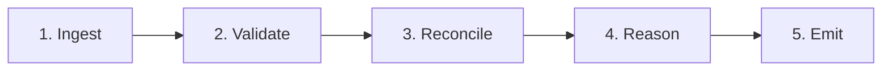
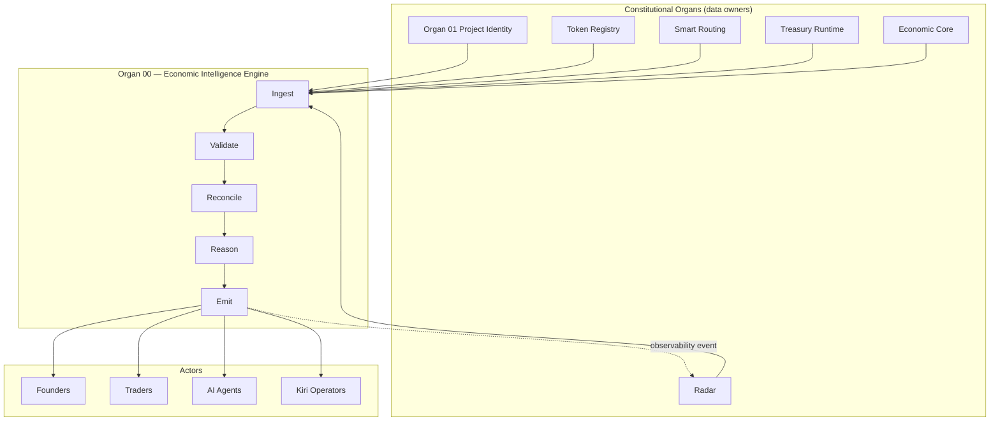

# Organ 00 — Economic Intelligence Engine

**Status:** Ratified organ specification (constitutional intelligence layer)  
**Version:** 1.0  
**Date:** 2026-06-27  
**Organ:** 00 — Economic Intelligence Engine (EIE)  
**Program position:** Meta-orchestration layer above all constitutional organs  
**Parent documents:** `MELEGA_DEX_CONSTITUTION_V1.md`, `MELEGA_DEX_SYSTEM_MAP_V1.md`, `MELEGA_DEX_ENTITY_MODEL_V1.md`, `MELEGA_DEX_AI_PROTOCOL_V1.md`, `MELEGA_DEX_EVOLUTION_PROTOCOL_V1.md`, `ORGAN_01_FREEZE_REPORT.md`  
**Nature:** Constitutional intelligence specification — **not** implementation code

> **System Map alignment:** The Economic Intelligence Engine is **not** an execution organ. It does not appear in the System Map as a data-owning surface. It is the **reasoning substrate** that binds Organ outputs into coherent economic understanding for founders, traders, agents, and civilization operators.

---

## Purpose

The **Economic Intelligence Engine (EIE)** is the constitutional intelligence layer of Melega DEX.

It exists to **interpret**, **reconcile**, and **explain** economic reality as declared and produced by constitutional organs — without owning authoritative data, without executing transactions, and without replacing organ sovereignty.

| EIE is | EIE is not |
|--------|------------|
| A reasoning orchestrator across organs | A registry, router, treasury, or swap engine |
| A convergence layer for human + machine understanding | A source of truth for prices, TVL, or APR |
| A constitutional interpreter of organ outputs | An endorsement or investment advisory system |
| A explainability envelope for D87 compliance | An autonomous execution agent |
| A civilization coherence synthesizer | A marketing or ranking layer |

**Core law:** Organ 00 **never owns data**. Every fact in an EIE output must trace to an organ-produced artifact with `data_source` and `as_of`. Missing data is explicit absence — never invention.

**Strategic role:** As Organ 01 (Project Identity) and future organs freeze their public contracts, EIE becomes the layer that **orchestrates interpretation** across them — enabling founders, traders, and AI agents to reason over the same civilizational economic graph without organ collision or semantic drift.

---

## Inputs

EIE consumes **read-only artifacts** from constitutional organs and external indexers. It does not write to organ stores.

### 1. Identity & registry inputs (Organ 01 — frozen)

| Input | Source | Use |
|-------|--------|-----|
| `StaticProjectRecord` / machine manifest | `/registry/projects/{slug}.json` | Project identity, trust, capabilities |
| Discovery index | `/registry/projects/discovery.json` | Search, filter, civilization readiness context |
| Registry catalog | `/registry/projects/index.json` | Catalog resolution |
| UPI graph | Entity Model | Cross-organ linkage anchor |

### 2. Token registry inputs (Organ 05 — future)

| Input | Source | Use |
|-------|--------|-----|
| Token records | Token Registry manifest | Symbol resolution, chain refs, project linkage |
| Listing lifecycle | Token Registry | Listing vs delisted interpretation |

### 3. Execution & routing inputs (Economic Core, Smart Routing)

| Input | Source | Use |
|-------|--------|-----|
| Route quotes | Smart Routing Engine | Path comparison, slippage, gas |
| Pool topology | On-chain + indexer | Depth, pair existence |
| Contract addresses | Economic Core preservation map | Settlement truth |

### 4. Liquidity, farm, pool inputs (Organs 04, 07, 08)

| Input | Source | Use |
|-------|--------|-----|
| LP positions / pool state | Indexer, on-chain | Depth interpretation |
| Farm emissions | MasterChef / sousChef | Reward source analysis |
| Staking pool state | Pool contracts | Stake surface interpretation |

### 5. Lock & launch inputs (Organs 09, 10, 11)

| Input | Source | Use |
|-------|--------|-----|
| Lock records | Lock Center | Vesting/trust interpretation |
| Launch campaigns | ILO / generator | Launch readiness context |

### 6. Treasury inputs (Treasury Runtime)

| Input | Source | Use |
|-------|--------|-----|
| Fee SKUs | Fee schedule manifest | Action cost explanation |
| Journal entries | Treasury Runtime | Attribution, payment history |
| MARCO fee paths | Economic Journal | Civilization fee loop |

### 7. Observability & risk inputs (Radar, AI Report organ)

| Input | Source | Use |
|-------|--------|-----|
| Incident feed | Radar | Risk escalation |
| Verification reports | AI Report pipeline | Observed vs inferred separation |
| Honeypot / anomaly signals | Radar heuristics | Trader warnings |

### 8. Civilization & governance inputs (Codex, KCG, Evolution Protocol)

| Input | Source | Use |
|-------|--------|-----|
| Evolution state manifest | Platform manifest | Organ maturity context |
| Codex entries | Kiri Codex | Doctrine binding |
| Governance proposals | KCG | Policy constraints on recommendations |

### 9. Actor context (session-local, non-authoritative)

| Input | Source | Use |
|-------|--------|-----|
| Actor role | Session (`founder` \| `trader` \| `agent` \| `operator`) | Reasoning mode selection |
| Chain context | Wallet / agent config | Scope filtering |
| Permission envelope | D87 policy | Execution boundary for agents |

**Input invariant:** EIE MUST reject or downgrade any input lacking `data_source` and `as_of` when used in live reasoning (Constitution I3, AI Protocol R1).

---

## Outputs

EIE produces **reasoning artifacts** — never authoritative state mutations.

### Primary output types

| Output | Audience | Nature |
|--------|----------|--------|
| `EconomicReasoningReport` | Human + machine | Master envelope for any reasoning session |
| `FounderGuidanceBrief` | Founders | Launch, listing, capability roadmap interpretation |
| `TraderDecisionBrief` | Traders | Route, depth, risk, fee interpretation |
| `AgentReasoningPacket` | AI agents | Structured, schema-validated reasoning for composition |
| `RegistryInterpretation` | Both | What registry state means — not what it should be |
| `CapabilityInterpretation` | Both | Per-capability readiness and gaps |
| `TreasuryInterpretation` | Both | Fee and attribution explanation |
| `RoutingInterpretation` | Both | Route tradeoff narrative |
| `RiskInterpretation` | Both | Layered risk synthesis with sources |
| `ConvergenceAssessment` | Operators | Human UI vs agent vs on-chain agreement |
| `CivilizationCoherenceBrief` | Kiri operators | Cross-organ integration narrative |

### Output metadata (required on every artifact)

```json
{
  "engine": "economic-intelligence-engine",
  "version": "1.0.0",
  "reasoning_id": "eie://melega/reasoning/{uuid}",
  "actor_role": "founder | trader | agent | operator",
  "as_of": "ISO-8601",
  "inputs_consumed": [{ "organ": "01", "artifact": "/registry/projects/melega-dex.json", "as_of": "..." }],
  "data_gaps": [],
  "disclaimer": "Interpretation only — not execution authority or investment advice.",
  "endorsement_status": "none"
}
```

---

## Decision model

EIE applies a **five-stage interpretive pipeline**. It does not "decide" economic outcomes — it decides **what can be said** and **with what confidence**.



### Stage 1 — Ingest

Collect organ artifacts for the reasoning scope (project UPI, token ref, route request, etc.). No transformation.

### Stage 2 — Validate

| Check | Failure action |
|-------|----------------|
| `data_source` present | Mark fact `unverified`; do not use in strong claims |
| `as_of` within staleness budget | Flag `stale`; downgrade confidence |
| Schema version compatible | Reject organ output from breaking schema without migration map |
| Organ evolution state sufficient | Label `organ_seed`; limit recommendation strength |
| Constitutional labels present | Block output if fake metrics detected |

### Stage 3 — Reconcile

Resolve cross-organ facts:

| Conflict type | Resolution rule |
|---------------|-----------------|
| Registry vs on-chain | **On-chain wins** for settlement; registry wins for identity (Entity Model) |
| Token Registry vs Project Registry | Project UPI linkage wins for identity |
| UI display vs manifest | Manifest wins |
| Treasury journal vs fee schedule | Journal wins for historical; schedule wins for prospective |
| Multiple route quotes | Present all with tradeoffs; no silent discard |

### Stage 4 — Reason

Apply role-specific reasoning templates (§ Founder, Trader, Agent). Separate:

- `verified_facts[]` — directly traceable to organ outputs
- `inferences[]` — logically derived, confidence-scored
- `unknowns[]` — explicit gaps

**Confidence scale:** `certain` \| `high` \| `medium` \| `low` \| `insufficient_data`

### Stage 5 — Emit

Produce human and machine outputs with full provenance. Emit observability event to Radar bus when EIE reaches `Active+` (Evolution Protocol E3).

**Decision prohibition:** EIE MUST NOT emit `execute`, `approve`, `list`, `endorse`, or `safe` as final verbs. Permitted terminal verbs: `explain`, `warn`, `compare`, `recommend_review`, `insufficient_data`.

---

## Founder reasoning

**Actor:** Project founder or launch initiator.  
**Goal:** Understand what Melega surfaces are available, what is missing, and what honest next steps exist — without fake launch promises.

### Founder reasoning scope

| Question class | EIE interpretation |
|----------------|-------------------|
| "Is my project registered?" | Registry interpretation → UPI status, phase, trust badges |
| "What capabilities can I activate?" | Capability matrix → live vs planned per surface |
| "What do I need for treasury compatibility?" | Treasury interpretation → SKU requirements, journal evidence |
| "How integrated am I?" | Civilization readiness (Organ 01) — integration only, not quality |
| "What should I do next?" | FounderGuidanceBrief → checklist from gaps, never guaranteed timelines |

### Founder output structure

```
FounderGuidanceBrief
├── identity_status        (from Organ 01)
├── capability_gaps[]      (planned slots with honest notes)
├── treasury_readiness     (Seed until journal proof)
├── launch_surfaces[]      (ILO, generator — organ state gated)
├── relationship_gaps[]    (indexed vs placeholder)
├── recommended_actions[]  (human-signed steps only)
└── why[]                  (explainability chain)
```

### Founder prohibitions

- No "you will get listed by date X"
- No APR or TVL projections
- No impersonation of governance approval
- No contract deployment without explicit wallet signature path

---

## Trader reasoning

**Actor:** Swapper, LP, farmer, staker.  
**Goal:** Understand route tradeoffs, fees, depth, and risk before signing — without hidden endorsement.

### Trader reasoning scope

| Question class | EIE interpretation |
|----------------|-------------------|
| "What route should I use?" | Routing interpretation → compare paths, gas, slippage, hops |
| "What are the fees?" | Treasury interpretation → MARCO SKU breakdown |
| "Is this token/project safe?" | Risk interpretation → layered warnings; never `safe: true` without audit proof |
| "What is the liquidity depth?" | On-chain/indexer only; label `data_source` |
| "What does listed mean?" | Registry interpretation → listed ≠ audited disclaimer |

### Trader output structure

```
TraderDecisionBrief
├── route_comparison[]     (if routing scope)
├── fee_explanation        (treasury SKU)
├── risk_layers[]          (token, project, route, radar)
├── registry_context       (UPI, trust badges — non-endorsement)
├── depth_summary          (sourced or absent)
├── warnings[]             (honeypot, stale farm, unverified APR)
└── why[]
```

### Trader prohibitions

- No guaranteed best price
- No APR without `calculation_method` (AI Protocol R3)
- No hiding negative Radar signals
- No conflation of civilization readiness with investment merit

---

## AI Agent reasoning

**Actor:** MELEGA AI agent, Kiri operator bot, institutional integrator.  
**Goal:** Compose machine-valid reasoning packets for multi-step workflows inside D87 policy envelopes.

### Agent reasoning scope

| Mode | `execution_mode` | EIE behavior |
|------|------------------|--------------|
| Read-only (default) | `observe` | Full interpretation; no execution hints beyond "human must sign" |
| Bounded assist | `propose` | Structured proposals with `requires_human_approval: true` |
| Policy envelope | `execute_bounded` | Only when D87 envelope valid; EIE still does not execute |

### Agent output structure

```
AgentReasoningPacket
├── schema: https://melega.finance/schemas/eie/agent-reasoning/v1
├── reasoning_id
├── actor_role: "agent"
├── organ_fragments[]      (normalized organ excerpts)
├── verified_facts[]
├── inferences[]           (confidence-scored)
├── unknowns[]
├── convergence_score      (UI/manifest/chain agreement 0–100)
├── recommended_next_reads[] (manifest URLs)
├── execution_mode
├── policy_envelope_ref    (if execute_bounded)
└── why[]
```

### Agent composition rules

1. Agents MAY chain multiple EIE packets across organs.
2. Agents MUST NOT merge `verified_facts` and `inferences` without label (AI Protocol R6).
3. Agents MUST cite `reasoning_id` in downstream reports.
4. Agents MUST respect Organ 01 frozen contract — UPI, capability keys, trust enums.
5. EIE is the **only** approved cross-organ reasoning composer — agents must not invent parallel synthesis layers that bypass provenance.

---

## Registry interpretation

EIE interprets registry organs (Organ 01 frozen; Token Registry future) without mutating records.

### Interpretation rules

| Registry signal | EIE meaning | EIE must not mean |
|-----------------|-------------|-------------------|
| `registry_status: listed` | Visible in catalog | Audited or endorsed |
| `trust_badges: canonical` | Platform-recognized identity | Investment approval |
| `trust_badges: observed` | Legacy-indexed data | Security verification |
| `verification_status: unverified` | No automated verification | Scam confirmation |
| `risk_tier` | Declared risk class | Price prediction |
| `civilization_readiness` | Ecosystem integration % | Financial ranking |
| `mvp_static: true` | Static compile-time data | Live indexed truth |
| `phase: legacy_import` | Imported without full registration | Fully governed project |

### Registry reconciliation

When EIE reasons over a token or pool, it resolves:

```
token://{chainId}/{address}  →  project_upi  →  ProjectRecord  →  capability context
```

If linkage missing: emit `unknowns[]` entry — never guess parent project.

---

## Capability interpretation

EIE interprets the **frozen 14 capability slots** from Organ 01 without redefining them.

| Capability key | EIE interprets as | Live threshold |
|----------------|-------------------|----------------|
| `tradable` | Swap surface availability | `live` or `partial` |
| `liquidity` | LP routes exist | `live` or `partial` |
| `farm` | Farm routes exist | `live` or `partial` |
| `pool` | Staking pool routes exist | `live` or `partial` |
| `lock` | Lock Center indexed | `live` |
| `vesting` | Vesting disclosures indexed | `live` |
| `launch` | ILO/generator surface | `live` or `partial` |
| `smartdrop` | Campaign organ connected | `live` |
| `radar` | Observability feed connected | `live` |
| `space` | Profile bind live | `live` |
| `labs` | Labs experiments indexed | `live` |
| `aiReport` | AI verification pipeline | `live` |
| `machineManifest` | Machine JSON published | `live` |
| `treasuryCompatible` | Treasury SKU + journal proof | `live` |

**Capability interpretation output:**

```json
{
  "capability": "treasuryCompatible",
  "status": "planned",
  "interpretation": "Treasury fee SKUs not yet journal-validated for this project.",
  "founder_implication": "Fee attribution unavailable until Treasury Runtime promotion.",
  "trader_implication": "Platform fees may not be civilization-accounted for project-scoped SKUs.",
  "evidence": [{ "organ": "01", "field": "capabilities.treasuryCompatible" }]
}
```

EIE MUST show per-capability state — never whole-project "verified" if any slot is `planned` or `seed` (Evolution Protocol §14.2).

---

## Treasury interpretation

EIE explains treasury economics; Treasury Runtime owns the ledger.

### Interpretation scope

| Input | EIE explains |
|-------|--------------|
| Fee schedule manifest | What a action costs in $MARCO |
| SKU catalog | Which actions are fee-bearing |
| Journal entries | What was paid, when, by whom (privacy-preserving) |
| Project-scoped fees | UPI attribution in civilization loop |
| Treasury compatibility flag | Whether project fees are civilization-accounted |

### Treasury truth hierarchy

1. **On-chain fee transfer** — settlement proof
2. **Treasury journal** — civilization accounting proof
3. **Fee schedule** — prospective intent
4. **Registry `treasuryCompatible`** — declarative readiness only

EIE MUST NOT claim treasury compatibility at `live` unless journal evidence exists — registry declaration alone is `planned` interpretation.

### Treasury output fragment

```json
{
  "treasury_interpretation": {
    "action": "swap",
    "sku": "swap.platform.marco",
    "estimated_marco_fee": { "value": "...", "data_source": "fee-schedule", "as_of": "..." },
    "journal_status": "not_applicable | pending | recorded",
    "project_attribution": "upi://melega/project/...",
    "why": ["Fee schedule v0.1.0", "No journal entry for this session"]
  }
}
```

---

## Routing interpretation

EIE interprets Smart Routing outputs without owning routes or executing swaps.

### Interpretation dimensions

| Dimension | Source | EIE narrative |
|-----------|--------|---------------|
| Path hops | Router quote | Bridge/wrap risk explanation |
| Price impact | Quote math | Slippage warning with formula reference |
| Gas estimate | Chain estimator | Cost comparison across paths |
| Liquidity depth | Pool reserves | Insufficient depth warning |
| Token risk | Token + Project registry | Registry context on route tokens |
| MEV exposure | Heuristic (labeled) | Inference only — not certainty |

### Routing reconciliation

When multiple quotes exist, EIE emits **comparison matrix** — not a single winner unless user policy requests optimization and all inputs are `certain`.

**Routing prohibition:** EIE never submits transactions. Route "recommendation" is `recommend_review` with explicit tradeoff array.

---

## Risk interpretation

EIE synthesizes risk layers without overriding organ-declared risk tiers.

### Risk layers (ordered)

```
L0  Constitutional    → disclaimers, evolution state, mvp_static labels
L1  Registry          → trust badges, verification_status, risk_tier
L2  On-chain          → contract verification, holder concentration
L3  Liquidity         → depth, pair age (sourced)
L4  Observability     → Radar incidents, staleness alerts
L5  Inference         → heuristics (honeypot, impersonation) — labeled inference only
```

### Risk output rules

| Rule | Enforcement |
|------|-------------|
| Never emit `safe: true` without audit attestation source | AI Protocol R2 |
| Never suppress Radar incidents | AI Protocol R9 |
| `risk_tier` from registry is declarative — EIE may add layers, not downgrade without evidence |
| Separate `verified_risks[]` from `inferred_risks[]` | AI Protocol R6 |

---

## Explainability model

EIE is the **D87 explainability envelope** for cross-organ reasoning.

### Explainability stack

| Layer | Content |
|-------|---------|
| **Summary** | 1–3 sentence human narrative |
| **Why chain** | Ordered `why[]` — each step cites source |
| **Facts vs inferences** | Strict separation |
| **Provenance** | `inputs_consumed[]` with organ, artifact, `as_of` |
| **Gaps** | `unknowns[]` and `data_gaps[]` |
| **Confidence** | Per-claim confidence score |
| **Disclaimers** | Role-appropriate constitutional labels |

### Explainability invariants (D87 E2)

1. Every recommendation has `why[]` with at least one traceable source.
2. Every numeric claim has `data_source` and `as_of`.
3. Every inference has `confidence` and `derivation`.
4. Humans receive summary + expandable detail.
5. Agents receive full structured object — never summary-only.

### Anti-patterns (blocked)

| Anti-pattern | Why blocked |
|--------------|-------------|
| "AI says buy" | Investment advice |
| "Verified safe" without audit | Fake endorsement |
| Black-box score | D87 explainability failure |
| Merged facts/inferences in UI | AI Protocol R6 violation |

---

## Machine reasoning outputs

All machine outputs MUST validate against published schemas under `https://melega.finance/schemas/eie/`.

### Schema catalog (v1)

| Schema | Path | Purpose |
|--------|------|---------|
| Master envelope | `eie/reasoning/v1` | `EconomicReasoningReport` |
| Agent packet | `eie/agent-reasoning/v1` | Agent composition |
| Registry slice | `eie/registry-interpretation/v1` | Registry meaning |
| Capability slice | `eie/capability-interpretation/v1` | Per-slot interpretation |
| Treasury slice | `eie/treasury-interpretation/v1` | Fee explanation |
| Routing slice | `eie/routing-interpretation/v1` | Route comparison |
| Risk slice | `eie/risk-interpretation/v1` | Layered risk |
| Convergence | `eie/convergence/v1` | Cross-surface agreement |

### Machine discovery (future)

| Artifact | Path (planned) |
|----------|----------------|
| EIE capability manifest | `/.well-known/melega-dex-economic-intelligence.json` |
| Reasoning schema index | `/registry/intelligence/schemas.json` |

**Machine output rule:** JSON only — no HTML scraping as reasoning input.

---

## Human reasoning outputs

Humans receive **progressive disclosure** — summary first, provenance on demand.

### Human surface types

| Surface | Location (future) | Content |
|---------|-------------------|---------|
| Reasoning panel | Swap, project, launch pages | Contextual brief for current action |
| Founder console | Launch / project admin | `FounderGuidanceBrief` |
| Risk drawer | Pre-trade confirmation | `TraderDecisionBrief` warnings |
| Intelligence sidebar | Project detail | Cross-organ interpretation (extends Organ 01.1) |
| Civilization brief | Kiri operator dashboard | `CivilizationCoherenceBrief` |

### Human labeling requirements

Every human surface MUST display:

- `Interpretation only` badge
- `as_of` timestamp
- Link to source manifest or on-chain proof
- `listed ≠ audited` when registry context present
- Per-capability status when whole-project context shown

**Organ 01 boundary:** Organ 01.1 Intelligence surfaces **display** registry-derived health. EIE surfaces **interpret** cross-organ meaning. EIE may consume Organ 01 outputs but must not redefine frozen fields.

---

## Constitutional boundaries

### Absolute prohibitions

| # | Boundary |
|---|----------|
| B1 | EIE MUST NOT own authoritative registries, journals, or chain state |
| B2 | EIE MUST NOT execute swaps, LP actions, farms, locks, or launches |
| B3 | EIE MUST NOT collect or retain platform fees |
| B4 | EIE MUST NOT fabricate metrics (Constitution I3) |
| B5 | EIE MUST NOT endorse projects or tokens (AI Protocol R2) |
| B6 | EIE MUST NOT replace organ manifests as source of truth |
| B7 | EIE MUST NOT bypass D87 policy envelopes for agents |
| B8 | EIE MUST NOT mutate frozen Organ 01 public contract |
| B9 | EIE MUST NOT present civilization readiness as investment rank |
| B10 | EIE MUST NOT operate when input organs are in `Seed` without labeling limitations |

### Ownership matrix

| Data domain | Owner organ | EIE role |
|-------------|-------------|----------|
| Project identity | Organ 01 | Interpret |
| Token listings | Token Registry | Interpret |
| Routes / quotes | Smart Routing | Interpret |
| Fees / journal | Treasury Runtime | Interpret |
| Incidents | Radar | Interpret |
| Swaps / LP | Economic Core | Never own |
| AI models | MELEGA AI | Consume via protocol |

---

## Evolution policy

EIE follows `MELEGA_DEX_EVOLUTION_PROTOCOL_V1.md`.

### Current state: **Seed**

| Attribute | Value |
|-----------|-------|
| Human UI | No dedicated EIE surface; Organ 01 intelligence is registry-display, not cross-organ EIE |
| Agents | May read this spec; must not assume EIE endpoints live |
| Treasury | No EIE fees |
| Manifest | This document only |

### Promotion gates (summary)

| Target state | Minimum evidence |
|--------------|------------------|
| **Seed → Active** | Schema published; read-only reasoning over Organ 01 manifests; unit tests for interpret pipeline; `data_source` enforcement |
| **Active → Trusted** | Live routing + treasury interpretation with journal proof; Radar event emission |
| **Trusted → Cooperative** | Codex anchoring; founder/trader surfaces in production; KCG policy reference |
| **Cooperative → Autonomous** | D87 policy envelope for agent `propose` mode; bounded execution hints only |
| **Autonomous+** | Civilization convergence briefs; meta-governance charter |

### Capability-level promotion

EIE sub-capabilities (routing interpret, treasury interpret, etc.) MAY promote independently. UI must show per-capability evolution state.

### Relationship to Organ 01 freeze

Organ 01 `READY_FOR_FREEZE` is **prerequisite** for EIE Active promotion over project identity. EIE must import Organ 01 manifests — never fork schema.

---

## Organ interactions



### Interaction table

| Organ | Direction | Contract |
|-------|-----------|----------|
| **Organ 01** | EIE reads manifests | Frozen URLs + schemas v0.1.0 |
| **Token Registry** | EIE reads listings | `token://` → UPI resolution |
| **Smart Routing** | EIE reads quotes | Quote schema with `as_of` |
| **Treasury Runtime** | EIE reads schedule + journal | SKU + attribution |
| **Radar** | EIE reads incidents; emits reasoning events | Observability bus |
| **Economic Core** | EIE reads preservation map | Contract truth reference |
| **MELEGA AI** | AI consumes EIE packets | AI Protocol roles compose fragments |
| **Agent Surface** | Serves EIE schemas | HTTP/MCP read paths |
| **Codex** | Anchors EIE doctrine | Append-only entries |
| **KCG** | Policy constraints | Governance bounds on recommendations |

**Interaction law:** Data flows **up** from organs to EIE. Reasoning flows **out** to actors. No reverse mutation.

---

## Future extensions

| Extension | Phase | Constraint |
|-----------|-------|------------|
| HTTP `/api/intelligence/reason` | Active | Read-only; schema-validated |
| Real-time Radar coupling | Trusted | Incident-aware reasoning refresh |
| Multi-project graph reasoning | Active | UPI-linked traversal only |
| Institutional policy packs | Cooperative | Custom `confidence` thresholds — not custom facts |
| Simulation mode | Labs | Labeled `synthetic`; never mixed with live |
| Cross-chain convergence scoring | Trusted | On-chain proof required per chain |
| Natural language query | Cooperative | Must emit machine packet alongside NL |
| EIE marketplace plugins | Evolutionary | Codex-governed; no third-party fact sources without provenance |
| Kiri civilization briefs | Civilizational | Signal-formatted, no hype |

**Extension rule:** New extensions add interpretive capability — never data ownership.

---

## Doctrine

**The Economic Intelligence Engine never replaces constitutional organs. It interprets their outputs to maximize explainability, convergence and civilizational coherence.**

---

## Appendix A — Organ 00 vs Organ 01.1 naming

| Name | Scope |
|------|-------|
| **Organ 01.1 Project Intelligence** (delivered) | Registry-display layer: health, manifest viewer, capability matrix within Organ 01 freeze |
| **Organ 00 Economic Intelligence Engine** (this spec) | Cross-organ reasoning orchestrator; consumes Organ 01 + all future organs |

Organ 01.1 is **constituent display intelligence** inside the frozen identity organ.  
Organ 00 is **constitutional meta-intelligence** above all organs. No naming collision when this doctrine is observed.

## Appendix B — Required future Codex entries

| Entry | Purpose |
|-------|---------|
| CE-EIE-1 | Economic Intelligence Engine V1 (this document) |
| CE-EIE-2 | EIE schema registry |
| CE-EIE-3 | D87 compliance — cross-organ reasoning |

---

**Specification status:** `ORGAN_00_SPEC_READY`
