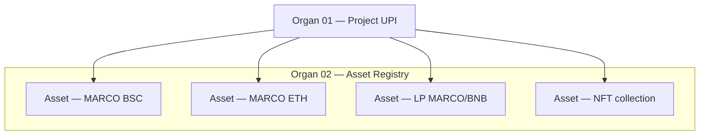
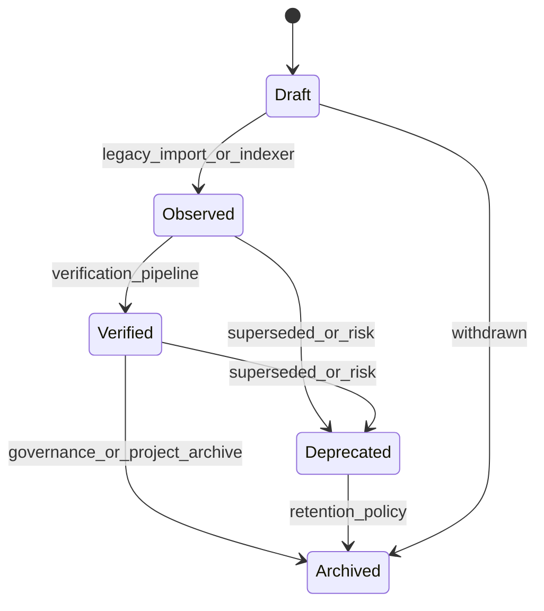
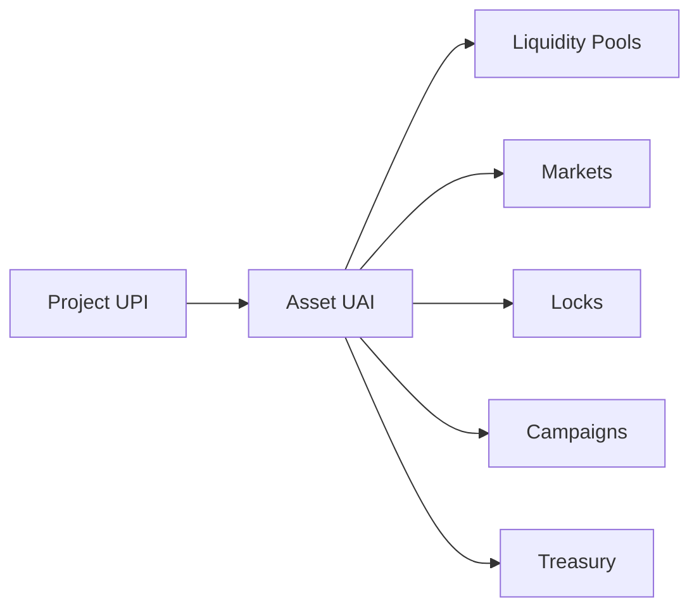

# Melega DEX Asset Registry Core — Specification V1

**Status:** Ratified organ specification (core)  
**Version:** 1.0  
**Date:** 2026-06-27  
**Organ:** 02 — Asset Registry (Core)  
**Strategic priority:** Canonical economic asset layer — assets belong to projects, not vice versa  
**Parent documents:** `MELEGA_DEX_CONSTITUTION_V1.md`, `MELEGA_DEX_SYSTEM_MAP_V1.md`, `MELEGA_DEX_ENTITY_MODEL_V1.md`, `MELEGA_DEX_AI_PROTOCOL_V1.md`, `MELEGA_DEX_EVOLUTION_PROTOCOL_V1.md`, `ORGAN_01_FREEZE_REPORT.md`, `ORGAN_00_ECONOMIC_INTELLIGENCE_ENGINE.md`  
**Nature:** Core organ specification — **not** implementation code

> **Program alignment:** Organ 01 (Project Identity Layer) is **frozen** at `api_version: 0.1.0`. Organ 02 introduces the **Asset Registry** as the next constitutional organ. It subsumes the *identity function* of the legacy Token Registry concept (System Map Organ 05) into a broader asset model. Execution organs remain unchanged.

> **Core doctrine:** **Projects own Assets. Assets are not Projects.**

---

## Purpose

The **Asset Registry Core** is the canonical registry of every **economic asset** that belongs to a Project in Melega DEX.

An **asset** is any economically meaningful instrument indexed under a Project (UPI): fungible tokens, LP positions-as-tokens, NFTs, stablecoins, wrapped natives, and future instrument classes. The Asset Registry makes each asset **legible, linkable, and machine-readable** without collapsing asset identity into project identity or contract address alone.

The Asset Registry exists to:

| Objective | Description |
|-----------|-------------|
| **Canonical asset identity** | Assign **Universal Asset Identity (UAI)** stable across metadata changes |
| **Project binding** | Every asset resolves to a parent `project_upi` from Organ 01 |
| **Type discipline** | Classify assets by economic role — not by UI label alone |
| **Honest trust surfacing** | Observed / verified / canonical / deprecated — never fake verification |
| **Capability declaration** | Per-asset capability matrix (tradable, liquidity, farm, etc.) |
| **Relationship graph** | Link assets to liquidity, markets, locks, campaigns, treasury |
| **Human discovery** | Asset pages, cards, project-scoped asset lists |
| **Agent discovery** | Machine manifests and discovery indexes |
| **Legacy bridge** | Map Organ 01 `token://` refs to full `AssetRecord` without breaking freeze |

The Asset Registry is a **registry and coordination layer**, not an endorsement engine, execution layer, or price oracle. **Listed ≠ audited. Verified ≠ safe.**

---

## Relationship with Project Registry

Organ 01 (frozen) is the **identity root**. Organ 02 is a **dependent resource organ**.



### Binding rules

| Rule | Enforcement |
|------|-------------|
| Every `AssetRecord` MUST include `project_upi` | Required field; submission blocked without resolvable UPI |
| Asset Registry MUST NOT mint or alter UPI | UPI authority remains Organ 01 only |
| Project page lists assets via Organ 02 index | Organ 01 `resources.tokens[]` becomes **legacy import view** — superseded by Asset Registry catalog, not deleted |
| Identity disagreement | **Project UPI wins** for ownership; **on-chain wins** for settlement (Entity Model) |
| One project, many assets | Expected; primary assets flagged via `is_primary` |
| Asset without project | **Forbidden** for new records; legacy import may use provisional UPI per Entity Model |

### Organ 01 freeze compatibility

| Organ 01 artifact | Organ 02 relationship |
|-------------------|----------------------|
| `TokenRef` (`token://{chainId}/{address}`) | **Legacy alias** → resolves to `uai://melega/asset/...` |
| `resources.tokens[]` | Seed import source for MVP static assets |
| `primaryTokenRefs[]` | Maps to `is_primary: true` on corresponding assets |
| Project capability matrix | **Project-level** capabilities remain on Organ 01; **asset-level** capabilities are Organ 02 |
| `/registry/projects/{slug}.json` | Gains optional `assets_index_url` pointer — additive only |

**Freeze law:** Organ 02 MUST NOT rename, remove, or repurpose frozen Organ 01 fields. It extends via new manifests and routes.

### Distinction: Project capabilities vs Asset capabilities

| Layer | Owner | Scope |
|-------|-------|-------|
| Project capabilities | Organ 01 (frozen) | Platform surfaces available to the project as a whole |
| Asset capabilities | Organ 02 | What this specific asset can do (e.g., one token tradable, another vesting-only) |

EIE (Organ 00) reconciles both layers without collapsing them.

---

## Canonical Asset Identity

### Universal Asset Identity (UAI)

```
uai://melega/asset/{asset_type}/{chain_id}/{contract_address}@{version}
```

| Component | Rule |
|-----------|------|
| `asset_type` | Frozen enum slug: `fungible`, `lp`, `nft`, `stable`, `wrapped`, … |
| `chain_id` | EVM chain ID (integer) |
| `contract_address` | Checksummed `0x` address for on-chain assets; collection + tokenId pattern for NFTs (see § NFT) |
| `version` | Monotonic integer; metadata breaking changes increment |

**Examples:**

- `uai://melega/asset/fungible/56/0x963556de0eb8138E97A85F0A86eE0acD159D210b@1`
- `uai://melega/asset/wrapped/1/0xC02aaA39b223FE8D0A0e5C4F27eAD9083C756Cc2@1`
- `uai://melega/asset/lp/56/0x...pairAddress@1`

### Legacy alias (Organ 01 compatible)

```
token://{chain_id}/{contract_address}
```

Organ 02 MUST resolve `token://` to UAI for fungible assets. `token://` remains valid as a **read alias** per Organ 01 freeze — never removed.

### Human slug (optional)

```
asset_slug: marco-bsc
```

Unique within parent project namespace: `{project_slug}/{asset_slug}`. Used for human URLs only; UAI remains canonical.

### UAI invariants

1. One canonical UAI per on-chain asset instance (chain + type + address [+ tokenId for NFT item]).
2. No asset UAI without `project_upi`.
3. Asset merges (e.g., bridge mapping) produce `uai_aliases[]` — history preserved.
4. AI agents MUST use UAI in reports — not symbol alone (AI Protocol).
5. Treasury asset-scoped fees MUST include `asset_uai` when SKU is asset-scoped.

---

## Asset Types

### Initial types (V1 spec)

| Type slug | `asset_type` | Definition | On-chain anchor |
|-----------|--------------|------------|-----------------|
| **Fungible Token** | `fungible` | ERC-20 style divisible token | `chain_id` + `contract_address` |
| **LP Token** | `lp` | Liquidity pool receipt token (LP pair) | Pair contract address |
| **NFT** | `nft` | Non-fungible or semi-fungible (ERC-721 / ERC-1155) | Collection contract; optional `token_id` on item records |
| **Stable Asset** | `stable` | Price-stable fungible (USDT, USDC, DAI, etc.) | Same as fungible; `stable` subtype for policy |
| **Wrapped Asset** | `wrapped` | Wrapped native or bridged representation (WETH, WBNB) | Same as fungible; `wrapped` subtype for routing policy |

**Subtype rule:** `stable` and `wrapped` are **classified fungibles** with distinct `asset_type` for capability and routing policy — they share ERC-20 shape but differ in economic role.

### NFT identity extension

For collection-level registry:

```
uai://melega/asset/nft/{chain_id}/{collection_address}@1
```

For item-level (optional Phase 2):

```
uai://melega/asset/nft/{chain_id}/{collection_address}/{token_id}@1
```

### Reserved future types (schema space only — not V1)

| Reserved slug | Purpose | Status |
|---------------|---------|--------|
| `rwa` | Real-world asset tokenization | Reserved — Codex-gated |
| `synthetic` | Synthetic / derivative exposure instruments | Reserved — Labs + governance |
| `credential` | Soulbound / attestation / access credentials | Reserved — Kiri integration |
| `ai_asset` | Model weights, agent licenses, inference credits | Reserved — MELEGA AI economy |

**Extension rule:** New types require schema minor version bump + Codex entry. Existing type slugs are frozen once published.

---

## Asset Lifecycle

Asset lifecycle is **independent** of project `registry_status` but constrained by it.



| State | Meaning | Human UI | Agents |
|-------|---------|----------|--------|
| **Draft** | Submitted or prepared; not publicly listed | Founder-only or Labs | Must not assume tradability |
| **Observed** | Indexed from legacy import, indexer, or founder submit — **not verified** | Visible with `Observed` badge | May read metadata; must not imply safety |
| **Verified** | Passed automated verification pipeline with sourced evidence | `Verified` badge with evidence ref | May cite verification dimensions |
| **Deprecated** | Superseded, migrated, or risk-retired; may still exist on-chain | Warning banner; link to successor UAI | Must prefer successor UAI if set |
| **Archived** | Removed from active discovery; historical record retained | Hidden from default browse | Read historical manifest only |

### Lifecycle invariants

| # | Invariant |
|---|-----------|
| L1 | `Verified` MUST NOT be assigned without `verification_evidence[]` and `as_of` |
| L2 | `Observed` MUST NOT be displayed as `Verified` |
| L3 | On-chain existence does not imply `Observed` — registry entry required |
| L4 | Archiving a project cascades **suggested** archive on assets — not automatic deletion |
| L5 | Deprecated assets MUST include `successor_uai` when migration exists |

**MVP (static):** Lifecycle states are **declared in static data** — no live verification pipeline. Melega DEX assets use `observed` with honest notes; platform MARCO tokens use `observed` + `canonical` trust where Organ 01 declares canonical project.

---

## Asset Metadata

### Required fields

| Field | Type | Rule |
|-------|------|------|
| `uai` | string | Canonical identity |
| `project_upi` | string | Parent project from Organ 01 |
| `asset_type` | enum | § Asset Types |
| `lifecycle` | enum | § Asset Lifecycle |
| `chain_id` | integer | Supported chain |
| `contract_address` | string | Checksummed hex |
| `symbol` | string | Display symbol — not unique globally |
| `decimals` | integer | On-chain decimals (0 for NFT collection) |
| `name` | string | Human name |
| `trust` | object | § Trust Model |
| `capabilities` | object | § Capability Matrix |
| `data_source` | string | Provenance label |
| `as_of` | ISO-8601 | Freshness |
| `disclaimer` | string | Constitutional label |

### Optional fields

| Field | Type | Rule |
|-------|------|------|
| `asset_slug` | string | Human slug within project |
| `logo_url` | string | Hosted or IPFS; hash optional |
| `description` | string | Plain text; no HTML in machine manifest |
| `tags` | string[] | Discovery tags (e.g., `defi`, `governance`, `meme`) |
| `is_primary` | boolean | Primary project token flag |
| `token_id` | string | NFT item scope |
| `underlying_uai` | string | For wrapped/LP — points to underlying asset |
| `verification_evidence` | object[] | Required when `lifecycle: verified` |
| `successor_uai` | string | Required when deprecated with migration |
| `uai_aliases` | string[] | Historical identity mapping |

### Contract metadata cross-check (future Active+)

| On-chain field | Registry field | Reconciliation |
|----------------|----------------|----------------|
| `symbol()` | `symbol` | Mismatch → `observed` warning |
| `decimals()` | `decimals` | Mismatch → block `verified` |
| `name()` | `name` | Mismatch → flag only |

**MVP:** Static declared metadata — cross-check is Seed capability.

### Project binding block

```json
{
  "project_binding": {
    "project_upi": "upi://melega/project/melega-dex@1",
    "project_slug": "melega-dex",
    "is_primary": true,
    "binding_source": "legacy_import | founder_submit | governance | indexer",
    "bound_at": "2026-06-26"
  }
}
```

---

## Asset Relationships

Assets participate in a **resource graph** anchored on UPI. Organ 02 indexes references; owning organs produce authoritative relationship data.



### Relationship types

| Relationship | Direction | Authority | MVP |
|--------------|-----------|-----------|-----|
| **Project** | Asset → UPI | Organ 01 + Organ 02 binding | ✅ Static |
| **Liquidity** | Asset → pool refs | Liquidity organ / indexer | Placeholder |
| **Markets** | Asset → pair/market refs | Indexer / routing | Placeholder |
| **Locks** | Asset → lock contract refs | Lock Center | Placeholder |
| **Campaigns** | Asset → SmartDrop campaign refs | SmartDrop organ | Placeholder |
| **Treasury** | Asset → fee SKU refs | Treasury Runtime | Placeholder |

### Relationship record shape

```json
{
  "relationships": {
    "liquidity_pools": [],
    "markets": [],
    "locks": [],
    "campaigns": [],
    "treasury_skus": []
  },
  "relationship_status": "not_indexed | partial | indexed",
  "relationship_notes": "Honest MVP placeholder — no fake pool or campaign data."
}
```

**Rule:** Empty arrays with `not_indexed` status are constitutional. Fabricated relationship IDs are a **breach** (Constitution I3).

---

## Machine Representation

### JSON — `AssetRecord`

Canonical machine type served at:

```
/registry/assets/{project_slug}/{asset_slug}.json
/registry/assets/by-uai/{encoded_uai}.json   (future)
```

```json
{
  "$schema": "https://melega.finance/schemas/asset/v1",
  "uai": "uai://melega/asset/fungible/56/0x963556de0eb8138E97A85F0A86eE0acD159D210b@1",
  "legacy_ref": "token://56/0x963556de0eb8138E97A85F0A86eE0acD159D210b",
  "asset_type": "fungible",
  "lifecycle": "observed",
  "project_binding": { "project_upi": "upi://melega/project/melega-dex@1", "is_primary": true },
  "chain_id": 56,
  "contract_address": "0x963556de0eb8138E97A85F0A86eE0acD159D210b",
  "symbol": "MARCO",
  "decimals": 18,
  "name": "MARCO",
  "tags": ["native", "coordination"],
  "trust": { "badges": ["canonical", "observed"], "verification_status": "observed" },
  "capabilities": { "tradable": { "status": "live" } },
  "relationships": { "relationship_status": "not_indexed" },
  "data_source": "asset-registry-static",
  "as_of": "2026-06-26",
  "disclaimer": "Listed ≠ audited. Observed = legacy-indexed only."
}
```

### Manifest — catalog index

| Path | Role |
|------|------|
| `/registry/assets/index.json` | Global asset catalog |
| `/registry/assets/by-project/{slug}.json` | Project-scoped asset list |
| `/.well-known/melega-dex-assets.json` | Agent discovery pointer |

**Index fields:** `api_version`, `phase`, `schema`, `assets[]` (uai, project_upi, asset_type, lifecycle, manifest_url), `discovery_url`, `data_source`, `as_of`, `disclaimer`.

### Discovery — asset discovery index

`/registry/assets/discovery.json` — parallel to Organ 01 discovery:

- Full-text search dimensions: symbol, name, tags, asset_type, project name
- Filters: chain, asset_type, lifecycle, trust, capability
- Sort: alphabetical, recently_added, project_binding
- Summary counts from registry only — no TVL, no market cap

**Schema:** `https://melega.finance/schemas/asset-discovery/v1`

---

## Human Representation

### Project page (Organ 01 extension — additive)

| Surface | Content |
|---------|---------|
| **Assets section** | List of project assets from Organ 02 index — replaces raw `TokenRef` list over time |
| **Primary asset badge** | `is_primary` highlight |
| **Per-asset chips** | Type, chain, lifecycle, trust |

Organ 01 project detail route `/projects/[slug]` remains frozen; assets section is an **additive panel** fed by Organ 02 data.

### Asset page

| Route | Purpose |
|-------|---------|
| `/assets/[project_slug]/[asset_slug]` | Asset detail — metadata, trust, capabilities, relationships |
| `/assets` | Global asset discovery browse (optional MVP) |

### Asset cards

Reusable card component (spec only):

| Element | Source |
|---------|--------|
| Symbol + name | Asset metadata |
| Chain chip | `chain_id` |
| Type badge | `asset_type` |
| Trust badge | § Trust Model |
| Lifecycle badge | § Asset Lifecycle |
| Capability chips | Live capabilities only |
| Link to project | UPI → `/projects/[slug]` |

**Labeling:** Every card shows `Listed ≠ audited` when lifecycle is `observed`.

---

## Trust Model

Asset trust is **independent** of project trust but **informed** by it.

### Trust badges (frozen enum)

| Badge | Meaning | May imply safety? |
|-------|---------|-------------------|
| **Observed** | Indexed from legacy list, indexer, or founder submit | ❌ No |
| **Verified** | Verification pipeline passed with evidence | ❌ No — verification ≠ safe |
| **Canonical** | Platform-recognized primary asset for a canonical project | ❌ No — identity only |
| **Deprecated** | Retired from active use | N/A — warning only |

### `verification_status` (parallel field)

```
unverified | observed | verified
```

### Trust rules

| # | Rule |
|---|------|
| T1 | **Never fake verification** — `verified` requires `verification_evidence[]` |
| T2 | `canonical` on asset requires `canonical` project trust from Organ 01 |
| T3 | Scam reports from Radar may force `deprecated` — governance path for disputes |
| T4 | Asset trust MUST NOT override project `risk_tier` — both displayed |
| T5 | `endorsement_status` defaults to `none` — same as Organ 01 |

### Verification evidence (required for `verified`)

```json
{
  "verification_evidence": [
    {
      "dimension": "contract_source",
      "status": "pass",
      "source": "bscscan-verified",
      "as_of": "2026-06-26"
    }
  ]
}
```

**MVP:** All assets remain `observed` / `unverified` except where static honesty allows `canonical` for platform MARCO under canonical Melega DEX project — still not "safe to invest."

---

## Capability Matrix

Per-asset capabilities declare what **this asset** can participate in. Keys are frozen once published.

| Capability key | Label | Description |
|----------------|-------|-------------|
| `tradable` | Tradable | Swap surface |
| `liquidity` | Liquidity | LP add/remove |
| `farm` | Farm | Farm stake rewards |
| `pool` | Pool | Single-asset staking pool |
| `lock` | Lock | Lockable in Lock Center |
| `governance` | Governance | Governance voting / proposals |
| `smartdrop` | SmartDrop | Campaign eligibility |
| `radar` | Radar | Observability feed indexed |
| `space` | Space | Space profile binding |
| `labs` | Labs | Labs experiment surface |
| `treasury` | Treasury | Treasury SKU compatibility |

### Capability status values (aligned with Organ 01)

```
none | partial | live | finished | planned | scheduled | unverified | clear | watch
```

Each cell: `{ status, notes? }` — same shape as Organ 01 `CapabilityCell`.

### Asset vs project capability reconciliation (EIE)

| Scenario | Display rule |
|----------|--------------|
| Asset `tradable: live`, Project `tradable: planned` | Show both; EIE notes project surface not yet live |
| Asset `farm: none` | Asset cannot be farmed — regardless of project |
| Project capability is superset | Expected — project declares platform intent; asset declares instance truth |

---

## MVP Scope

### In scope (Organ 02 Core MVP)

| Deliverable | Constraint |
|-------------|------------|
| **Static asset records** | Compile-time registry — `mvp_static: true` |
| **MARCO assets** | Four chain fungible tokens under `melega-dex` project (legacy import) |
| **UAI assignment** | Full UAI for each static asset |
| **Legacy `token://` alias** | Mapped from Organ 01 `TokenRef` |
| **Machine manifests** | `index.json`, per-asset JSON, discovery index |
| **Human routes** | Asset section on project page; optional asset detail route |
| **Asset cards & type chips** | Reusable components |
| **Trust badges** | Honest `observed` / `canonical` — no fake verified |
| **Capability matrix** | Per-asset static declaration |
| **Relationship placeholders** | `not_indexed` — no fake pools or campaigns |
| **Unit tests** | Schema integrity, UPI binding, no fake verification |
| **i18n** | All user-facing strings |

### Explicit MVP exclusions

| Excluded | Rationale |
|----------|-----------|
| Backend API | Static runtime only |
| Wallet connection | Read-only |
| Founder submit / write path | Seed — Phase 2 |
| Logo upload pipeline | Seed |
| Live verification pipeline | Seed |
| Indexer-sourced relationships | Seed |
| MARCO fees for listing | Treasury Seed |

### MVP evolution state

| Capability | State |
|------------|-------|
| Asset read / browse | **Active** (target post-implementation) |
| Asset discovery | **Active** (target) |
| Founder write | **Seed** |
| AI verification | **Seed** |
| Live relationships | **Seed** |

---

## Out of Scope

Organ 02 **does not own** and **must not** implement:

| Domain | Owner organ |
|--------|-------------|
| **Trading / swap execution** | Swap organ / Economic Core |
| **Routing / quotes** | Smart Routing |
| **Liquidity management** | Liquidity organ |
| **Treasury accounting** | Treasury Runtime |
| **Transaction execution** | Economic Core + wallet |
| **Price / TVL / APR** | Indexer + EIE interpretation |
| **Token generation / minting** | Token Generator |
| **Project identity** | Organ 01 (frozen) |
| **Cross-chain bridging** | Bridge infrastructure |
| **Contract changes** | Economic Core (governed) |

**Boundary law:** Organ 02 indexes and declares. Execution organs settle.

---

## Constitutional Alignment

### D87 (Explainability · Observability · Bounded Autonomy · Treasury Truth)

| Principle | Alignment |
|-----------|-----------|
| **Explainability** | Every capability cell has `status` + `notes`; trust badges have tooltips; verification requires evidence |
| **Observability** | `data_source` + `as_of` on every record; Radar capability slot reserved |
| **Bounded autonomy** | No agent write path; manifests are read-only in MVP |
| **Treasury truth** | `treasury` capability declares compatibility only — no fee collection in Organ 02 |

### Codex

| Requirement | Status |
|-------------|--------|
| Asset Registry spec anchoring | This document — pending Codex entry CE-AR-1 |
| Type extension policy | Codex-gated for `rwa`, `synthetic`, `credential`, `ai_asset` |
| Immutability | UAI and frozen enums append-only |

### KCG (Kiri Civilization Governance)

| Requirement | Status |
|-------------|--------|
| Asset listing governance | Future — founder submit requires proposal at Cooperative+ |
| Asset deprecation disputes | KCG appeal path — not MVP |
| Canonical asset designation | Platform canonical (MARCO) via governance record — not silent |

### Evolution Protocol

| Rule | Alignment |
|------|-----------|
| E1 No fake state | Lifecycle and trust honestly declared |
| E2 Explainability | Capability notes + disclaimers |
| E7 Machine ingestion | Schema + manifest required for Active |
| Per-capability promotion | Asset verification Seed; read Active |
| Organ 01 freeze respect | Additive extension only |

### Constitution invariants (I1–I5)

| Invariant | Impact |
|-----------|--------|
| I1 Preserve liquidity | No LP mutation |
| I2 Preserve contracts | No contract changes |
| I3 No fake metrics | No TVL, price, or fake verification |
| I4 Machine-readable | Manifests + well-known pointers |
| I5 Treasury-accounted | No fees in Organ 02 MVP |

### Organ 00 (EIE) consumption

EIE reads Asset Registry manifests as **inputs** for registry interpretation and risk layers. Organ 02 does not implement EIE — it feeds it.

---

## Extension Points

| Extension | Mechanism |
|-----------|-----------|
| New asset types | Reserved slugs + schema minor bump + Codex |
| New capability keys | Additive enum + matrix extension |
| New chains | `chain_id` in CHAIN_LABELS + static record |
| Relationship indexing | Populate `relationships.*` from indexer when live |
| Founder submit | Write path — Evolution Seed → Active |
| Verification pipeline | `observed` → `verified` promotion with evidence |
| LP / NFT static import | Append `AssetRecord` entries |
| Bridge asset mapping | `uai_aliases[]` + `underlying_uai` |

---

## Public Contract (target — post-implementation freeze candidate)

| Artifact | Path |
|----------|------|
| Asset catalog | `/registry/assets/index.json` |
| Project asset list | `/registry/assets/by-project/{slug}.json` |
| Asset manifest | `/registry/assets/{project_slug}/{asset_slug}.json` |
| Asset discovery | `/registry/assets/discovery.json` |
| Well-known pointer | `/.well-known/melega-dex-assets.json` |
| Human route | `/assets/[project_slug]/[asset_slug]` |

**API version target:** `0.1.0` · **phase:** `mvp_static`

---

## Doctrine

**Assets are economic components of Projects. Their identity derives from the Project Registry and not vice versa.**

---

## Appendix A — Organ numbering map

| Program ID | Organ name | System Map ID | Status |
|------------|------------|---------------|--------|
| Organ 01 | Project Identity Layer | Organ 06 Project Registry | **Frozen** |
| Organ 02 | Asset Registry Core | Supersedes Token Registry identity scope | **Spec** |
| Organ 00 | Economic Intelligence Engine | Meta-layer | **Spec** |
| Organ 05 (legacy doc) | Token Registry | Narrower — fungible only | Superseded by Organ 02 for new work |

New implementations SHOULD use Organ 02 Asset Registry. Token Registry spec remains historical reference for fungible-only patterns until formally deprecated in Codex.

## Appendix B — MVP seed assets (illustrative)

| UAI | Project | Type | Lifecycle |
|-----|---------|------|-----------|
| `uai://melega/asset/fungible/56/0x9635…D210b@1` | melega-dex | fungible | observed |
| `uai://melega/asset/fungible/1/0x5911…db76@1` | melega-dex | fungible | observed |
| `uai://melega/asset/fungible/137/0xD3e2…8AC2@1` | melega-dex | fungible | observed |
| `uai://melega/asset/fungible/8453/0x56e4…8d7@1` | melega-dex | fungible | observed |

All four: `is_primary: true` per chain instance; `trust.badges: [canonical, observed]` inherited from project canonical status with honest verification labeling.

---

**Specification status:** `ORGAN_02_ASSET_REGISTRY_CORE_SPEC_READY`
