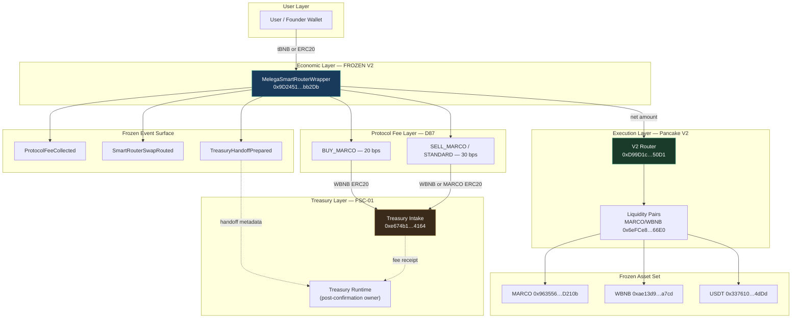

# R748 — Smart Router Testnet Freeze

**Date:** 2026-07-09  
**Verdict:** `SMART_ROUTER_TESTNET_FROZEN`  
**Chain:** BNB Testnet (97) only  
**Mainnet (56):** Not activated — not in scope

---

## Mission

Chain 97 Smart Router implementation is **frozen** following constitutional validation (R747). This ticket is **documentation and registry publication only**. No behavior changes, optimizations, refactors, redesigns, or mainnet preparation.

| Artifact | Path |
|---|---|
| Freeze manifest (machine-readable) | `apps/web/public/registry/smart-router/testnet-freeze-manifest.json` |
| Validation certificate | `apps/web/public/registry/smart-router/testnet-validation-certificate.json` |
| Smart Router registry | `apps/web/public/registry/smart-router/index.json` |
| Prior publication | `docs/runtime/R747_SMART_ROUTER_TESTNET_VALIDATION.md` |

**Registry version:** `0.4.1`  
**Wrapper version:** `2` (frozen)  
**Bytecode hash:** `0x38b51c47d376400b04c3af1c7425d4af830dc71aec9a7faee23e80e51213d610`

---

## Architecture

Melega Smart Router Wrapper V2 is the constitutional **economic entrypoint** for exact-input swaps on BNB Testnet. It applies D87 protocol fees, forwards fees to Treasury Intake as ERC20, and delegates net swap amounts to the underlying Pancake V2 router.

**Native-input path (V2 — frozen):** protocol fee is wrapped to WBNB inside the wrapper and transferred to Treasury Intake as ERC20. Plain ETH `call` to Treasury Intake is forbidden (intake rejects contract-origin native transfers).

**ERC20-input path (frozen):** fee deducted via `safeTransfer` to Treasury Intake before underlying router delegation.

Treasury Runtime owns FSC-01 settlement post-confirmation. The wrapper emits `TreasuryHandoffPrepared` metadata only — it does not execute waterfall splits locally.

---

## Immutable architecture diagram

This diagram is the **frozen reference topology** for chain 97. Addresses are testnet-specific; semantics are mainnet-migration invariants (see Part E).



**ASCII reference (immutable flow):**

```
User (tBNB / ERC20)
  │
  ▼
MelegaSmartRouterWrapper V2  ──► ProtocolFeeCollected
  │                              SmartRouterSwapRouted
  ├─ fee ──► WBNB.deposit (native routes)
  │          └──► ERC20 ──► Treasury Intake
  │
  └─ net ──► Pancake V2 Router ──► Pair ──► Output token
                                          │
                                          └──► TreasuryHandoffPrepared ──► Treasury Runtime (off-chain)
```

---

## Contracts (frozen)

| Role | Address | Explorer |
|---|---|---|
| **Wrapper V2** | `0x9D2451b30102B098570bfCeae0E8b8C9Fd2bb2Db` | [BscScan](https://testnet.bscscan.com/address/0x9D2451b30102B098570bfCeae0E8b8C9Fd2bb2Db) |
| Underlying router | `0xD99D1c33F9fC3444f8101754aBC46c52416550D1` | [BscScan](https://testnet.bscscan.com/address/0xD99D1c33F9fC3444f8101754aBC46c52416550D1) |
| Factory | `0x6725F303b657a9451d8BA641348b6761A6CC7a17` | Pancake V2 testnet |
| WBNB | `0xae13d989daC2f0dEbFf460aC112a837C89BAa7cd` | Wrapped tBNB |
| MARCO | `0x963556de0eb8138E97A85F0A86eE0acD159D210b` | Treasury Runtime R744B |
| USDT (testnet) | `0x337610d27c682E347C9cD60BD4b3b107C9d34dDd` | STANDARD_SWAP path |

**Deploy evidence:**

| Field | Value |
|---|---|
| Deploy tx | [`0xef5be1c2…2d009ef`](https://testnet.bscscan.com/tx/0xef5be1c2324a0b68853f15a8d1c729c2bffae2c82372fe9a3c4f9b95f2d009ef) |
| Block | `118153243` |
| Timestamp | `2026-07-09T16:17:17.000Z` |
| Supersedes V1 | `0xe29b30099f7E5B7205151f9893e6829dbC964002` (defective native fee path — **forbidden**) |

**Constructor immutables (on-chain, frozen):**

- `underlyingRouter_` → Pancake V2 Router
- `treasuryCollector_` → Treasury Intake
- `marcoToken_` → MARCO
- `pricingRefHash_` → `D87_DEX_PRICING_RATIFIED`
- `treasuryPolicyRefHash_` → `FSC-01`

---

## Wrapper (frozen behavior)

| Property | Frozen value |
|---|---|
| Source | `contracts/MelegaSmartRouterWrapper.sol` |
| Solidity | `0.8.20` |
| Executable routes | `STANDARD_SWAP`, `BUY_MARCO`, `SELL_MARCO` |
| Exact output | Hard revert |
| Fee-on-transfer | Blocked |
| Native fee delivery | WBNB wrap + ERC20 transfer |
| Narrative / marketplace routes | Not implemented |

---

## Treasury Intake (frozen binding)

| Property | Value |
|---|---|
| Address | `0xe674b1d925d79f5A0053e40cC7cdED7841AD4164` |
| Policy | `FSC-01` |
| Registry | `/registry/treasury/index.json#97` |
| Verified behavior | Accepts ERC20 fees from wrapper; rejects plain ETH from contract sender |

**Fee token by route (validated):**

| Route | Fee token |
|---|---|
| BUY_MARCO | WBNB (wrapped from tBNB) |
| SELL_MARCO | MARCO |
| STANDARD_SWAP | WBNB (wrapped from tBNB) |

---

## Pair (validation liquidity)

| Pair | Address | Tokens |
|---|---|---|
| MARCO / WBNB | `0x6eFCe8f5C7Fb3B979A6a2Be4a62DB4A055c666E0` | MARCO, WBNB |

Used during constitutional validation for BUY_MARCO and SELL_MARCO paths. STANDARD_SWAP validation used USDT/WBNB liquidity (pair resolved at ceremony time via factory).

---

## Validation transactions (frozen evidence)

| Route | Fee | Tx |
|---|---|---|
| **BUY_MARCO** | 20 bps | [`0x8a19f2eb…22ec1`](https://testnet.bscscan.com/tx/0x8a19f2eb24793dad439cb9779bc1586579fa411bc004dee8302ce37757e22ec1) |
| **SELL_MARCO** | 30 bps | [`0x5602377a…61486`](https://testnet.bscscan.com/tx/0x5602377a4f9eed55a047ef215e3e2b437b5df4e919ac9a3bd04b5a1d4a961486) |
| **STANDARD_SWAP** | 30 bps | [`0x80969383…138ec`](https://testnet.bscscan.com/tx/0x80969383a47713d6e0dd115b8382f6a0531b7a0575b8ae1d6ef942fdb2b138ec) |

All three routes verified: `ProtocolFeeCollected`, `SmartRouterSwapRouted`, `TreasuryHandoffPrepared`.

---

## Known limitations (frozen scope)

- Exact-output swaps not certified
- Fee-on-transfer tokens blocked
- `prepareCivilizationRoute` still hard-blocks chain 97 (product wiring separate from freeze)
- Production DEX studios may use ADAPTER on some surfaces until explicitly wired to registry wrapper address
- Narrative trade, AI service, marketplace routes remain blocked
- KERL registry read-only — no writable intake from DEX
- Signal Gateway not bound to wrapper execution on testnet
- SmartDrop not active on testnet
- V1 wrapper address forbidden

---

## Forbidden modifications

While `SMART_ROUTER_TESTNET_FROZEN` is in effect:

1. **No redeploy** or upgrade of Wrapper V2 on chain 97
2. **No bytecode or ABI changes** to `MelegaSmartRouterWrapper.sol` for testnet without a new constitutional ticket
3. **No fee schedule changes** (20 / 30 / 30 bps)
4. **No pricing or treasury ref hash changes** in deployed immutables
5. **No Treasury Intake address substitution** without Treasury Runtime publication
6. **No mainnet activation claims** from testnet artifacts
7. **No optimization, refactor, or redesign** of frozen testnet paths under R748
8. **No use** of superseded V1 wrapper `0xe29b30099f7E5B7205151f9893e6829dbC964002`
9. **No NARRATIVE_TRADE or marketplace wiring** without explicit unfreeze ticket

Permitted without unfreeze: registry metadata that documents freeze status; product UI wiring that **calls the frozen wrapper address without changing the contract**; off-chain documentation.

---

## Compatibility matrix

| System | Status | Integration with frozen Wrapper V2 (chain 97) |
|---|---|---|
| **Wrapper V2** | `FROZEN_CANONICAL` | Self — constitutional economic entrypoint; bytecode hash locked |
| **Treasury Runtime** | `COMPATIBLE` | Treasury Intake receives ERC20 protocol fees; FSC-01 post-confirmation owner; `/registry/treasury/index.json#97` |
| **KERL** | `READ_ONLY_COMPATIBLE` | MARCO resolution via static asset registry; read-only — no writable KERL intake from DEX |
| **Labs** | `PARTIAL` | Chain 97 indexed in labs-integration-contract; swap routes only; `narrative_trade_support: false` |
| **Signal** | `NOT_WIRED` | Signal Gateway authority at exchange level; no chain 97 wrapper execution binding |
| **SmartDrop** | `PLANNED` | No SmartDrop settlement through wrapper on testnet; Phase 2 |
| **DEX** | `PARTIAL` | Founder validate pages (`/testnet/wrapper-validate`); registry published; civilization route prep still blocks 97 |
| **Marketplace** | `BLOCKED` | No executable `MARKETPLACE_SERVICE` / `MARKETPLACE_SETTLEMENT` routes |

Machine-readable matrix: `apps/web/public/registry/smart-router/testnet-freeze-manifest.json` → `compatibilityMatrix`.

---

## Mainnet identity requirements (Part E)

When BNB Chain mainnet (56) wrapper is deployed in a **future ticket**, the following **MUST remain identical** to the frozen testnet implementation unless an explicit constitutional supersession says otherwise:

### Must remain identical

| Category | Requirement |
|---|---|
| **Fee math** | BUY_MARCO 20 bps; SELL_MARCO 30 bps; STANDARD_SWAP 30 bps |
| **Native fee path** | WBNB `deposit` + ERC20 `safeTransfer` to Treasury Intake — never plain ETH `call` to intake |
| **ERC20 fee path** | Fee deducted via `safeTransfer` to Treasury Intake before router delegation |
| **Policy refs** | `D87_DEX_PRICING_RATIFIED` and `FSC-01` with deploy-time ref hashes matching policy semantics |
| **MARCO rules** | Output equals MARCO → BUY_MARCO; input equals MARCO → SELL_MARCO |
| **Events** | `ProtocolFeeCollected`, `SmartRouterSwapRouted`, `TreasuryHandoffPrepared` with same semantic fields |
| **Treasury handoff** | Metadata emission only — no local FSC-01 waterfall execution in wrapper |
| **Trade types** | Exact-input only; exact-output hard revert |
| **Token policy** | Fee-on-transfer blocked |
| **LP separation** | Protocol fee distinct from LP fees |
| **Router roles** | Wrapper = canonical-economic-entrypoint; underlying router = execution-only |
| **Solidity semantics** | Same `MelegaSmartRouterWrapper.sol` logic (new deploy address allowed; behavior not) |

### May differ per chain

- Contract addresses (wrapper, router, intake, MARCO, WBNB, pairs)
- Chain ID, RPC, explorer URLs
- Deploy tx hashes, block numbers, timestamps
- Liquidity pair addresses
- Validation transaction hashes

**Rule:** Mainnet deploy is a **new address on chain 56** with **identical behavior**, followed by a **new validation ceremony** — not a promotion of the testnet contract.

---

## Future migration path

| Path | Description |
|---|---|
| **Testnet → Mainnet** | Deploy fresh wrapper on chain 56 with frozen semantics + mainnet immutables; constitutional validation; new registry publication ticket |
| **Testnet unfreeze** | Requires explicit ticket superseding R748; new validation certificate mandatory for any contract change |
| **Product wiring** | Enabling `prepareCivilizationRoute` or production UI for chain 97 is integration work — does not modify frozen contract |
| **Labs narrative** | Blocked until `NARRATIVE_TRADE` route type and wrapper entrypoint defined in separate ticket |
| **Signal / SmartDrop** | Separate organ tickets; no binding implied by R748 freeze |

---

## Files changed (R748)

| File | Action |
|---|---|
| `apps/web/public/registry/smart-router/testnet-freeze-manifest.json` | **Created** — freeze verdict + compatibility matrix |
| `apps/web/public/registry/smart-router/index.json` | Chain 97 `freezeStatus`, manifest ref, registry `0.4.1` |
| `apps/web/public/registry/smart-router/civilization-router-contract.json` | `testnetPublication.freezeStatus` |
| `docs/runtime/R748_SMART_ROUTER_TESTNET_FREEZE.md` | **Created** |

**Not changed:** contracts, TypeScript runtime behavior, Treasury Runtime, KERL, D87, FSC-01, mainnet registry.

---

## Final verdict

**`SMART_ROUTER_TESTNET_FROZEN`**

Chain 97 Smart Router Wrapper V2 implementation is frozen as the validated constitutional reference. Mainnet remains blocked.
