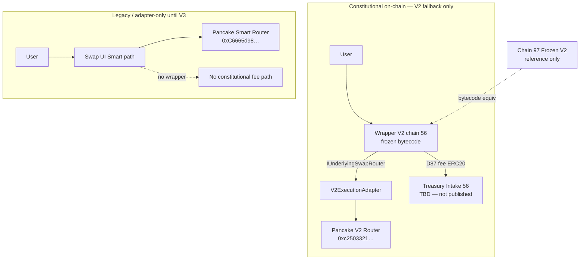

# R752 — Mainnet Strategy D Implementation Plan

**Date:** 2026-07-09  
**Authority:** R751 `MAINNET_STRATEGY_D` · KRMP-01 · `SMART_ROUTER_TESTNET_FROZEN`  
**Mode:** Plan only — **no deploy**, no chain 97 changes, no registry activation

---

## Output

| Field | Result |
|---|---|
| **Plan status** | **PASS** |
| **Deploy status** | **BLOCKED** (preconditions not met) |
| **Final verdict** | **`MAINNET_STRATEGY_D_PLAN_READY`** |

---

## 1. Mainnet architecture (Strategy D Phase 1)



**Truth boundaries:**

| Path | Engine | Wrapper | D87 protocol fee |
|---|---|---|---|
| **V2 fallback** (`fallbackV2 === true`) | V2 via adapter | **Yes** (post-validation) | On-chain via Wrapper V2 |
| **Smart Router** (`fallbackV2 === false`) | Smart Router | **No** | ADAPTER/off-chain only until V3 |
| **Chain 97** | V2 direct | Frozen V2 | Validated — **do not touch** |

---

## 2. Contracts to deploy (chain 56 only)

Deploy order is **strict**:

| Step | Contract | Source | Role |
|---|---|---|---|
| **1** | `V2ExecutionAdapter` | `contracts/adapters/V2ExecutionAdapter.sol` | Implements `IExecutionAdapter` + `IUnderlyingSwapRouter`; delegates to V2 |
| **2** | `MelegaSmartRouterWrapper` V2 | `contracts/MelegaSmartRouterWrapper.sol` (frozen) | Constitutional economic entrypoint; `underlyingRouter` = adapter address |

**Do not deploy:** `SmartRouterExecutionAdapter` on mainnet in Phase 1.  
**Do not deploy:** Wrapper V3.  
**Do not redeploy:** anything on chain 97.

---

## 3. Constructor arguments

### 3.1 V2ExecutionAdapter

```solidity
constructor(address v2Router_)
```

| Arg | Mainnet value | Notes |
|---|---|---|
| `v2Router_` | `0xc25033218D181b27D4a2944Fbb04FC055da4EAB3` | Pancake V2 Router — `ROUTER_ADDRESS[56]` |

**Post-deploy verification:**

- `routerType()` → `V2`
- `routerAddress()` → `0xc25033218D181b27D4a2944Fbb04FC055da4EAB3`
- Selectors `0x7ff36ab5` + `0x38ed1739` present on `routerAddress()` (R745B gate)

### 3.2 MelegaSmartRouterWrapper V2

```solidity
constructor(
  address underlyingRouter_,   // V2ExecutionAdapter deploy address
  address treasuryCollector_,  // Treasury Intake 56 — TBD
  address marcoToken_,
  bytes32 pricingRefHash_,
  bytes32 treasuryPolicyRefHash_,
  address owner_
)
```

| Arg | Mainnet value | Notes |
|---|---|---|
| `underlyingRouter_` | `<V2ExecutionAdapter address>` | **Not** Smart Router; **not** raw V2 (adapter is constitutional indirection per R750) |
| `treasuryCollector_` | **TBD** — Treasury Runtime publication | Registry currently `null` — **deploy blocker** |
| `marcoToken_` | `0x963556de0eb8138E97A85F0A86eE0acD159D210b` | Same address as chain 97 |
| `pricingRefHash_` | `0x86ec759a7d636e2c23c8e666673400056cc5ef99061381c1dac5abbd90530294` | `keccak256("D87_DEX_PRICING_RATIFIED")` — identical to frozen 97 |
| `treasuryPolicyRefHash_` | `0x2c4da16e00f42da5ec690db4a2db138a94f7c423d1ad10de9274c4d404b7d6b8` | `keccak256("FSC-01")` — identical to frozen 97 |
| `owner_` | Founder deployer EOA | `MAINNET_DEPLOYER` env |

**Bytecode requirement:** mainnet wrapper bytecode hash must equal chain 97 frozen hash:

`0x38b51c47d376400b04c3af1c7425d4af830dc71aec9a7faee23e80e51213d610`

---

## 4. Registry fields (schema delta — not activated until post-validation)

Apply only after Steps 8–10 of validation ceremony. Until then, keep `wrapperAddress: null`, `v2ExecutionAdapter: null`.

### 4.1 `smart-router/index.json` — chain `56` delta

| Field | Pre-deploy (now) | Post-validation target |
|---|---|---|
| `status` | `partial` | `partial_mainnet` |
| `wrapperCoverage` | *(new)* `null` | `v2_fallback_only` |
| `smartRouterStatus` | *(new)* — | `adapter_only_until_v3` |
| `wrapperAddress` | `null` | `<Wrapper V2 address>` |
| `v2ExecutionAdapter` | *(new)* `null` | `<V2ExecutionAdapter address>` |
| `underlyingRouter` | `0xC6665d98…` (Smart Router) | **Add** `v2ExecutionRouter: 0xc2503321…`; keep Smart Router under `executionRouter` with `adapterOnly: true` |
| `wrapper.underlyingTarget` | *(new)* — | `v2_execution_adapter` |
| `executableRouteTypes` | unchanged | `["STANDARD_SWAP","BUY_MARCO","SELL_MARCO"]` — **wrapper-executable only on V2 path** |
| `wrapperExecutableEngine` | *(new)* — | `V2` |
| `blockerReason` | current blockers | `null` only after validation + registry publication |

### 4.2 New registry artifact (post-validation)

| Artifact | Path |
|---|---|
| Mainnet validation certificate | `public/registry/smart-router/mainnet-validation-certificate.json` |
| Strategy D manifest | `public/registry/smart-router/mainnet-strategy-d-manifest.json` |
| KERL handoff update | `public/registry/melega-dex/smart-router-wrapper-v2.json` — chain 56 section only; 97 unchanged |

### 4.3 Example chain 56 block (draft — do not publish yet)

```json
{
  "chainId": 56,
  "status": "partial_mainnet",
  "wrapperCoverage": "v2_fallback_only",
  "smartRouterStatus": "adapter_only_until_v3",
  "wrapperAddress": null,
  "v2ExecutionAdapter": null,
  "wrapperVersion": 2,
  "underlyingRouter": "0xc25033218D181b27D4a2944Fbb04FC055da4EAB3",
  "executionRouter": {
    "address": "0xC6665d98Efd81f47B03801187eB46cbC63F328B0",
    "label": "PancakeSwap Smart Router",
    "role": "execution-only",
    "status": "active",
    "wrapperCovered": false,
    "note": "adapter_only_until_v3"
  },
  "wrapper": {
    "address": null,
    "status": "planned",
    "underlyingTarget": "v2_execution_adapter",
    "wrapperExecutableEngine": "V2"
  }
}
```

---

## 5. Frontend behavior

### 5.1 Routing rules (chain 56)

| Condition | Execution target | Wrapper | UI label |
|---|---|---|---|
| `fallbackV2 === true` | Wrapper V2 → V2ExecutionAdapter → V2 | **Yes** (after `MAINNET_WRAPPER_V2_ENABLED`) | "Constitutional V2 route" |
| `fallbackV2 === false` | Smart Router direct (legacy) | **No** | "Smart route (adapter only — fees not via Wrapper)" |
| Chain 97 | Unchanged testnet flows | Frozen V2 | No mainnet switch |

### 5.2 Feature gate

```typescript
// Env gate — default false until validation certificate published
MAINNET_WRAPPER_V2_ENABLED=false
NEXT_PUBLIC_MAINNET_WRAPPER_V2_ADDRESS=   // empty until registry populated
```

Wrapper commit path enabled only when:

1. `chainId === 56`
2. `tradeInfo.fallbackV2 === true`
3. `MAINNET_WRAPPER_V2_ENABLED === true`
4. Registry `wrapperAddress` non-null

### 5.3 UI disclosure (required)

Display on `/swap` and Trade terminal when chain 56:

- **V2 fallback swaps:** "Protocol fees route through Melega Wrapper V2 (D87)."
- **Smart Router swaps:** "Smart Router path is not Wrapper-covered. Constitutional on-chain fees apply on V2 routes only until Wrapper V3."

Use existing `DexDisclaimer` pattern — no fake "all swaps" coverage.

### 5.4 Files to change (implementation ticket — not this mission)

| File | Change |
|---|---|
| `views/Swap/SmartSwap/index.tsx` | Branch commit button: wrapper vs legacy by `fallbackV2` + gate |
| `views/Swap/SmartSwap/hooks/useSwapCallback.ts` / wrapper commit | New `useWrapperSwapCallback` for V2 path |
| `views/Trade/tradeRuntime/useTradeSwapRuntime.ts` | Surface `wrapperCovered: boolean` in machine payload |
| `lib/melega-smart-router/smartRouterAdapter.ts` | `preferSmartRouter: false` when wrapper path selected |
| `config/constants/exchange.ts` or new `mainnetWrapper.ts` | Wrapper + adapter addresses from registry fetch |
| `components/Dex/DexDisclaimer.tsx` | Strategy D coverage disclosure strings |
| `public/registry/smart-router/index.json` | Post-validation only |
| `docs/runtime/MAINNET_ACTIVATION_CHECKLIST.md` | Cross-link R752 deploy order |

---

## 6. Validation ceremony (V2 adapter path only)

Mirror R747 testnet ceremony on chain 56. **Only** txs through Wrapper V2 → V2ExecutionAdapter → V2.

| Route | Expected fee | Input | Output path | Evidence |
|---|---|---|---|---|
| **BUY_MARCO** | 20 bps | BNB (native) | MARCO | Tx hash; `ProtocolFeeCollected`; intake WBNB delta |
| **SELL_MARCO** | 30 bps | MARCO | WBNB | Tx hash; `ProtocolFeeCollected`; intake MARCO delta |
| **STANDARD_SWAP** | 30 bps | BNB (native) | USDT or non-MARCO | Tx hash; `ProtocolFeeCollected` |

**Per-tx checks:**

1. `underlyingRouter` in events = V2ExecutionAdapter address (not raw V2, not Smart Router)
2. `ProtocolFeeCollected`, `SmartRouterSwapRouted`, `TreasuryHandoffPrepared` — 3/3 routes
3. Bytecode hash matches frozen 97
4. Immutables read matches constructor snapshot
5. Issue `mainnet-validation-certificate.json` per `MAINNET_DEPLOYMENT_CERTIFICATE_SCHEMA.json`

**Explicitly not validated in Phase 1:** Smart Router swaps through wrapper (deferred to V3).

---

## 7. Deploy ceremony sequence (when unblocked)

| # | Action | Owner | Rollback |
|---|---|---|---|
| 0 | Treasury publishes Intake 56 | Treasury Runtime | Abort all |
| 1 | External audit sign-off on frozen V2 + V2ExecutionAdapter | Auditor | Abort deploy |
| 2 | Verify MARCO/WBNB/mainnet pair liquidity for ceremony amounts | Founder | Reschedule ceremony |
| 3 | Deploy `V2ExecutionAdapter(0xc2503321…)` | Founder | Discard address |
| 4 | Verify adapter `routerAddress()` + V2 selectors | DEX engineering | Do not deploy wrapper |
| 5 | Deploy `MelegaSmartRouterWrapper(adapter, intake, marco, hashes, owner)` | Founder | `pause()` if wrong immutables |
| 6 | Run validation 3/3 (Section 6) | Founder | `pause()` + DO NOT USE registry |
| 7 | Publish registry + certificate | DEX operator | Revert registry commit |
| 8 | Enable `MAINNET_WRAPPER_V2_ENABLED` staging → prod | DEX operator | Disable gate |

**Forge commands (reference only — do not run until unblocked):**

```bash
# Step 3 — requires new script: script/DeployV2ExecutionAdapter.s.sol
forge script script/DeployV2ExecutionAdapter.s.sol --rpc-url bsc_mainnet --broadcast --verify

# Step 5
UNDERLYING_ROUTER=<adapter_address> \
TREASURY_INTAKE=<intake_56> \
MARCO_TOKEN=0x963556de0eb8138E97A85F0A86eE0acD159D210b \
DEPLOYER_OWNER=<founder> \
forge script script/DeployMelegaSmartRouterWrapper.s.sol --rpc-url bsc_mainnet --broadcast --verify
```

---

## 8. Remaining blockers

| # | Blocker | Owner | Blocks |
|---|---|---|---|
| 1 | **Treasury Intake mainnet** — registry `collector: null` | Treasury Runtime | Wrapper constructor `treasuryCollector_` |
| 2 | **External security audit** — frozen V2 + V2ExecutionAdapter | Auditor | Mainnet deploy |
| 3 | **Deploy credentials** — funded `MAINNET_DEPLOYER`, BscScan API | Founder | Broadcast |
| 4 | **Mainnet liquidity route verification** — MARCO/WBNB pair depth for ceremony | Founder | Validation txs |
| 5 | **`script/DeployV2ExecutionAdapter.s.sol`** — not yet authored | DEX engineering | Adapter deploy automation |
| 6 | **Registry / KERL publication** — kiri 404 for wrapper registry | KIRI ops | Labs env unblock |
| 7 | **V3 future work** — Wrapper targeting `IExecutionAdapter` for Smart Router coverage | Future ticket R7XX | Full dual-engine constitutional path |

---

## 9. Chain 97 preservation checklist

| Invariant | R752 plan |
|---|---|
| Wrapper V2 address on 97 | Unchanged |
| Frozen bytecode hash | Unchanged |
| Testnet validation certificate | Unchanged |
| Freeze manifest | Unchanged |
| `underlyingRouter` on 97 (raw V2) | Unchanged — 97 does not require adapter deploy |
| Registry chain 97 block | No edits in Phase 1 mainnet ticket |

---

## 10. Phase 2 pointer (out of scope)

**R751 Phase 2 → Strategy B:** Wrapper V3 → `IExecutionAdapter` unifies Smart Router + V2. Requires new constitutional ticket, audit, and mainnet freeze publication. Does not supersede chain 97 frozen V2 reference.

---

## Files to change later (summary)

| Category | Paths |
|---|---|
| **Deploy** | `script/DeployV2ExecutionAdapter.s.sol` (new), `script/DeployEnv.sol` (adapter config) |
| **Registry** | `public/registry/smart-router/index.json`, `mainnet-validation-certificate.json` (new), `mainnet-strategy-d-manifest.json` (new), `public/registry/melega-dex/smart-router-wrapper-v2.json` |
| **Runtime** | `lib/melega-smart-router/registry/smartRouterRegistry.ts`, `mainnetReadiness.ts`, `blocker-audit.ts` |
| **Frontend** | `views/Swap/SmartSwap/*`, `Trade/tradeRuntime/*`, `DexDisclaimer.tsx`, env example |
| **Docs** | `MAINNET_ACTIVATION_CHECKLIST.md` — add adapter deploy step before wrapper |

---

**Final verdict:** `MAINNET_STRATEGY_D_PLAN_READY`  
**Deploy verdict:** `BLOCKED` until blockers 1–4 resolved.
